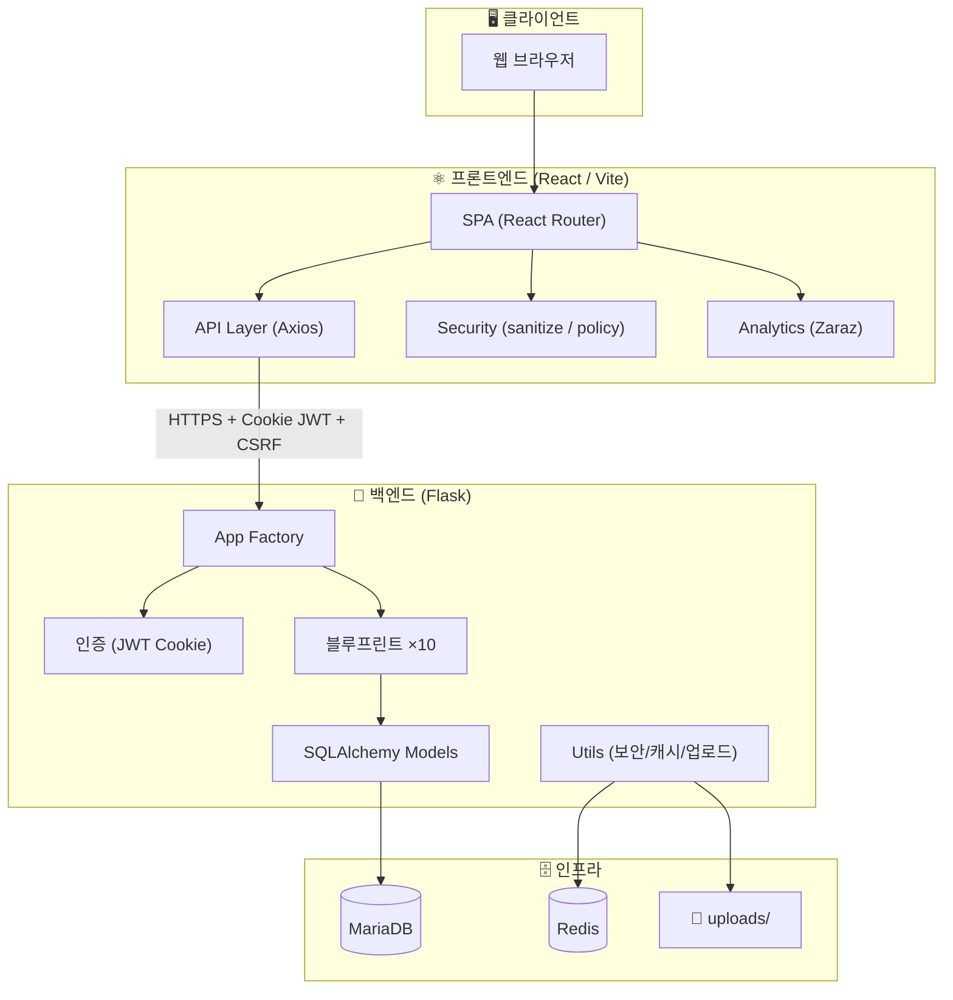

<p align="center">

</p>

<p align="center">
  
</p>

<h1 align="center">🏫 beomseo.in</h1>

<p align="center">
  <strong>범서고등학교 학생 커뮤니티 플랫폼</strong><br/>
  <em>"지혜로운 눈으로 꿈을 이루고, 따뜻한 가슴으로 인류에 봉사하자"</em>
</p>

<p align="center">
  
  
  
  
  
  
</p>

---

## 📋 목차

- [🌟 프로젝트 소개](#-프로젝트-소개)
- [✨ 주요 기능](#-주요-기능)
- [🛠️ 기술 스택](#️-기술-스택)
- [🏗️ 시스템 아키텍처](#️-시스템-아키텍처)
- [📂 프로젝트 구조](#-프로젝트-구조)
- [🚀 빠른 시작](#-빠른-시작)
- [📖 문서 인덱스](#-문서-인덱스)
- [📜 라이선스](#-라이선스)

---

## 🌟 프로젝트 소개

**beomseo.in**은 범서고등학교 17대 학생회 정보기술부에서 기획·개발한 **학생 커뮤니티 웹 플랫폼**입니다.

학생들이 학교 생활에서 필요한 정보를 한곳에서 쉽게 찾고, 서로 소통할 수 있는 공간을 만들기 위해 시작되었습니다. 공지사항 확인부터 자유 게시판, 동아리 모집, 학생 청원, 설문조사, 실시간 투표, 분실물 게시판, 그리고 교내 중고거래까지 — 범서고 학생이라면 누구나 참여할 수 있습니다.

> **개발 철학**
> 1. 첫째도 **개발의 편리함**, 둘째도 **학생들의 편리함** 🛠️
> 2. 복잡하게 만들지 않는다. 단순하지만 완성도 있게 ✅

### 🌲 학교 상징

| 상징 | 설명 |
|:---:|---|
| 🎯 **교훈** | 지혜로운 눈으로 꿈을 이루고 따뜻한 가슴으로 인류에 봉사하자 |
| 🎯 **목표** | 지적 능력과 고운 인성이 조화로운 인간으로 성장시킨다 |
| 🌲 **교목** | 곰솔나무 — 끈기와 장수, 장대함을 상징 |
| 🌺 **교화** | 모란 — 부귀와 번영, 행복을 상징 |

---

## ✨ 주요 기능

<table>
  <tr>
    <td width="50%">

### 📢 공지·소통
- **학교/학생회 공지** — 카테고리별 CRUD, 댓글, 반응
- **자유 게시판** — 북마크, 승인 시스템
- **학생 청원** — 투표 + 학생회 답변

</td>
<td width="50%">

### 🗳️ 참여·활동
- **설문 교환** — 크레딧 기반 설문 시스템
- **실시간 투표** — 즉석 투표 생성 & 참여
- **동아리 모집** — 학년별 모집 공고 + 승인

</td>
  </tr>
  <tr>
    <td>

### 🔍 생활 편의
- **분실물 게시판** — 사진 첨부, 댓글
- **곰솔 마켓** — 교내 중고거래 플랫폼
- **과목 변경 매칭** — 과목 교환 요청 & 상태 관리

</td>
<td>

### 🔒 보안·인프라
- **Cookie JWT + CSRF** — HttpOnly 쿠키 인증
- **IP 기반 가입 제한** — 교내 네트워크 가입 제어
- **3중 업로드 검증** — 확장자 + MIME + 시그니처

</td>
  </tr>
</table>

---

## 🛠️ 기술 스택

### 백엔드

| 구분 | 기술 | 비고 |
|:---:|---|---|
| 언어 | **Python** | |
| 프레임워크 | **Flask 3.1** | 앱 팩토리 패턴 |
| ORM | **Flask-SQLAlchemy** | |
| DB | **MariaDB** (PyMySQL) | |
| 캐시 | **Redis** + Flask-Caching | 장애 시 NullCache fallback |
| 인증 | **Flask-JWT-Extended** | Cookie + CSRF 이중 보호 |
| 비밀번호 | **bcrypt** | |
| 레이트리밋 | **Flask-Limiter** | 사용자ID/IP 기반 |

### 프론트엔드

| 구분 | 기술 | 비고 |
|:---:|---|---|
| 라이브러리 | **React 19** | |
| 번들러 | **Vite 7** | |
| 라우팅 | **React Router DOM 7** | lazy loading |
| HTTP | **Axios** | withCredentials 쿠키 인증 |
| 차트 | **Recharts** | |
| 폼 빌더 | **react-form-builder2** | 설문 빌더 |
| 아이콘 | **Lucide React** | |
| XSS 방어 | **DOMPurify** | |
| 분석 | **Cloudflare Zaraz** + GA4 | 민감 키 자동 필터링 |

---

## 🏗️ 시스템 아키텍처



### 요청 라이프사이클

```
사용자 클릭 → React Component → Axios (withCredentials) → Flask 라우터
    → 미들웨어(JWT 검증, CSRF, Rate Limit)
    → 블루프린트 핸들러
    → SQLAlchemy ORM → MariaDB
    → JSON 응답 → React 렌더링
```

---

## 📂 프로젝트 구조

```
beomseo.in/
├── 📄 README.md              ← 지금 읽고 있는 이 문서
├── 📄 LICENSE                 ← GNU GPL-3.0
├── 📄 TODO.md                 ← 개발 로드맵 & 아이디어
├── 📄 .gitignore
│
├── 🐍 backend/                ← Flask API 서버
│   ├── app.py                 # 앱 팩토리 + 미들웨어
│   ├── config.py              # 환경별 설정 (보안/캐시/레이트리밋)
│   ├── requirements.txt
│   ├── .env.example
│   ├── routes/                # 10개 블루프린트 (기능별 API)
│   │   ├── auth.py            #   인증/회원
│   │   ├── notices.py         #   공지
│   │   ├── free.py            #   자유게시판
│   │   ├── club_recruit.py    #   동아리 모집
│   │   ├── subject_changes.py #   과목변경
│   │   ├── petitions.py       #   학생 청원
│   │   ├── surveys.py         #   설문 교환
│   │   ├── votes.py           #   실시간 투표
│   │   ├── lost_found.py      #   분실물
│   │   └── gomsol_market.py   #   곰솔 마켓
│   ├── models/                # SQLAlchemy 모델
│   ├── utils/                 # 보안·캐시·업로드 유틸
│   ├── uploads/               # 파일 업로드 저장소
│   └── docs/                  # 백엔드 문서
│
└── ⚛️ frontend/               ← React SPA
    ├── index.html
    ├── package.json
    ├── vite.config.js
    ├── .env.example
    ├── src/
    │   ├── App.jsx            # 라우터 + Provider
    │   ├── main.jsx           # 엔트리포인트
    │   ├── api/               # Axios 기반 API 모듈 (22개)
    │   ├── components/        # 재사용 컴포넌트 (70개)
    │   ├── pages/             # 페이지 컴포넌트 (45개)
    │   ├── context/           # AuthContext, ThemeContext
    │   ├── security/          # URL/HTML/CSV sanitize
    │   ├── analytics/         # Zaraz 이벤트 래퍼
    │   ├── layout/            # AppLayout
    │   ├── config/            # 환경 설정
    │   ├── styles/            # 글로벌 스타일
    │   └── utils/             # 유틸리티
    └── docs/                  # 프론트엔드 문서
```

---

## 🚀 빠른 시작

### 사전 요구사항

| 도구 | 최소 버전 | 용도 |
|---|---|---|
| **Python** | 3.10+ | 백엔드 런타임 |
| **Node.js** | 20+ | 프론트엔드 런타임 |
| **npm** | 10+ | 패키지 관리 |
| **MariaDB** | 10.6+ | 데이터베이스 |
| **Redis** | 7.0+ | 캐시 & 레이트리밋 (선택사항) |

### 1단계: 저장소 클론

```bash
git clone https://github.com/hanjm-github/2026-beomseo.git
cd 2026-beomseo
```

### 2단계: 백엔드 설정

```bash
cd backend

# 가상환경 생성 & 활성화
python -m venv .venv
# Windows
.venv\Scripts\activate
# macOS / Linux
source .venv/bin/activate

# 의존성 설치
pip install -r requirements.txt

# 환경 변수 준비
copy .env.example .env    # Windows
cp .env.example .env      # macOS / Linux
# .env 파일을 열어 DB 접속 정보, JWT_SECRET_KEY 등을 수정합니다

# 서버 실행
python app.py
```

> 💡 기본 개발 서버: `http://127.0.0.1:5000`

### 3단계: 프론트엔드 설정

```bash
cd frontend

# 의존성 설치
npm install

# 환경 변수 준비
copy .env.example .env    # Windows
cp .env.example .env      # macOS / Linux

# 개발 서버 실행
npm run dev
```

> 💡 기본 개발 서버: `http://localhost:5173`

### 4단계: 동작 확인

```bash
# 백엔드 헬스체크
curl http://127.0.0.1:5000/api/health

# 프론트엔드
# 브라우저에서 http://localhost:5173 접속
```

### 프로덕션 빌드 (프론트엔드)

```bash
cd frontend
npm run build    # dist/ 디렉터리에 빌드 파일 생성
npm run preview  # 빌드된 결과물 미리보기
```

---

## 📖 문서 인덱스

이 프로젝트에는 백엔드와 프론트엔드 각각의 상세 문서가 포함되어 있습니다.

### 백엔드 문서

| 문서 | 설명 |
|---|---|
| [backend/README.md](backend/README.md) | 백엔드 종합 가이드 |
| [backend/docs/backend_api.md](backend/docs/backend_api.md) | API 레퍼런스 |
| [backend/docs/backend_architecture.md](backend/docs/backend_architecture.md) | 아키텍처 문서 |

### 프론트엔드 문서

| 문서 | 설명 |
|---|---|
| [frontend/README.md](frontend/README.md) | 프론트엔드 종합 가이드 |
| [frontend/docs/frontend-code-map.md](frontend/docs/frontend-code-map.md) | 코드 맵 |
| [frontend/docs/frontend-architecture.md](frontend/docs/frontend-architecture.md) | 아키텍처 문서 |
| [frontend/docs/frontend-api-reference.md](frontend/docs/frontend-api-reference.md) | API 참조 |
| [frontend/docs/analytics-tracking.md](frontend/docs/analytics-tracking.md) | 분석 트래킹 스펙 |
| [frontend/docs/team-checklist.md](frontend/docs/team-checklist.md) | 팀 체크리스트 |

### 프로젝트 전체

| 문서 | 설명 |
|---|---|
| [TODO.md](TODO.md) | 개발 로드맵 & 아이디어 |
| [LICENSE](LICENSE) | GNU GPL-3.0 라이선스 |

---


## 📜 라이선스

이 프로젝트는 [**GNU General Public License v3.0**](LICENSE) 하에 배포됩니다.

```
beomseo.in
Copyright (C) 2026  범서고등학교 17대 학생회 정보기술부

This program is free software: you can redistribute it and/or modify
it under the terms of the GNU General Public License as published by
the Free Software Foundation, either version 3 of the License, or
(at your option) any later version.

This program is distributed in the hope that it will be useful,
but WITHOUT ANY WARRANTY; without even the implied warranty of
MERCHANTABILITY or FITNESS FOR A PARTICULAR PURPOSE.  See the
GNU General Public License for more details.

You should have received a copy of the GNU General Public License
along with this program.  If not, see <http://www.gnu.org/licenses/>.
```

---

<p align="center">
  🌲 곰솔나무처럼 끈기 있게, 모란처럼 아름답게 🌺<br/>
  <strong>범서고등학교 17대 학생회 정보기술부</strong>가 만들었습니다.
</p>
