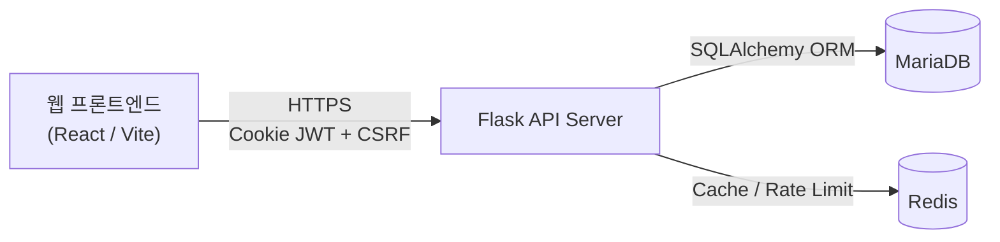
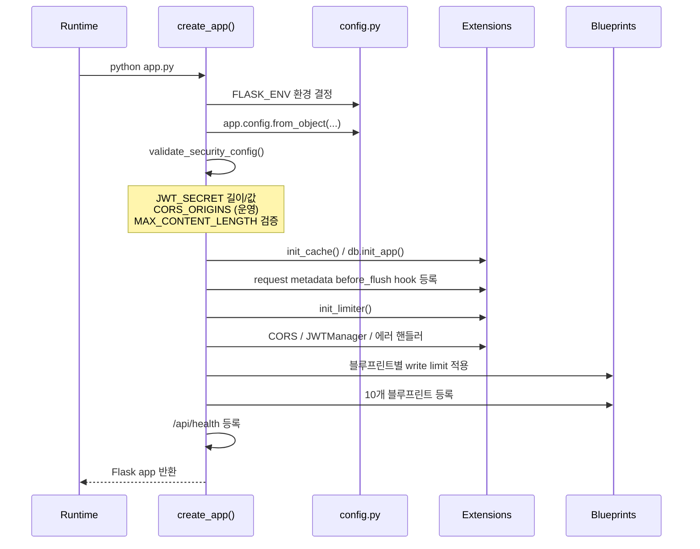
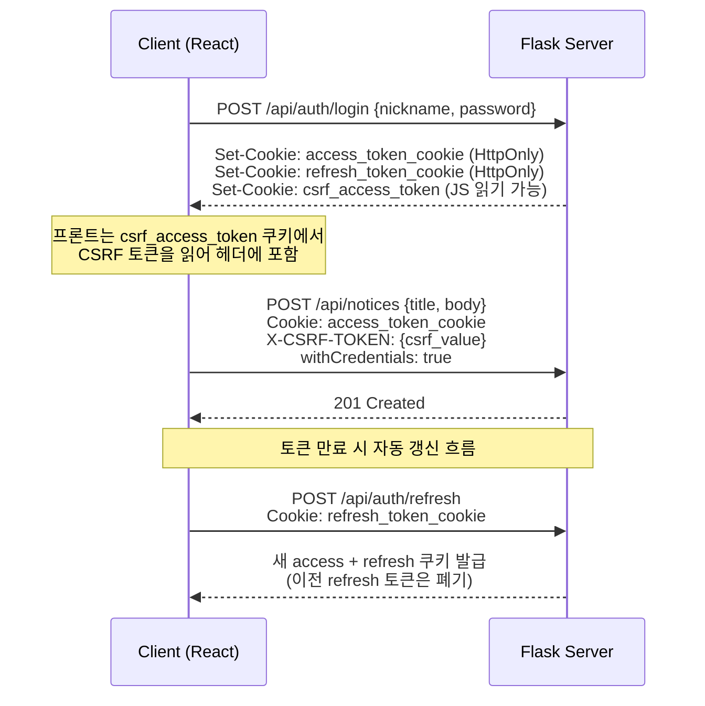

# beomseo.in Backend

범서고 커뮤니티 서비스 `beomseo.in`의 Flask 기반 백엔드 API입니다.  
공지/커뮤니티/설문/투표/인증 기능을 단일 API 서버로 제공하며, 인증·권한·레이트리밋·캐시·업로드 보안을 공통 정책으로 강제하고 쓰기 요청 메타데이터(IP/User-Agent)도 일관 수집합니다.

## 시스템 개요



## 핵심 기술 스택

| 구분 | 기술 |
|---|---|
| Language | Python |
| Web Framework | Flask 3.1 |
| ORM | Flask-SQLAlchemy |
| Auth | Flask-JWT-Extended (Cookie + CSRF) |
| Rate Limiting | Flask-Limiter |
| Cache | Flask-Caching + Redis (장애 시 NullCache fallback) |
| DB Driver | PyMySQL |
| Password Hash | bcrypt |
| Config | python-dotenv |
| Request Audit | SQLAlchemy `before_flush` + `utils/request_metadata.py` |

## 빠른 시작

### 1) 의존성 설치

```bash
cd backend
python -m venv .venv
.venv\Scripts\activate
pip install -r requirements.txt
```

### 2) 환경 변수 준비

```bash
copy .env.example .env
```

필수로 점검할 항목:

- `FLASK_ENV` (`development` 또는 `production`)
- `JWT_SECRET_KEY` (최소 길이 `JWT_MIN_SECRET_LENGTH`, 기본 32)
- DB 접속 정보 (`DATABASE_URL` 또는 `DB_*`)
- `CORS_ORIGINS`

### 3) 서버 실행

```bash
python app.py
```

기본 개발 서버:

- Host: `127.0.0.1`
- Port: `5000`

헬스체크:

```bash
curl http://127.0.0.1:5000/api/health
```

## 앱 부팅 순서

`create_app()` 팩토리가 아래 순서대로 초기화합니다. 순서가 중요하며, 설정 검증이 확장 초기화보다 먼저 실행됩니다.



## 블루프린트 인덱스

서버에 등록된 10개 블루프린트와 URL 접두사:

| Blueprint | URL Prefix | 주요 기능 |
|---|---|---|
| `auth` | `/api/auth` | 회원가입, 로그인, 토큰 갱신, 로그아웃 |
| `notices` | `/api/notices` | 학교/학생회 공지 CRUD, 댓글, 반응 |
| `free` | `/api/community/free` | 자유게시판 CRUD, 북마크, 승인 |
| `club_recruit` | `/api/club-recruit` | 동아리 모집 CRUD, 승인 |
| `subject_changes` | `/api/subject-changes` | 과목변경 매칭 CRUD, 상태 관리 |
| `petitions` | `/api/community/petitions` | 학생 청원, 투표, 답변 |
| `surveys` | `/api/surveys` | 설문 교환, 크레딧 시스템 |
| `votes` | `/api/community/votes` | 실시간 투표 |
| `lost_found` | `/api/community/lost-found` | 분실물 게시판 |
| `gomsol_market` | `/api/community/gomsol-market` | 곰솔 중고마켓 |

## 디렉터리 구조

```text
backend/
├─ app.py                  # Flask 앱 팩토리, 공통 미들웨어/헤더/블루프린트 등록
├─ config.py               # 환경별 정책 (보안, 캐시, 레이트리밋, 업로드)
├─ requirements.txt
├─ .env.example
├─ routes/                 # 기능별 API 엔드포인트
│  ├─ auth.py              #   인증/회원
│  ├─ notices.py            #   공지
│  ├─ free.py               #   자유게시판
│  ├─ club_recruit.py       #   동아리 모집
│  ├─ subject_changes.py    #   과목변경
│  ├─ petitions.py          #   학생 청원
│  ├─ surveys.py            #   설문 교환
│  ├─ votes.py              #   실시간 투표
│  ├─ lost_found.py         #   분실물
│  └─ gomsol_market.py      #   곰솔 마켓
├─ models/                 # SQLAlchemy 모델 및 enum
│  ├─ user.py              #   User, UserRole, db
│  ├─ auth_token.py        #   AuthToken, AuthTokenType
│  ├─ notice.py            #   Notice, Attachment, Comment, Reaction
│  ├─ free_post.py         #   FreePost, FreeComment, Bookmark, Reaction
│  ├─ club_recruit.py      #   ClubRecruit, GradeGroup
│  ├─ petition.py          #   Petition, PetitionVote, PetitionAnswer
│  ├─ subject_change.py    #   SubjectChange, Comment, Like
│  ├─ survey.py            #   Survey, SurveyResponse, SurveyCredit
│  ├─ vote.py              #   Vote, VoteOption, VoteResponse
│  ├─ lost_found.py        #   LostFoundPost, Image, Comment
│  ├─ gomsol_market.py     #   GomsolMarketPost, Image
│  └─ countdown_event.py   #   CountdownEvent (메인 위젯)
├─ utils/                  # 보안/토큰/캐시/레이트리밋/업로드 유틸
│  ├─ security.py          #   비밀번호 해시, IP 검증, 권한 데코레이터
│  ├─ security_tokens.py   #   토큰 발급/회전/폐기
│  ├─ request_metadata.py  #   IP/User-Agent 정규화 및 before_flush 자동 주입
│  ├─ cache.py             #   Redis 캐시 + NullCache fallback
│  ├─ rate_limit.py        #   레이트리밋 초기화/정책
│  ├─ files.py             #   업로드 검증/저장/미리보기 토큰
│  └─ pagination.py        #   페이지네이션 공통 헬퍼
├─ uploads/                # 로컬 업로드 저장 루트
└─ docs/
   ├─ backend_api.md       # API 레퍼런스
   └─ backend_architecture.md  # 아키텍처 문서
```

## 인증 흐름 (Cookie JWT + CSRF)

이 프로젝트의 표준 인증은 **Bearer 헤더 기반이 아니라 Cookie 기반 JWT + CSRF**입니다.



### 인증 계약 요약

1. 로그인/회원가입 성공 시 서버가 HttpOnly 쿠키를 발급합니다.
2. 액세스 토큰 쿠키: `access_token_cookie`
3. 리프레시 토큰 쿠키: `refresh_token_cookie`
4. 비안전 메서드(`POST/PUT/PATCH/DELETE`)는 `X-CSRF-TOKEN` 헤더가 필요합니다.
5. 프론트는 `withCredentials: true`로 요청해야 쿠키가 동작합니다.
6. 토큰 만료 시 `/api/auth/refresh`로 회전(rotate)하며 이전 refresh 토큰은 폐기됩니다.

CSRF 쿠키/헤더 이름:

- Access CSRF Cookie: `csrf_access_token`
- Refresh CSRF Cookie: `csrf_refresh_token`
- Header: `X-CSRF-TOKEN`

## 요청 메타데이터 자동 기록

쓰기 경로 감사 목적으로, 서버는 신규 DB 행 생성 시 `ip_address`, `user_agent`를 자동 채웁니다.

- 실행 시점: SQLAlchemy `before_flush` 훅(앱 부팅 시 1회 등록)
- 채움 조건: 요청 컨텍스트가 있고 대상 컬럼 값이 비어 있을 때만 채움
- IP 소스: `utils.security.get_client_ip()` (신뢰 프록시 설정 반영)
- 문자열 정규화: `ip_address` 최대 64자, `user_agent` 최대 255자
- 실패 처리: 메타데이터 추출 실패가 요청 실패로 전파되지 않음(best-effort)

주요 적용 대상(예시):

- 사용자/인증: `users`, `auth_tokens`
- 게시판/상호작용: `notices`, `comments`, `notice_reactions`, `free_posts`, `free_comments`, `free_reactions`, `free_bookmarks`
- 도메인 기능: `club_recruits`, `subject_changes`, `subject_change_comments`, `petitions`, `petition_votes`, `petition_answers`, `surveys`, `survey_responses`, `votes`, `vote_responses`, `lost_found_*`, `gomsol_market_*`

## 환경 변수 핵심표

아래는 운영/개발에서 영향도가 큰 변수만 요약한 표입니다. 상세는 [.env.example](./.env.example), [config.py](./config.py)를 기준으로 확인하세요.

### 런타임/환경

| 변수 | 기본값 | 설명 |
|---|---|---|
| `FLASK_ENV` | `development` | 런타임 환경(`development`/`production`) |
| `REQUIRE_EXPLICIT_ENV` | `true` | `FLASK_ENV` 미지정 시 부팅 실패 여부 |
| `AUTO_CREATE_TABLES` | dev:`true`, prod:`false` | 서버 부팅 시 `db.create_all()` 자동 실행 여부 |

### 데이터베이스

| 변수 | 기본값 | 설명 |
|---|---|---|
| `DATABASE_URL` | (없음) | 전체 SQLAlchemy URI를 직접 지정할 때 사용 |
| `DB_HOST` | `localhost` | MariaDB 호스트 |
| `DB_PORT` | `3306` | MariaDB 포트 |
| `DB_USER` | `root` | DB 사용자 |
| `DB_PASSWORD` | `""` | DB 비밀번호 |
| `DB_NAME` | `app_db` | DB 이름 |

### 인증/JWT

| 변수 | 기본값 | 설명 |
|---|---|---|
| `JWT_SECRET_KEY` | `""` | JWT 서명 키 (운영 필수) |
| `JWT_MIN_SECRET_LENGTH` | `32` | 최소 키 길이 |
| `JWT_COOKIE_SECURE` | env 기반 | HTTPS 전송 강제 여부 |
| `JWT_COOKIE_SAMESITE` | `Lax` | 쿠키 SameSite |
| `JWT_COOKIE_CSRF_PROTECT` | `true` | CSRF 이중 제출 방어 사용 여부 |
| `JWT_ACCESS_COOKIE_NAME` | `access_token_cookie` | 액세스 토큰 쿠키 이름 |
| `JWT_REFRESH_COOKIE_NAME` | `refresh_token_cookie` | 리프레시 토큰 쿠키 이름 |
| `JWT_ACCESS_COOKIE_PATH` | `/` | 액세스 쿠키 경로 |
| `JWT_REFRESH_COOKIE_PATH` | `/api/auth` | 리프레시 쿠키 경로 |

### CORS/프록시

| 변수 | 기본값 | 설명 |
|---|---|---|
| `CORS_ORIGINS` | `http://localhost:5173` | 허용 Origin 목록(콤마 구분) |
| `TRUST_PROXY_HEADERS` | `false` | `X-Forwarded-*` 신뢰 여부 |
| `TRUSTED_PROXY_CIDRS` | `""` | 신뢰할 프록시 CIDR 목록 |

### 캐시/레이트리밋

| 변수 | 기본값 | 설명 |
|---|---|---|
| `CACHE_ENABLED` | `true` | 캐시 사용 여부 |
| `REDIS_URL` | `redis://localhost:6379/0` | Redis 접속 URL |
| `CACHE_DEFAULT_TIMEOUT` | `60` | 기본 TTL(초) |
| `RATELIMIT_STORAGE_URI` | `memory://` 또는 `REDIS_URL` | 레이트리밋 저장소 |
| `RATELIMIT_DEFAULT` | `300 per hour` | 기본 제한 |
| `RATELIMIT_WRITE_LIMIT` | `120 per minute` | 쓰기 메서드 공통 제한 |
| `RATELIMIT_LOGIN_LIMIT` | `5 per minute` | 로그인 제한 |
| `RATELIMIT_REGISTER_LIMIT` | `5 per 10 minute` | 회원가입 제한 |
| `RATELIMIT_REFRESH_LIMIT` | `20 per 10 minute` | 토큰 갱신 제한 |

### 업로드

| 변수 | 기본값 | 설명 |
|---|---|---|
| `MAX_CONTENT_LENGTH` | `12582912` | 요청 본문 최대 바이트 |
| `MAX_ATTACH_SIZE` | 코드 기본 10MB | 파일 1개 최대 용량 |
| `MAX_ATTACH_COUNT` | 코드 기본 5 | 첨부 최대 개수 |
| `UPLOAD_ALLOWED_MIME_TYPES` | 기본 allowlist | 허용 MIME |
| `UPLOAD_ALLOWED_EXTENSIONS` | 기본 allowlist | 허용 확장자 |
| `UPLOAD_TEMP_PREVIEW_TTL_SECONDS` | `86400` | 임시 미리보기 토큰 TTL(초) |
| `UPLOAD_TEMP_PREVIEW_SIGNING_KEY` | `JWT_SECRET_KEY` fallback | 미리보기 토큰 서명 키 |

## 운영 체크리스트

### 보안/기동

1. 운영에서 `FLASK_ENV=production`으로 명시 실행
2. `JWT_SECRET_KEY` 강도/길이 확인 (기본값 금지)
3. 운영에서 `CORS_ORIGINS` 비어 있지 않게 설정
4. `MAX_CONTENT_LENGTH` 양수 확인 (부팅 시 fail-fast)
5. 프록시 환경이면 `TRUST_PROXY_HEADERS` + `TRUSTED_PROXY_CIDRS`를 함께 설정
6. 프록시 체인 변경 시 원본 IP 추출(`get_client_ip`)과 감사 컬럼 저장값을 함께 점검

### 캐시/레이트리밋

1. Redis 장애 시 API는 계속 동작하지만 캐시는 `NullCache`로 강등됨
2. 레이트리밋은 사용자 ID 우선, 비로그인 시 IP 기준으로 계산
3. 신규 쓰기 엔드포인트 추가 시 캐시 무효화 네임스페이스를 반드시 연결
4. 권한/개인화 GET는 `actor_scope(anon | user:{id}:role:{role})` 단위로 캐시가 분리됨
5. 승인형 게시판에서 비관리자는 `승인 글 + 본인 미승인 글`만 보며, 이 결과도 사용자별 캐시 키로 격리됨

### 업로드

1. 업로드는 확장자+MIME+시그니처(헤더 바이트) 3중 검증
2. 임시 업로드 조회는 `preview_token`이 있어야 허용
3. 게시글/공지와 연결되지 않은 파일은 기본적으로 404 처리

## 문서 인덱스

- [백엔드 API 레퍼런스](./docs/backend_api.md)
- [백엔드 아키텍처](./docs/backend_architecture.md)

프론트 연계 문서:

- [Frontend README](../frontend/README.md)
