# 백엔드 API 레퍼런스 (코드 기준 / 한국어)

이 문서는 `backend/routes`, `backend/models`, `backend/utils`, `backend/config.py`, `backend/app.py`와 `backend/fastapi_app/*`를 기준으로 작성한 실행 계약 문서입니다.

## 1. 공통 규약

### 1.1 Base URL

- Flask 개발 기본값: `http://127.0.0.1:5000`
- FastAPI 개발 기본값: `http://127.0.0.1:8000`
- Health Check: `GET /api/health`

### 1.2 콘텐츠 타입

- 요청: `Content-Type: application/json` (파일 업로드 제외)
- 응답: JSON (`application/json`)

### 1.3 페이지네이션 공통 포맷

- 요청 쿼리:
  - `page` (기본 1)
  - `page_size` 또는 `pageSize` (동시 지원)
- 응답 키:
  - `items`, `total`, `page`, `page_size`, `pageSize`

```json
{
  "items": [],
  "total": 0,
  "page": 1,
  "page_size": 10,
  "pageSize": 10
}
```

### 1.4 인증 규약 (중요)

이 백엔드는 Bearer 헤더 중심 계약이 아닙니다. 표준 계약은 HttpOnly 쿠키 기반 JWT + CSRF 헤더입니다.

- Access Cookie: `access_token_cookie`
- Refresh Cookie: `refresh_token_cookie`
- CSRF Cookie: `csrf_access_token`, `csrf_refresh_token`
- CSRF Header: `X-CSRF-TOKEN`
- 관련 설정:
  - `JWT_TOKEN_LOCATION=['cookies']`
  - `JWT_COOKIE_CSRF_PROTECT=true` (기본)
  - `JWT_ACCESS_COOKIE_PATH=/`
  - `JWT_REFRESH_COOKIE_PATH=/api/auth`

클라이언트 요구사항:

1. `withCredentials: true`로 요청
2. 비안전 메서드(`POST/PUT/PATCH/DELETE`)에 `X-CSRF-TOKEN` 포함

FastAPI 수학여행 쓰기 추가 규약:

- 대상: `/api/community/field-trip/*`의 쓰기 요청
- 추가 CSRF Cookie: `field_trip_csrf_token`
- 추가 CSRF Header: `X-Field-Trip-CSRF`
- 설명: 로그인 사용자도 기본 `X-CSRF-TOKEN`을 유지하고, 수학여행 잠금 해제 후에는 `X-Field-Trip-CSRF`도 함께 보냄

### 1.5 권한 Role

- `admin`
- `student_council`
- `teacher`
- `student`

### 1.6 공통 상태 코드

| 코드 | 의미 | 대표 응답 |
|---|---|---|
| `200` | 조회/처리 성공 | `{...}` |
| `201` | 생성 성공 | `{...}` |
| `400` | 잘못된 요청 | `{"error":"..."}` |
| `401` | 인증 실패/누락 | `{"error":"...","error_code":"..."}` |
| `403` | 권한 부족/가시성 제한 | `{"error":"..."}` |
| `404` | 리소스 없음 | `{"error":"..."}` |
| `405` | 메서드 비허용 | `{"error":"..."}` |
| `409` | 중복/충돌 | `{"error":"..."}` |
| `422` | 유효성 검증 실패 | `{"error":"..."}` 또는 `{"errors":[...]}` |
| `429` | 레이트 리밋 초과 | `{"error":"...","error_code":"rate_limit_exceeded"}` |
| `500` | 서버 오류 | `{"error":"..."}` |

JWT 공통 에러 코드:

- `token_expired`
- `invalid_token`
- `authorization_required`
- `token_revoked`

### 1.7 캐시/레이트리밋 공통

- 캐시:
  - `@cache_json_response(namespace)` 데코레이터 기반 응답 캐시
  - 실동작 조건: `GET` + `CACHE_RUNTIME_MODE=redis` + `admin 아님`
  - 키 구성: `method + path + normalized query + actor_scope(anon | user:{id}:role:{role})`
  - 권한/개인화 응답(`myReaction`, `myVote`, 승인+본인 pending 목록`)도 actor_scope로 사용자별 분리
  - 쓰기 성공 시 `invalidate_cache_namespaces(...)`로 네임스페이스 일괄 무효화
- 레이트리밋 키:
  - 로그인 사용자: `user:<id>`
  - 익명: `ip:<remote>`
- 공통 쓰기 제한:
  - 블루프린트 단위 `POST/PUT/PATCH/DELETE`
- 인증 엔드포인트 별도 제한:
  - `register`, `login`, `refresh`

### 1.8 업로드 공통 계약

업로드 성공 응답:

```json
{
  "id": "stored-filename.ext",
  "name": "original.ext",
  "size": 12345,
  "url": "/api/.../uploads/stored-filename.ext?preview_token=...",
  "canonicalUrl": "/api/.../uploads/stored-filename.ext",
  "mime": "image/png",
  "kind": "image"
}
```

- `url`: 임시 미리보기 토큰이 포함될 수 있음
- `canonicalUrl`: DB/본문 저장에 사용하는 정규 URL
- DB 미연결 임시 파일은 `preview_token` 없이 접근 불가

### 1.9 요청 메타데이터 감사 필드(서버 자동)

쓰기 요청에서 생성되는 리소스는 서버가 `ip_address`, `user_agent`를 자동 수집할 수 있습니다.

- 클라이언트 입력: 불필요(요청 바디에 보내지 않음)
- 수집 시점: 신규 ORM row flush 직전(`before_flush`)
- 수집 조건: 요청 컨텍스트 존재 + 대상 컬럼이 비어 있음
- 정규화: `ip_address` 최대 64자, `user_agent` 최대 255자
- 오류 처리: 수집 실패가 API 실패로 이어지지 않음(best-effort)

적용 범위(요약):

- 사용자/인증: `users`, `auth_tokens`
- 공지/자유게시판/댓글/반응/북마크
- 청원/설문/투표/분실물/곰솔마켓/동아리모집/과목변경 관련 쓰기 엔티티

## 2. 엔드포인트 인덱스

```mermaid
flowchart TD
    API["beomseo.in API"]
    API --> Health["/api/health"]
    API --> Auth["/api/auth/*"]
    API --> Notices["/api/notices/*"]
    API --> Free["/api/community/free/*"]
    API --> Club["/api/club-recruit/*"]
    API --> Subject["/api/subject-changes/*"]
    API --> Petition["/api/community/petitions/*"]
    API --> Survey["/api/surveys/*"]
    API --> Vote["/api/community/votes/*"]
    API --> SportsLeague["/api/sports-league/*"]
    API --> FieldTrip["/api/community/field-trip/*"]
    API --> SchoolMeals["/api/school-info/meals*"]
    API --> Lost["/api/community/lost-found/*"]
    API --> Market["/api/community/gomsol-market/*"]

    Auth --> A1["register / login"]
    Auth --> A2["refresh / logout / me"]
    Notices --> N1["CRUD + comments"]
    Notices --> N2["reactions + uploads"]
    Free --> F1["CRUD + approve"]
    Free --> F2["bookmark + comments"]
    Survey --> S1["CRUD + responses"]
    Survey --> S2["credits / summary"]
    FieldTrip --> FT1["class unlock / posts / uploads"]
    FieldTrip --> FT2["scoreboard / admin board settings"]
    SchoolMeals --> SM1["today / range / ratings"]
    SchoolMeals --> SM2["notification subscriptions"]
```



- Health/Auth: `/api/health`, `/api/auth/*`
- Notices: `/api/notices/*`
- Free: `/api/community/free/*`
- Club Recruit: `/api/club-recruit/*`
- Subject Changes: `/api/subject-changes/*`
- Petitions: `/api/community/petitions/*`
- Surveys: `/api/surveys/*`
- Votes: `/api/community/votes/*`
- Sports League: `/api/sports-league/*`
- Field Trip: `/api/community/field-trip/*`
- 급식: `/api/school-info/meals*`
- Lost & Found: `/api/community/lost-found/*`
- Gomsol Market: `/api/community/gomsol-market/*`

참고: 목록/생성/업로드 일부는 trailing slash(`.../`)도 허용합니다.

## 3. Health

### 3.1 `GET /api/health`

- 권한: 없음
- 성공 `200`:

```json
{
  "status": "healthy",
  "message": "범서고등학교 API 서버"
}
```

## 4. Auth API (`/api/auth`)

### 4.1 `POST /api/auth/register`

- 권한: 없음
- 레이트리밋: `RATELIMIT_REGISTER_LIMIT` (기본 `5 per 10 minute`)
- 정책:
  - `ALLOWED_SIGNUP_IPS` 대역에서만 가입 허용
  - 닉네임 금칙어(`NICKNAME_BANNED_WORDS`) 검사
- Body:
  - `nickname` string, 길이 `2~50`, 필수
  - `password` string, 길이 `8~72`, 필수
  - 비밀번호 강도: 소문자/숫자/특수문자 각 1개 이상
- 성공 `201`: `message + user`, 쿠키 발급
- 대표 실패:

```json
{
  "error": "이미 사용 중인 닉네임입니다."
}
```

### 4.2 `POST /api/auth/login`

- 권한: 없음
- 레이트리밋: `RATELIMIT_LOGIN_LIMIT` (기본 `5 per minute`)
- Body:
  - `nickname` string, 필수
  - `password` string, 필수
- 성공 `200`: `message + user`, 쿠키 발급
- 대표 실패:

```json
{
  "error": "닉네임 또는 비밀번호가 올바르지 않습니다."
}
```

### 4.3 `POST /api/auth/refresh`

- 권한: Refresh JWT 필요 (`@jwt_required(refresh=True)`)
- 레이트리밋: `RATELIMIT_REFRESH_LIMIT` (기본 `20 per 10 minute`)
- 성공 `200`:

```json
{
  "message": "토큰이 갱신되었습니다."
}
```

- 대표 실패:

```json
{
  "error": "Invalid refresh token"
}
```

### 4.4 `POST /api/auth/logout`

- 권한: Access JWT 필요
- Body: 없음
- 성공 `200`:

```json
{
  "message": "로그아웃 되었습니다."
}
```

### 4.5 `GET /api/auth/me`

- 권한: Access JWT 필요
- 성공 `200`:

```json
{
  "user": {
    "id": 1,
    "nickname": "user01",
    "role": "student",
    "is_teacher": false,
    "created_at": "2026-02-24T10:00:00"
  }
}
```

---
## 5. Notices API (`/api/notices`)

### 5.1 Enum/필드 규약

- `category`: `school | council`
- `reaction.type`: `like | dislike`
- 댓글 길이: `1~1000`
- 제목 길이: `2~200`
- 첨부 개수: 최대 `MAX_ATTACH_COUNT`(기본 5)

### 5.2 `GET /api/notices`

- 권한: 선택 인증
- 캐시: `notices`
- Query:
  - `category`: `school|council`
  - `query`: 제목/본문/요약/태그 검색
  - `pinned`, `important`, `exam`: boolean
  - `tags`: 콤마/개행/세미콜론 구분
  - `sort`: `recent|views|important`
  - `view`: `list`면 리스트 직렬화
  - `page`, `page_size|pageSize`

### 5.3 `POST /api/notices`

- 권한: `student_council | admin`
- Body:
  - `title` string `2~200`
  - `body` string 필수
  - `category` required (`school|council`)
  - `summary` optional
  - `pinned`, `important`, `examRelated` optional
  - `tags` optional
  - `attachments` array optional
- 실패 `422` 예시:

```json
{
  "errors": [
    "제목은 2~200자로 입력해주세요."
  ]
}
```

### 5.4 `GET /api/notices/{notice_id}`

- 권한: 선택 인증
- 성공: 상세 + `myReaction`
- 실패: `404`(없음/삭제)

### 5.5 `PUT /api/notices/{notice_id}`

- 권한: 작성 학생회 본인 또는 `admin`
- Body: 생성과 동일

### 5.6 `DELETE /api/notices/{notice_id}`

- 권한: 작성 학생회 본인 또는 `admin`
- 동작: 소프트 삭제

### 5.7 `POST /api/notices/uploads`

- 권한: `student_council | admin`
- Content-Type: `multipart/form-data`
- 필드: `file`
- 성공: 업로드 공통 계약

### 5.8 `GET /api/notices/uploads/{filename}`

- 권한: 선택 인증
- 정책:
  - 공지 첨부/본문 연결 파일은 접근 허용
  - 임시 파일은 `preview_token` 필수

### 5.9 `GET /api/notices/{notice_id}/comments`

- 권한: 선택 인증
- 캐시: `notices`
- Query: `order`, `page`, `page_size|pageSize`

### 5.10 `POST /api/notices/{notice_id}/comments`

- 권한: 인증 필요
- Body: `body` string `1~1000`

### 5.11 `DELETE /api/notices/{notice_id}/comments/{comment_id}`

- 권한: `admin`
- 동작: 소프트 삭제

### 5.12 `POST /api/notices/{notice_id}/reactions`

- 권한: 인증 필요
- Body: `{"type":"like"|"dislike"}`
- 동작: 같은 타입 재요청 시 토글 off, 다른 타입 시 전환

---

## 6. Free API (`/api/community/free`)

### 6.1 Enum/규약

- `category`: `chat|info|qna`
- `status`: `pending|approved`
- reaction: `like|dislike`
- 댓글 길이: `1~1000`

### 6.2 `GET /api/community/free`

- 권한: 선택 인증
- 캐시: `free`
- Query:
  - `category`, `query`
  - `sort`: `recent|comments|likes`
  - `mine` boolean
  - `bookmarked` boolean
  - `status` (`admin`에서만 의미)
  - `view`
  - `page`, `page_size|pageSize`
- 가시성:
  - 비로그인: 승인 글만
  - 일반 로그인: 승인 글 + 본인 pending
  - admin: 전체

### 6.3 `POST /api/community/free`

- 권한: 인증 필요
- Body:
  - `title` `2~200`
  - `body` required
  - `category` required (`chat|info|qna`)
  - `summary` optional
- 성공: `status=pending`

### 6.4 `GET /api/community/free/{post_id}`

- 권한: 선택 인증
- pending 가시성: admin/작성자만

### 6.5 `PUT /api/community/free/{post_id}`

- 권한: 작성자 또는 `admin`

### 6.6 `DELETE /api/community/free/{post_id}`

- 권한: `admin`
- 동작: 소프트 삭제

### 6.7 `POST /api/community/free/{post_id}/approve`

- 권한: `admin`

### 6.8 `POST /api/community/free/{post_id}/unapprove`

- 권한: `admin`

### 6.9 `POST /api/community/free/{post_id}/reactions`

- 권한: 인증 필요
- Body: `{"type":"like"|"dislike"}`

### 6.10 `POST /api/community/free/{post_id}/bookmark`

- 권한: 인증 필요
- 성공 예시:

```json
{
  "bookmarked": true,
  "bookmarkedCount": 3
}
```

### 6.11 `GET /api/community/free/{post_id}/comments`

- 권한: 선택 인증
- 캐시: `free`
- Query: `order`, `page`, `page_size|pageSize`

### 6.12 `POST /api/community/free/{post_id}/comments`

- 권한: 인증 필요
- Body: `body` `1~1000`

### 6.13 `DELETE /api/community/free/{post_id}/comments/{comment_id}`

- 권한: `admin`

### 6.14 `POST /api/community/free/uploads`

- 권한: 인증 필요
- 업로드: 파일/이미지 허용(`require_image=false`)

### 6.15 `GET /api/community/free/uploads/{filename}`

- 권한: 선택 인증
- pending 게시글 첨부는 admin/작성자만 접근
- 임시 파일은 `preview_token` 필요

---

## 7. Club Recruit API (`/api/club-recruit`)

### 7.1 Enum/규약

- `gradeGroup`: `lower|upper`
- `status`: `pending|approved`

### 7.2 `GET /api/club-recruit`

- 권한: 선택 인증
- 캐시: `club_recruit`
- Query:
  - `gradeGroup`
  - `q` 또는 `query`
  - `sort`: `recent|deadline`
  - `status` (`admin` 의미)
  - `view`
  - `page`, `page_size|pageSize`

### 7.3 `POST /api/club-recruit`

- 권한: 인증 필요
- Body:
  - `clubName` `1~120`
  - `field` `1~120`
  - `gradeGroup` (`lower|upper`)
  - `applyPeriod.start`(또는 `applyStart`) required
  - `applyPeriod.end` optional, 시작일 이후
  - `applyLink` optional, 길이 `<=500`, `http/https`
  - `extraNote` `1~200`
  - `body` optional `<=20000`
  - `posterUrl` optional

### 7.4 `GET /api/club-recruit/{item_id}`

- 권한: 선택 인증
- pending 가시성: admin/작성자만

### 7.5 `PUT /api/club-recruit/{item_id}`

- 권한: 작성자 또는 admin

### 7.6 `DELETE /api/club-recruit/{item_id}`

- 권한: `admin`

### 7.7 `POST /api/club-recruit/{item_id}/approve`

- 권한: `admin`

### 7.8 `POST /api/club-recruit/{item_id}/unapprove`

- 권한: `admin`

### 7.9 `POST /api/club-recruit/uploads`

- 권한: 인증 필요
- 업로드: 이미지 전용(`require_image=true`)

### 7.10 `GET /api/club-recruit/uploads/{filename}`

- 권한: 선택 인증
- 임시 파일은 `preview_token` 필요

---

## 8. Subject Changes API (`/api/subject-changes`)

### 8.1 Enum/규약

- `status`: `open|negotiating|matched`
- `approvalStatus`: `pending|approved`
- `contactLinks[].type`: `kakao|email|url|student_id|extra`
- 댓글 길이: `1~800`

### 8.2 `GET /api/subject-changes`

- 권한: 선택 인증
- 캐시: `subject_changes`
- Query:
  - `grade` (`1|2|3`)
  - `q` 또는 `query`
  - `subjectTag`
  - `onlyMine`, `hideClosed` boolean
  - `status` (`pending|approved`, admin 의미)
  - `view`
  - `page`, `page_size|pageSize`

### 8.3 `POST /api/subject-changes`

- 권한: 인증 필요
- Body:
  - `grade` (`1~3`)
  - `className` optional `<=20`
  - `offeringSubject` `2~120`
  - `requestingSubject` `2~120`
  - `note` optional `<=1000`
  - `contactLinks` array 최대 3
  - `status` optional
- 성공: `approvalStatus=pending`

### 8.4 `GET /api/subject-changes/{item_id}`

- 권한: 인증 필요 (`@jwt_required`)
- pending 가시성: admin/작성자만

### 8.5 `PUT /api/subject-changes/{item_id}`

- 권한: 작성자 또는 admin
- 작성자 수정 시 `approvalStatus`가 `pending`으로 리셋

### 8.6 `DELETE /api/subject-changes/{item_id}`

- 권한: 작성자 또는 admin

### 8.7 `POST /api/subject-changes/{item_id}/approve`

- 권한: `admin`

### 8.8 `POST /api/subject-changes/{item_id}/unapprove`

- 권한: `admin`

### 8.9 `POST /api/subject-changes/{item_id}/status`

- 권한: 작성자 또는 admin
- Body: `status=open|negotiating|matched`

### 8.10 `GET /api/subject-changes/{item_id}/comments`

- 권한: 인증 필요
- 캐시: `subject_changes`

### 8.11 `POST /api/subject-changes/{item_id}/comments`

- 권한: 인증 필요
- Body: `body` `1~800`

### 8.12 `DELETE /api/subject-changes/{item_id}/comments/{comment_id}`

- 권한: 댓글 작성자 또는 admin

---
## 9. Petitions API (`/api/community/petitions`)

### 9.1 Enum/규약

- `status`: `pending|approved|rejected`
- `statusDerived`: `needs-support|waiting-answer|answered`
- `category`는 고정 한글 enum(14개 부서 포함)

### 9.2 `GET /api/community/petitions`

- 권한: 선택 인증
- 캐시: `petitions`
- Query:
  - `view`
  - `status` (admin)
  - `approval` (`approved|unapproved|all`, admin)
  - `statusDerived`
  - `category`
  - `q`
  - `sort` (`recent|votes`)
  - `page`, `page_size|pageSize`
- 가시성:
  - 비로그인: 승인 글만
  - 로그인 일반: 승인 글 + 본인 글
  - admin: 전체 상태

### 9.3 `POST /api/community/petitions`

- 권한: 인증 필요
- Body:
  - `title` `2~200`
  - `summary` `1~200`
  - `body` required, `<=MAX_PETITION_BODY` (기본 10000)
  - `category` 고정 enum
- 성공: `status=pending`

### 9.4 `GET /api/community/petitions/{petition_id}`

- 권한: 선택 인증
- 캐시: `petitions`
- 승인 전: 작성자/admin만 조회 가능

### 9.5 `PUT /api/community/petitions/{petition_id}`

- 권한:
  - admin
  - 또는 작성자(현재 상태가 `pending|rejected`)

### 9.6 `DELETE /api/community/petitions/{petition_id}`

- 권한: `admin`

### 9.7 `POST /api/community/petitions/{petition_id}/approve`

- 권한: `admin`

### 9.8 `POST /api/community/petitions/{petition_id}/reject`

- 권한: `admin`

### 9.9 `POST /api/community/petitions/{petition_id}/vote`

- 권한: 인증 필요
- 조건: 승인된 청원만
- Body: `action=up|cancel` (기본 `up`)
- 성공 예시:

```json
{
  "votes": 34,
  "isVotedByMe": true,
  "status": "needs-support"
}
```

### 9.10 `POST /api/community/petitions/{petition_id}/answer`

- 권한: `admin | student_council`
- Body: `content` required
- 동작: 기존 답변 overwrite

---

## 10. Surveys API (`/api/surveys`)

### 10.1 Enum/크레딧 규약

- `approvalStatus`: `pending|approved`
- 파생 `status`: `open|closed`
- 크레딧 원장: `survey_credits`
  - `available = base + earned - used`
- 승인 보너스: `SURVEY_APPROVAL_GRANT` (기본 30)
- 응답 보상: 타인 설문 응답 시 `earned +5`

### 10.2 `GET /api/surveys`

- 권한: 선택 인증
- 캐시: `surveys`
- Query:
  - `view`
  - `status` (`pending|approved`, admin)
  - `q|query`
  - `sort`: `recent|quota-asc|responses-desc`
  - `mine=1`
  - `hide=1` (이미 응답한 설문 숨김)
  - `page`, `page_size|pageSize`

### 10.3 `GET /api/surveys/{survey_id}`

- 권한: 선택 인증
- 캐시: `surveys`
- 승인 전: owner/admin만

### 10.4 `POST /api/surveys`

- 권한: 인증 필요
- Body:
  - `title` `2~200`
  - `description` optional `<=1000`
  - `formJson`(또는 `form_json`) array 최소 1개
  - `expiresAt` optional

### 10.5 `PATCH /api/surveys/{survey_id}`

- 권한: 인증 필요
- 현재 동작: 항상 `405`

### 10.6 `POST /api/surveys/{survey_id}/approve`

- 권한: `admin`
- 동작: 승인 + 최초 1회 보너스 크레딧 지급

### 10.7 `POST /api/surveys/{survey_id}/unapprove`

- 권한: `admin`

### 10.8 `POST /api/surveys/{survey_id}/responses`

- 권한: 인증 필요
- 조건:
  - 설문 open
  - 중복 응답 불가
  - owner 크레딧 잔여 > 0
- Body: `answers` required
- 성공 예시:

```json
{
  "responseId": 100,
  "creditsEarned": 5,
  "creditsAvailable": 29,
  "responseQuota": 60,
  "responsesReceived": 1
}
```

### 10.9 `GET /api/surveys/{survey_id}/summary`

- 권한: owner/admin
- 캐시: `surveys`

### 10.10 `GET /api/surveys/{survey_id}/responses`

- 권한: owner/admin
- 캐시: `surveys`

### 10.11 `GET /api/surveys/credits/me`

- 권한: 인증 필요
- 캐시: `surveys` (TTL 20초)

---

## 11. Votes API (`/api/community/votes`)

### 11.1 규약

- 생성 권한: `admin | student_council`
- 옵션 개수: 최소 2, 최대 8 (기본값 기준)
- 투표 보상: `VOTE_REWARD_CREDITS` (기본 1)

### 11.2 `GET /api/community/votes`

- 권한: 선택 인증
- 캐시: `votes` (TTL 20)
- Query:
  - `view`
  - `sort`: `recent|participation|deadline`
  - `q`
  - `includeClosed` 또는 `closed`
  - `page`, `page_size|pageSize`

### 11.3 `GET /api/community/votes/{vote_id}`

- 권한: 선택 인증
- 캐시: `votes` (TTL 20)

### 11.4 `POST /api/community/votes`

- 권한: `admin | student_council`
- Body:
  - `title` `2~120`
  - `description` optional `<=1000`
  - `closesAt` optional, 현재보다 미래
  - `options` array (`id`, `text`)

### 11.5 `POST /api/community/votes/{vote_id}/vote`

- 권한: 인증 필요
- Body: `optionId` required
- 조건: open poll + 중복 투표 불가

---

## 12. Lost & Found API (`/api/community/lost-found`)

### 12.1 Enum/규약

- `status`: `searching|found`
- `category`: `electronics|clothing|bag|wallet_card|stationery|etc`
- 생성 시 이미지 최소 1개 필수

### 12.2 `GET /api/community/lost-found`

- 권한: 선택 인증
- 캐시: `lost_found`
- Query:
  - `status`
  - `category`
  - `q|query`
  - `sort`: `recent|foundAt-desc|foundAt-asc`
  - `view`
  - `page`, `page_size|pageSize`

### 12.3 `GET /api/community/lost-found/{post_id}`

- 권한: 없음

### 12.4 `POST /api/community/lost-found`

- 권한: `admin | student_council`
- Body:
  - `title` `2~120`
  - `description` `1~2000`
  - `status`, `category`
  - `foundAt` required
  - `foundLocation` `1~200`
  - `storageLocation` `1~200`
  - `images` 최소 1개

### 12.5 `POST /api/community/lost-found/{post_id}/status`

- 권한: `admin | student_council`
- Body: `status=searching|found`

### 12.6 `POST /api/community/lost-found/uploads`

- 권한: `admin | student_council`
- 업로드: 이미지 전용

### 12.7 `GET /api/community/lost-found/uploads/{filename}`

- 권한: 없음
- 임시 파일은 `preview_token` 필요

### 12.8 `GET /api/community/lost-found/{post_id}/comments`

- 권한: 없음
- 캐시: `lost_found`

### 12.9 `POST /api/community/lost-found/{post_id}/comments`

- 권한: 인증 필요
- Body: `body` `1~1000`

### 12.10 `DELETE /api/community/lost-found/{post_id}/comments/{comment_id}`

- 권한: `admin`

---

## 12A. Sports League API (`/api/sports-league`)

- 공개 읽기 경로는 익명 접근을 허용합니다.
- `GET /categories/{category_id}`에는 `60 per minute` 제한이 연결되어 있습니다.
- 선수 라인업/개인 순위 데이터는 snapshot에 포함되지 않으며, 별도 `/players` 엔드포인트로 읽고 씁니다.
- `liveEvents[].author`는 `{ nickname }`만 노출합니다.
- active event는 최신 `250`개까지만 유지되고, 오래된 항목은 soft delete 됩니다.
- `RATELIMIT_SPORTS_LEAGUE_STREAM_CONNECT`, client/category 동시 연결 제한 helper는 현재 코드에 정의되어 있지만 stream route에는 직접 연결되지 않았습니다.

### 12A.1 `GET /api/sports-league/categories/{category_id}`

- 권한: 없음
- 캐시: `sports_league` (TTL 10초)
- 반환: `category`, `teams`, `matches`, `rules`, `liveEvents`, `standingsOverrides`, `updatedAt`, `storageVersion`

응답 예시:

```json
{
  "category": {
    "id": "2026-spring-grade3-boys-soccer",
    "title": "2026 1학기 3학년 남자 축구"
  },
  "teams": [],
  "matches": [],
  "rules": {
    "format": [],
    "points": [],
    "ranking": [],
    "notes": []
  },
  "liveEvents": [],
  "standingsOverrides": {
    "A": null,
    "B": null
  },
  "updatedAt": "2026-03-15T12:00:00Z",
  "storageVersion": "2026.03.15"
}
```

### 12A.2 `GET /api/sports-league/categories/{category_id}/players`

- 권한: 없음
- 반환: `players`, `updatedAt`
- 정렬 규칙:
  - 팀 group (`A` → `B`)
  - 팀 `displayOrder`
  - 선수 이름
  - 생성 시각

응답 예시:

```json
{
  "players": [
    {
      "id": "sports-player-3f2b6d8d7f5b4c37b8a2b0ef5d92e44f",
      "categoryId": "2026-spring-grade3-boys-soccer",
      "teamId": "class-3-1",
      "name": "김민준",
      "goals": 2,
      "assists": 1,
      "createdAt": "2026-03-15T04:10:00Z",
      "updatedAt": "2026-03-15T04:32:00Z"
    }
  ],
  "updatedAt": "2026-03-15T04:32:00Z"
}
```

### 12A.3 `POST /api/sports-league/categories/{category_id}/teams/{team_id}/players`

- 권한: `student_council | admin`
- Body:
  - `name` required, `1~20`자
- 제약:
  - `team_id`는 현재 카테고리에 속한 실제 반 팀(`group=A|B`)이어야 함
- 성공 `201`:
  - `player`: 생성된 선수
  - `players`: 정렬된 전체 라인업
  - `updatedAt`: 전체 라인업 최신 갱신 시각

### 12A.4 `DELETE /api/sports-league/categories/{category_id}/players/{player_id}`

- 권한: `student_council | admin`
- 동작: 선수를 라인업에서 제거하고, 남은 전체 라인업을 다시 반환

### 12A.5 `PATCH /api/sports-league/categories/{category_id}/players/{player_id}/stats`

- 권한: `student_council | admin`
- Body:
  - `stat`: `goals | assists`
  - `delta`: `-1 | 1`
- 제약:
  - 누적 값은 0 아래로 내려가지 않음
- 성공 응답:
  - `player`: 수정된 선수
  - `players`: 정렬된 전체 라인업
  - `updatedAt`: 전체 라인업 최신 갱신 시각

### 12A.6 `GET /api/sports-league/categories/{category_id}/stream`

- 권한: 없음
- 형식: `text/event-stream`
- 헤더:
  - `Cache-Control: no-cache, no-transform`
  - `X-Accel-Buffering: no`
- 이벤트:
  - `retry: <ms>`
  - `event: snapshot`
  - `data: <snapshot-json>`
- 동작:
  - 최초 연결 직후 현재 snapshot 1회 전송
  - pub/sub 신호를 받으면 전체 snapshot을 다시 전송
  - 유휴 시에도 최신 `updatedAt`을 비교하기 위해 최대 3초 간격으로 snapshot을 재검사
  - heartbeat comment를 주기적으로 전송

### 12A.7 `POST /api/sports-league/categories/{category_id}/events`

- 권한: `student_council | admin`
- Body:
  - `matchId` required
  - `eventType` required
  - `status`, `minute`, `message`, `subjectTeamId`, `scoreSnapshot`, `winnerTeamId`
- 제약:
  - `message` 최대 240자
  - 점수는 0 이상 정수
  - 토너먼트 경기 동점 종료 시 `winnerTeamId` 필수

### 12A.8 `PATCH /api/sports-league/categories/{category_id}/events/{event_id}`

- 권한: `student_council | admin`
- 동작: 기존 이벤트를 수정하고 match 상태를 최신 이벤트 기준으로 재계산

### 12A.9 `DELETE /api/sports-league/categories/{category_id}/events/{event_id}`

- 권한: `student_council | admin`
- 동작: soft delete 후 match 상태를 재계산

### 12A.10 `PUT /api/sports-league/categories/{category_id}/standings-overrides/{group_id}`

- 권한: `student_council | admin`
- `group_id`: `A | B`
- Body:
  - `rows[]`
  - 각 row: `teamId`, `rank`, `points`, `goalDifference`, `goalsFor`, `goalsAgainst`, `wins`, `draws`, `losses`, `note`
- 동작: 자동 계산 순위 전체를 운영진 확정 순위로 대체

### 12A.11 `DELETE /api/sports-league/categories/{category_id}/standings-overrides/{group_id}`

- 권한: `student_council | admin`
- 동작: 해당 조의 공식 override를 제거하고 자동 계산 순위로 복귀

### 12A.12 `PATCH /api/sports-league/categories/{category_id}/matches/{match_id}/participants`

- 권한: `admin`
- 조건: `phase`가 `knockout` 또는 `final`인 경기만 허용
- Body:
  - `teamAId` required
  - `teamBId` required
- 제약:
  - 두 팀은 서로 달라야 함
  - 둘 다 현재 카테고리의 팀이어야 함
- 동작: 토너먼트 placeholder를 실제 참가 팀으로 교체하며, 기존 `winnerTeamId`가 새 팀 조합과 맞지 않으면 비웁니다.

### 12A.13 `POST /api/sports-league/bootstrap/{category_id}`

- 권한: `admin`
- 동작:
  - 카테고리/팀/경기 seed를 upsert
  - 기존 live event와 standings override는 유지
  - 최신 snapshot을 `201`과 함께 반환

---

## 12B. Field Trip API (`/api/community/field-trip`)

- 반별 게시판 읽기는 잠금 해제된 반에 한해 허용됩니다.
- 글 작성은 반 비밀번호 확인 후 anonymous도 가능하고, 로그인 사용자는 계정 닉네임/역할을 그대로 사용합니다.
- 게시글 응답은 `authorRole`을 포함하며, anonymous 글은 `authorUserId=0`으로 직렬화됩니다.
- 본문은 plain text가 아니라 rich HTML이며, 저장 전에 field-trip 업로드 canonical URL로 정규화됩니다.
- 게시판 비밀번호 변경과 게시판 설명 수정은 `admin` 전용입니다.

### 12B.1 `GET /api/community/field-trip/classes`

- 권한: 없음
- 반환: `items[]`
  - `classId`, `label`, `postCount`, `isUnlocked`, `boardDescription`
- 비고:
  - `isUnlocked`는 잠금 해제 쿠키와 반별 상태를 합쳐 계산됩니다.

### 12B.2 `POST /api/community/field-trip/classes/{class_id}/unlock`

- 권한: 없음
- Body:
  - `password` required, `<=64`
- 성공 시:
  - HttpOnly unlock cookie 갱신
  - `field_trip_csrf_token` 쿠키 발급
- 성공 응답 예시:

```json
{
  "classId": "3",
  "isUnlocked": true
}
```

### 12B.3 `GET /api/community/field-trip/classes/{class_id}/posts`

- 권한: 해당 반 unlock 필요
- 반환: `items[]`
  - `id`, `classId`, `authorUserId`, `authorRole`, `nickname`, `title`, `body`, `attachments`, `createdAt`, `updatedAt`

### 12B.4 `GET /api/community/field-trip/classes/{class_id}/posts/{post_id}`

- 권한: 해당 반 unlock 필요
- 반환: 단일 게시글 상세
- 비고:
  - 본문은 rich HTML 그대로 반환됩니다.
  - 첨부 URL은 FastAPI 업로드 경로를 기준으로 절대경로화됩니다.

### 12B.5 `POST /api/community/field-trip/classes/{class_id}/posts`

- 권한: 해당 반 unlock 필요
- CSRF: `X-Field-Trip-CSRF` 필수
- 인증:
  - 로그인 사용자: 선택
  - 비로그인 사용자: 허용
- Body:
  - `nickname` optional, anonymous 작성 시 필요, `<=20`
  - `title` required, `1~80`
  - `body` required, rich HTML 포함 가능, `<=6000`
  - `attachments[]` optional, 최대 5개
- 작성자 규칙:
  - 비로그인: `author_role='anonymous'`, `author_user_id IS NULL`, 응답은 `authorUserId=0`
  - 로그인: 계정 닉네임/역할 사용, 요청 `nickname`은 무시

### 12B.6 `PUT /api/community/field-trip/classes/{class_id}/posts/{post_id}`

- 권한: 해당 반 unlock 필요 + 인증 필요
- CSRF:
  - `X-CSRF-TOKEN`
  - `X-Field-Trip-CSRF`
- 수정 가능 주체:
  - `admin`, `student_council`
  - 또는 로그인한 원작성자
- 비고:
  - anonymous 글은 원작성자 FK가 없으므로 운영진만 수정 가능
  - anonymous 글 닉네임은 수정 시에도 기존 값을 유지

### 12B.7 `DELETE /api/community/field-trip/classes/{class_id}/posts/{post_id}`

- 권한: 해당 반 unlock 필요 + 인증 필요
- CSRF:
  - `X-CSRF-TOKEN`
  - `X-Field-Trip-CSRF`
- 삭제 가능 주체:
  - `admin`, `student_council`
  - 또는 로그인한 원작성자

### 12B.8 `POST /api/community/field-trip/uploads`

- 권한: 하나 이상의 반 unlock 필요
- CSRF: `X-Field-Trip-CSRF` 필수
- Content-Type: `multipart/form-data`
- 필드: `file`
- 성공 응답: 업로드 공통 계약
- 비고:
  - `canonicalUrl`은 본문 저장용 정규 URL
  - 미연결 임시 업로드는 `preview_token`이 붙은 `url`로만 먼저 접근 가능

### 12B.9 `GET /api/community/field-trip/uploads/{filename}`

- 권한:
  - 게시글/첨부에 연결된 파일: 해당 반 unlock 필요
  - 아직 미연결 임시 파일: `preview_token` 필요
- 비고:
  - 첨부 row가 없어도 게시글 본문에 canonical URL이 삽입돼 있으면 연결 파일로 간주합니다.

### 12B.10 `GET /api/community/field-trip/scoreboard`

- 권한: 없음
- 반환: `items[]`
  - `classId`, `label`, `totalScore`

### 12B.11 `PATCH /api/community/field-trip/classes/{class_id}/score`

- 권한: `student_council | admin`
- Body:
  - `delta`: `-5 | 5`
- 제약:
  - 점수는 0 미만 불가
  - 점수는 10000 초과 불가

### 12B.12 `PUT /api/community/field-trip/classes/{class_id}/password`

- 권한: `admin`
- Body:
  - `password` required, `4~64`
- 비고:
  - 학생회는 더 이상 이 엔드포인트를 사용할 수 없습니다.

### 12B.13 `PUT /api/community/field-trip/classes/{class_id}/board-description`

- 권한: `admin`
- Body:
  - `boardDescription` optional, `<=240`

---

## 12C. 급식 API (`/api/school-info/meals`)

- 읽기 엔드포인트는 공개 접근을 허용합니다.
- 요청 경로는 MySQL에 저장된 급식 데이터만 읽고, NEIS 호출은 동기화 스크립트에서만 수행합니다.
- 읽기/평점 요청은 `MEAL_RATING_COOKIE_NAME` 쿠키를 보장해 비로그인 브라우저도 날짜/카테고리별 1개의 평점을 유지합니다.
- 알림 구독은 계정 단위가 아니라 `installationId` 기준의 기기 단위 레코드입니다.

### 12C.1 `GET /api/school-info/meals/today`

- 권한: 없음
- 응답:
  - `item`
  - `meta.date`
  - `meta.generatedAt`
  - `meta.timezone`
- 비고:
  - 오늘 급식이 없으면 `isNoMeal=true` synthetic entry를 반환합니다.
  - 응답 전에 익명 평점 쿠키가 없으면 새로 발급합니다.

### 12C.2 `GET /api/school-info/meals?from=YYYY-MM-DD&to=YYYY-MM-DD`

- 권한: 없음
- Query:
  - `from` required
  - `to` required
- 응답:
  - `items[]`
  - `meta.from`
  - `meta.to`
  - `meta.generatedAt`
  - `meta.timezone`
  - `meta.service`
  - `meta.maxRangeDays`
- 제약:
  - 시작일은 종료일보다 늦을 수 없음
  - 조회 가능 기간은 `MEALS_MAX_RANGE_DAYS` 이내
- 비고:
  - 저장된 급식이 없는 날짜도 `isNoMeal=true` 항목으로 채워져 주말/휴일 gap을 프론트가 그대로 렌더링할 수 있습니다.

### 12C.3 `POST /api/school-info/meals/{meal_date}/ratings`

- 권한: 없음
- Body:
  - `category`: `taste | anticipation`
  - `score`: `1 ~ 5`
- 제약:
  - `taste`: 오늘(KST) 급식에만 허용
  - `anticipation`: 오늘 또는 미래 급식에만 허용
  - 과거 날짜는 `422`
  - 실제 급식 row가 없는 날짜는 `404`
- 비고:
  - 동일 브라우저/사용자는 `meal_date + category` 조합마다 1개 행만 유지하며 재평가 시 overwrite됩니다.

성공 예시:

```json
{
  "date": "2026-03-22",
  "ratings": {
    "taste": {
      "averageScore": 4.2,
      "totalCount": 12,
      "myScore": 5,
      "distribution": []
    },
    "anticipation": {
      "averageScore": null,
      "totalCount": 0,
      "myScore": null,
      "distribution": []
    }
  }
}
```

### 12C.4 `GET /api/school-info/meals/notifications/subscription?installationId=...`

- 권한: 없음
- Query:
  - `installationId` required, `1~64`
- 응답:
  - `item` (`null` 가능)

### 12C.5 `PUT /api/school-info/meals/notifications/subscription`

- 권한: 없음
- Body:
  - `installationId` required
  - `enabled` boolean required
  - `notificationTime` required, `HH:MM`
  - `timezone` required, IANA timezone
  - `fcmToken` required when `enabled=true`
- 비고:
  - installationId 기준으로 upsert합니다.
  - 로그인 사용자가 있으면 소유자 FK를 연결할 수 있지만, 기본 식별자는 기기입니다.

### 12C.6 `DELETE /api/school-info/meals/notifications/subscription?installationId=...`

- 권한: 없음
- Query:
  - `installationId` required, `1~64`
- 성공: `204 No Content`

---

## 13. Gomsol Market API (`/api/community/gomsol-market`)

### 13.1 Enum/규약

- `category`: `books|electronics|fashion|hobby|ticket|etc`
- `status`: `selling|sold`
- `approvalStatus`: `pending|approved`

### 13.2 `GET /api/community/gomsol-market`

- 권한: 선택 인증
- 캐시: `gomsol_market`
- Query:
  - `status`
  - `category`
  - `approval` (`admin` 전용)
  - `q|query`
  - `sort`: `recent|price-asc|price-desc`
  - `view`
  - `page`, `page_size|pageSize`

### 13.3 `GET /api/community/gomsol-market/{post_id}`

- 권한: 인증 필요 (`@jwt_required`)
- pending 글은 admin/작성자만
- 동작: 조회 시 `views` 카운터 증가 (best-effort)

### 13.4 `POST /api/community/gomsol-market`

- 권한: 인증 필요
- Body:
  - `title` `2~120`
  - `description` `1~2000`
  - `price` 정수 `>=0`
  - `category`, `status`
  - `images` 최소 1개
  - `contact` (`studentId|openChatUrl|extra`) 중 최소 1개

### 13.5 `POST /api/community/gomsol-market/{post_id}/approve`

- 권한: `admin`

### 13.6 `POST /api/community/gomsol-market/{post_id}/unapprove`

- 권한: `admin`

### 13.7 `POST /api/community/gomsol-market/{post_id}/status`

- 권한: 작성자 또는 admin
- Body: `status=selling|sold`

### 13.8 `POST /api/community/gomsol-market/uploads`

- 권한: 인증 필요
- 업로드: 이미지 전용

### 13.9 `GET /api/community/gomsol-market/uploads/{filename}`

- 권한: 선택 인증
- 임시 파일은 `preview_token` 필요

---

## 14. 대표 오류 응답

### 14.1 인증 누락

```json
{
  "error": "인증이 필요합니다.",
  "error_code": "authorization_required"
}
```

### 14.2 토큰 만료

```json
{
  "error": "토큰이 만료되었습니다.",
  "error_code": "token_expired"
}
```

### 14.3 레이트리밋 초과

```json
{
  "error": "요청이 너무 많습니다. 잠시 후 다시 시도해주세요.",
  "error_code": "rate_limit_exceeded",
  "retry_after": 10
}
```

### 14.4 유효성 오류(배열형)

```json
{
  "errors": [
    "category는 school 또는 council 이어야 합니다."
  ]
}
```

## 15. 검증 체크포인트

1. 엔드포인트 커버리지: `rg -n "route\(" backend/routes` + `rg -n "@router" backend/fastapi_app/routes`
2. 인증 설정 정합성: `backend/config.py`와 `backend/fastapi_app/config.py`의 JWT/field-trip CSRF 설정
3. 페이지네이션 정합성: `backend/utils/pagination.py`
4. 업로드 토큰 정합성: `backend/utils/files.py`
5. 문서 계약은 Bearer 문구가 아닌 쿠키 JWT + CSRF 기준으로 유지
6. 수학여행 익명 작성/`authorRole` 직렬화 정합성: `backend/fastapi_app/services/field_trip.py`, `backend/models/field_trip.py`
7. 요청 메타데이터 정합성: `backend/utils/request_metadata.py`와 `backend/app.py`의 hook 등록 확인
