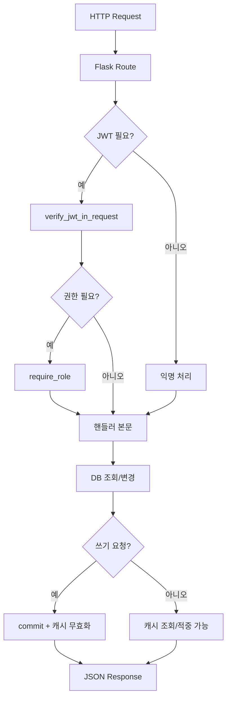

# 백엔드 아키텍처 설명서 (Korean)

## 1. 아키텍처 요약
이 백엔드는 Flask 기반 단일 API 서버이며, 다음 공통 계층을 모든 게시판/기능에 공통 적용합니다.

- 인증/인가: JWT + 역할 기반 접근 제어(`require_role`)
- 데이터 계층: SQLAlchemy ORM + 소프트 삭제(`deleted_at`) 패턴
- 운영 안정성: Rate Limit, 캐시(Redis/NullCache fallback), 보안 헤더
- 파일 처리: scope 기반 업로드 디렉터리/URL 정책 + MIME/시그니처 검증

핵심 진입점은 `backend/app.py`의 `create_app` 입니다.

## 2. 요청 처리 라이프사이클

## 3. 인증/인가 모델

### 3.1 JWT와 Principal
- `utils/security.py`의 `get_current_principal()`이 `{id, role}` 형태로 principal을 구성합니다.
- JWT claim에 role이 있으면 DB 조회 없이 권한 판별이 가능합니다.
- legacy 토큰(역할 claim 없음)은 `get_current_user()` fallback으로 DB 조회를 수행합니다.

### 3.2 역할 정책
- `admin`: 모든 보드/승인/삭제 권한
- `student_council`: 공지/일부 공식 응답 작성 권한
- `student`, `teacher`: 일반 사용자 권한(기능별 세부 차등)

### 3.3 토큰 상태 관리
- `utils/security_tokens.py`가 토큰 발급/로테이션/폐기를 담당합니다.
- `auth_tokens` 테이블을 진실 소스로 사용하여 “알 수 없는 JTI”도 차단합니다.
- 로그아웃 시 access는 즉시 폐기, refresh는 제공되면 추가 폐기 시도합니다.

## 4. 승인(Moderation) 워크플로우 공통 패턴
여러 보드(`free`, `club_recruit`, `subject_changes`, `petitions`, `surveys`, `gomsol_market`)에서 공통적으로:

1. 작성 시 `pending` 상태로 저장
2. 관리자 승인 시 `approved` 및 승인자 메타데이터 저장
3. 비관리자 목록 조회 시 “승인글 + 본인 글”만 노출
4. 상세 조회도 동일한 가시성 규칙 적용

이 패턴은 “운영자 검수 + 작성자 자기글 확인” 요구를 동시에 만족하기 위한 설계입니다.

## 5. 캐시 전략

### 5.1 설계
- 데코레이터: `@cache_json_response(namespace, ttl=...)`
- 키 구성: `method + path + normalized query + auth fingerprint`
- auth fingerprint는 Authorization 원문 대신 해시를 사용합니다.

### 5.2 무효화
- 쓰기 성공 후 `invalidate_cache_namespaces(...)` 호출
- 네임스페이스 인덱스를 통해 관련 캐시 키를 일괄 삭제합니다.

### 5.3 장애 내성
- Redis 미연결 시 `NullCache`로 자동 fallback
- 캐시 실패가 API 실패로 전파되지 않도록 방어적 처리

## 6. 레이트 리밋 전략
- 키 함수 우선순위: 로그인 사용자(`user:<id>`) > 익명 IP(`ip:<addr>`)
- 블루프린트 공통 쓰기 제한: `POST/PUT/PATCH/DELETE`
- 인증 엔드포인트(register/login/refresh)는 별도 제한값 사용
- 초과 시 일관된 429 JSON + 선택적 `Retry-After`

## 7. 파일 업로드/서빙 보안 모델

### 7.1 업로드
- scope별 디렉터리/URL prefix를 강제 (`UPLOAD_SCOPE_DIRS`, `UPLOAD_ROUTE_PREFIXES`)
- 확장자 + MIME + 시그니처(헤더 바이트) 삼중 검증
- 이미지 전용 endpoint는 `require_image=True`로 추가 제한

### 7.2 서빙
- 대부분 “DB에 연결된 리소스인지” 확인 후 접근 허용
- 게시글/공지 저장 전 임시 업로드는 파일 존재 시 preview 허용 fallback
- `X-Content-Type-Options: nosniff` 고정 적용

## 8. 데이터 모델링 규칙
- 소프트 삭제: `deleted_at` 컬럼으로 논리 삭제
- 카운터 캐시: `views`, `comments_count`, `votes_count`, `total_votes` 등
- 유니크 제약: 중복 반응/중복 투표/중복 응답 방지
- serializer 계약:
  - 상세: `to_dict(...)`
  - 목록: `to_list_dict(...)`
  - 프론트 계약 안정성을 위해 camelCase 키를 유지

## 9. 크레딧(설문/투표) 경제 규칙
- `SurveyCredit`가 사용자별 `base + earned - used`를 관리
- 설문 응답 시:
  - 설문 소유자 credit 소비
  - 응답자(타인 설문) credit 보상
- 투표 응답 시:
  - 응답자 credit 보상(`VOTE_REWARD_CREDITS`)

## 10. 온보딩 체크리스트
새 기여자가 가장 먼저 보면 좋은 파일:

1. `backend/app.py`: 앱 부팅, 공통 미들웨어, 블루프린트 등록
2. `backend/config.py`: 환경변수/운영 정책
3. `backend/utils/security.py`: 인증/인가 핵심
4. `backend/utils/cache.py`: 캐시 키/무효화 규칙
5. `backend/routes/surveys.py`, `backend/routes/petitions.py`: 복합 비즈니스 로직 예시
6. `backend/utils/files.py`: 업로드 보안 규칙

## 11. 변경 시 주의사항
- 응답 필드명(특히 camelCase)은 프론트와 결합되어 있으므로 변경 시 프론트 동시 반영 필요
- 승인/가시성 분기 로직은 보드별로 비슷하지만 약간 다르므로 복사 수정 시 권한 누락에 주의
- 캐시 네임스페이스 누락 시 stale 응답이 남을 수 있으므로 쓰기 endpoint 추가 시 무효화 필수
