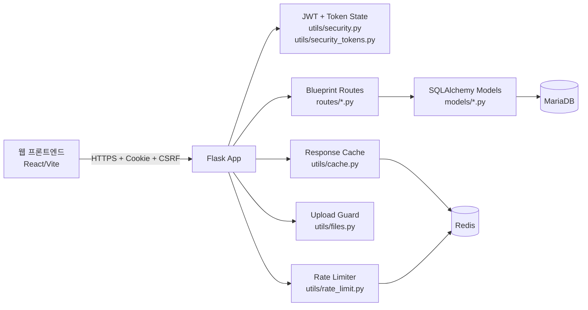
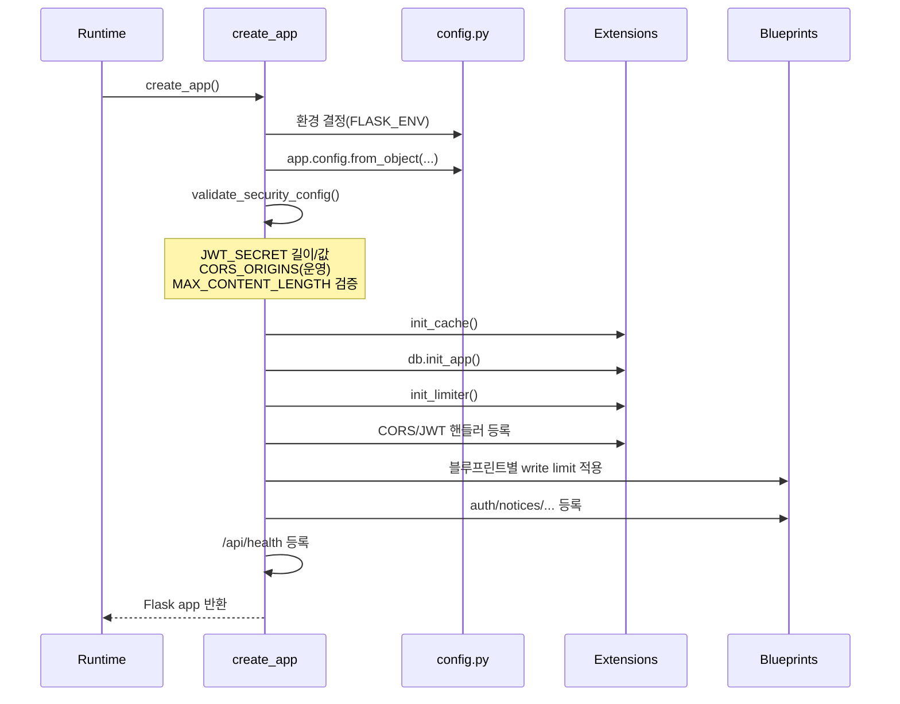
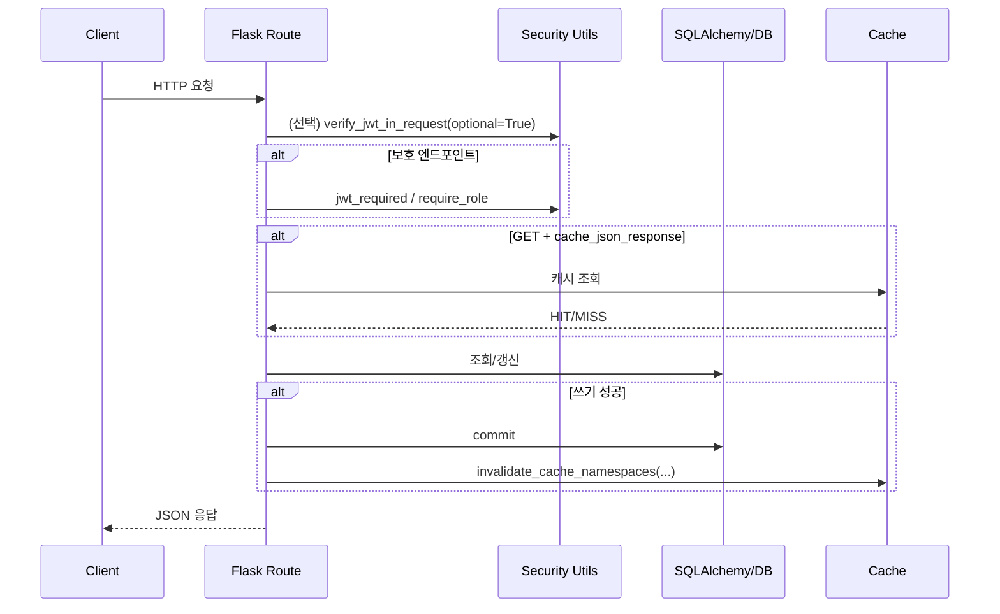
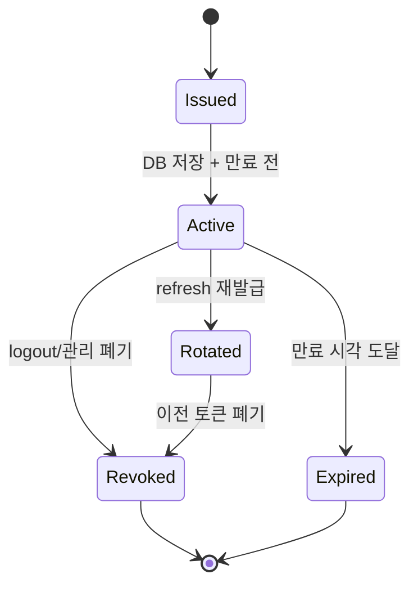
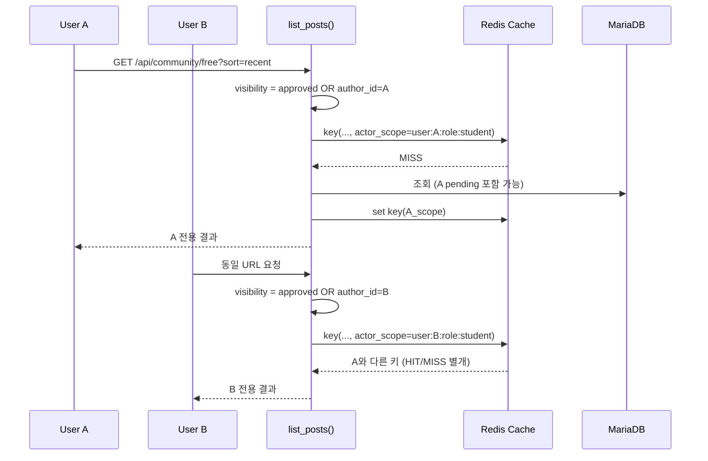
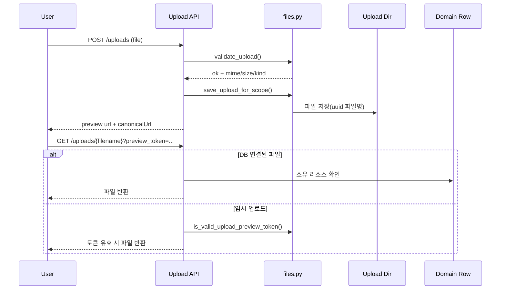

# 백엔드 아키텍처 문서

`backend` 코드를 소스 오브 트루스로 정리한 아키텍처 문서입니다.  
대상 독자는 신규 백엔드 개발자/운영자이며, 실제 런타임 정책(`app.py`, `config.py`, `utils/*`)을 중심으로 설명합니다.

## 1. 시스템 개요

이 서비스는 **Flask 단일 API 애플리케이션**이며, 인증·인가·캐시·레이트리밋·업로드 검증을 공통 유틸 계층에서 제공한 뒤 기능별 블루프린트(`routes/*`)로 도메인 API를 분리합니다.

핵심 특징:

1. 인증: JWT를 **쿠키(`JWT_TOKEN_LOCATION=['cookies']`)**로 운용
2. 세션 무효화: `auth_tokens` 테이블 기반 서버 주도 토큰 폐기
3. 운영 방어: 보안 설정 fail-fast + 레이트리밋 + 보안 헤더
4. 데이터 일관성: 소프트 삭제(`deleted_at`) + 카운터 캐시 + 유니크 제약

## 2. 앱 부팅 순서 (`app.py:create_app`)

`create_app()`은 “설정 검증 → 확장 초기화 → 라우트 등록” 순서를 강제합니다.

## 3. 계층 구조와 책임

| 계층 | 주요 파일 | 책임 |
|---|---|---|
| App Bootstrap | `app.py`, `config.py` | 환경/보안 정책 로딩, 확장 초기화, 블루프린트 등록 |
| Route Layer | `routes/*.py` | HTTP 입력 검증, 권한 체크, 응답 직렬화, 도메인 흐름 오케스트레이션 |
| Domain/Data Layer | `models/*.py` | 엔티티, enum, 관계, 직렬화(`to_dict`) |
| Security Utils | `utils/security.py`, `utils/security_tokens.py` | 비밀번호 해시, 권한 데코레이터, principal 해석, 토큰 회전/폐기 |
| Infra Utils | `utils/cache.py`, `utils/rate_limit.py`, `utils/files.py`, `utils/pagination.py` | 캐시/레이트리밋/업로드 검증/페이지네이션 규약 |

## 4. 요청 처리 시퀀스

## 5. 인증/인가 아키텍처

### 5.1 인증 매체

1. Access/Refresh JWT를 HttpOnly 쿠키로 발급
2. 비안전 메서드(`POST/PUT/PATCH/DELETE`)에 `X-CSRF-TOKEN` 요구
3. `/api/auth/refresh`는 refresh 토큰 회전(rotate) 수행

### 5.2 권한 모델

`UserRole`:

- `admin`: 전체 관리 권한
- `student_council`: 공지/공식 답변/일부 관리 기능
- `teacher`, `student`: 일반 사용자

`require_role(...)` 동작:

1. JWT role claim 우선 사용(핫패스 DB 조회 절감)
2. legacy 토큰(역할 claim 없음)은 사용자 조회 후 판정
3. `admin`은 role gate 우회 허용

### 5.3 토큰 상태 저장소

`auth_tokens` 테이블이 세션 상태의 단일 진실 소스입니다.

- 존재하지 않는 JTI: 차단
- `revoked_at` 존재: 차단
- refresh 회전 시 부모 refresh 토큰 자동 폐기/교체 링크(`replaced_by_jti`) 저장

## 6. 캐시 아키텍처

### 6.1 런타임 모드

`init_cache()`는 부팅 시 Redis 실연결(`PING`) 성공 여부를 검사해 캐시 모드를 결정합니다.

- `redis`: 실제 캐시 read/write 활성
- `fallback-null`: `CACHE_ENABLED=true`지만 Redis 연결 실패 → `NullCache`로 강등
- `disabled`: `CACHE_ENABLED=false`로 명시 비활성

핵심은 **API 가용성을 우선**한다는 점입니다. Redis 장애가 발생해도 요청은 계속 처리되고, 캐시만 비활성화됩니다.

### 6.2 캐시 저장/조회 조건

`@cache_json_response(namespace, ttl?)`는 아래 조건을 모두 만족할 때만 동작합니다.

1. 요청 메서드가 `GET`
2. 런타임 모드가 `redis`
3. 호출자가 `admin`이 아님
4. 응답이 `2xx + JSON + non-streaming(direct_passthrough=False)`

즉, admin GET/비GET/에러 응답/파일 스트리밍 응답은 캐시하지 않습니다.

디버깅이 필요하면 `CACHE_DEBUG_HEADERS=true`로 `X-Cache: HIT|MISS|BYPASS`를 확인할 수 있습니다.

### 6.3 키 설계와 권한 격리

캐시 키 원문은 아래 요소를 결합한 뒤 SHA-256 해시로 축약합니다.

- `namespace`
- `request.method`
- `request.path`
- `normalized query` (키/값 정렬로 동치 쿼리 통합)
- `actor_scope`

`actor_scope` 규칙:

- 비로그인: `anon`
- 로그인: `user:{id}:role:{role_or_unknown}`

role claim이 없는 legacy 토큰은 DB에서 role을 1회 복구한 뒤 scope를 결정합니다.  
이 구조 때문에 **같은 URL이라도 사용자별로 캐시가 분리**됩니다.

### 6.4 "승인 전 본인 글만 보임"과 캐시의 결합 방식

승인 워크플로우가 있는 목록 엔드포인트는 비관리자에서 공통적으로 다음 가시성 조건을 갖습니다.

- 공개: `APPROVED`
- 예외 허용: `author_id == current_user.id` (본인 글)

대표 라우트:

- `free.list_posts`
- `club_recruit.list_recruits`
- `subject_changes.list_subject_changes`
- `petitions.list_petitions`
- `surveys.list_surveys`
- `gomsol_market.list_posts`

`free.list_posts`를 예로 들면:

1. 비관리자 요청 시 `status` 관리자 필터를 무력화
2. 최종 where 절에서 `approved OR author_id=current_user` 적용
3. 같은 요청 URL이어도 `actor_scope`가 사용자마다 달라 별도 캐시 키 생성

결과적으로:

- 사용자 A의 캐시에는 "A의 pending 글"이 포함될 수 있음
- 사용자 B/익명은 다른 scope 키를 사용하므로 A의 pending 결과를 재사용하지 않음

즉, "일반 사용자가 자신의 미승인 글을 본다"는 요구사항은 **라우트 SQL 가시성 규칙 + actor_scope 기반 캐시 분리**의 조합으로 안전하게 구현됩니다.

### 6.5 detail 캐시와 권한 체크

일부 detail GET도 캐시를 사용합니다(예: `petitions.get_petition`, `surveys.get_survey`, `votes.get_vote`).  
이 경우에도 권한 체크/개인화 필드 계산이 view 함수 내부에 존재하며, actor_scope가 다르면 캐시도 분리됩니다.

반대로 `free.get_post`, `club_recruit.get_recruit`, `subject_changes.get_subject_change`, `gomsol_market.get_post`는 캐시 데코레이터를 사용하지 않습니다.

### 6.6 무효화/인덱스 관리

쓰기 성공 경로는 `invalidate_cache_namespaces(...)`를 호출합니다.

- 네임스페이스 인덱스 키: `nsidx:{namespace}`
- 인덱스에는 실제 응답 키 목록을 저장
- 인덱스 최대 길이: 5000 (초과 시 오래된 키 제거)
- 인덱스 TTL: `max(CACHE_DEFAULT_TIMEOUT * 20, 3600)`

무효화/캐시 I/O 예외는 요청 실패로 전파하지 않습니다(운영 안정성 우선).

## 7. 레이트리밋 아키텍처

키 함수 우선순위:

1. 로그인 사용자: `user:<id>`
2. 익명: `ip:<remote_addr>`

적용 정책:

- 공통 쓰기 제한: 블루프린트 단위 `POST/PUT/PATCH/DELETE`
- 인증 엔드포인트 별도 제한:
  - register
  - login
  - refresh
- 초과 응답: 429 + JSON(`error_code=rate_limit_exceeded`) + `Retry-After`(가능 시)

## 8. 업로드 보안 아키텍처

업로드 정책은 `utils/files.py`에서 중앙화됩니다.

1. 스코프 고정: `UPLOAD_SCOPE_DIRS`, `UPLOAD_ROUTE_PREFIXES`
2. 검증 3단계:
   - 확장자 allowlist
   - MIME allowlist
   - 파일 시그니처(sniff) 검증
3. 임시 미리보기:
   - `preview_token` 서명 토큰(`itsdangerous`) 필요
   - TTL 기반 만료
4. 저장 URL 정규화:
   - 서버 canonical URL로 변환
   - HTML 본문 내 업로드 URL canonicalize

## 9. 데이터 모델 핵심 규칙

1. 소프트 삭제 표준: `deleted_at`
2. 카운터 캐시: `views`, `comments_count`, `votes_count`, `total_votes` 등
3. 중복 방지 유니크 제약:
   - 반응/북마크/투표/설문 응답
4. 직렬화 계약:
   - 프론트 계약 안정화를 위해 camelCase 중심 응답 유지

### 9.1 ER 다이어그램 (핵심 관계)

```mermaid
erDiagram
    USERS ||--o{ AUTH_TOKENS : owns

    USERS ||--o{ NOTICES : writes
    NOTICES ||--o{ ATTACHMENTS : has
    NOTICES ||--o{ COMMENTS : has
    NOTICES ||--o{ NOTICE_REACTIONS : has

    USERS ||--o{ FREE_POSTS : writes
    FREE_POSTS ||--o{ FREE_COMMENTS : has
    FREE_POSTS ||--o{ FREE_REACTIONS : has
    FREE_POSTS ||--o{ FREE_BOOKMARKS : has

    USERS ||--o{ CLUB_RECRUITS : writes
    USERS ||--o{ SUBJECT_CHANGES : writes
    SUBJECT_CHANGES ||--o{ SUBJECT_CHANGE_COMMENTS : has
    SUBJECT_CHANGES ||--o{ SUBJECT_CHANGE_LIKES : has

    USERS ||--o{ PETITIONS : writes
    PETITIONS ||--o{ PETITION_VOTES : has
    PETITIONS ||--|| PETITION_ANSWERS : has

    USERS ||--o{ SURVEYS : owns
    SURVEYS ||--o{ SURVEY_RESPONSES : has
    USERS ||--|| SURVEY_CREDITS : has

    USERS ||--o{ VOTES : creates
    VOTES ||--o{ VOTE_OPTIONS : has
    VOTES ||--o{ VOTE_RESPONSES : has

    USERS ||--o{ LOST_FOUND_POSTS : writes
    LOST_FOUND_POSTS ||--o{ LOST_FOUND_IMAGES : has
    LOST_FOUND_POSTS ||--o{ LOST_FOUND_COMMENTS : has

    USERS ||--o{ GOMSOL_MARKET_POSTS : writes
    GOMSOL_MARKET_POSTS ||--o{ GOMSOL_MARKET_IMAGES : has

    COUNTDOWN_EVENTS {
        int id PK
        string event_name
        datetime event_at
    }
```

> **참고:** `COUNTDOWN_EVENTS`는 사용자 소유가 아닌 독립 엔티티입니다. 공지 목록 응답에 다음 카운트다운 이벤트가 부가 데이터로 포함됩니다.

## 10. 보드 공통 승인(Moderation) 패턴

다음 보드는 공통적으로 승인 워크플로우를 가집니다.

- `free_posts`
- `club_recruits`
- `subject_changes`(approval_status)
- `petitions`(pending/approved/rejected)
- `surveys`
- `gomsol_market_posts`(approval_status)

공통 흐름:

1. 작성 시 `pending` 계열 상태
2. 관리자 승인 시 승인자/승인시각 기록
3. 비관리자 목록 조회는 “승인 + 본인 작성글”로 제한
4. 상세 조회에도 동일한 가시성 규칙 적용

## 11. 크레딧 경제(설문/투표)

`survey_credits`는 설문과 투표가 공유하는 사용자 크레딧 원장입니다.

- `available = base + earned - used`

설문 응답 시:

1. 설문 소유자 크레딧 1 소비
2. 응답자(타인 설문) 크레딧 +5 보상

투표 응답 시:

1. 응답자에게 `VOTE_REWARD_CREDITS`만큼 적립(기본 1)

## 12. 운영 관점 체크포인트

1. `validate_security_config()`가 부팅 시 필수 보안값 검증
2. 운영에서 HSTS는 HTTPS 요청일 때만 주입
3. `TRUST_PROXY_HEADERS=true` + `TRUSTED_PROXY_CIDRS` 비어 있음 조합은 위험(경고 로그)
4. 캐시/레이트리밋 장애는 요청 실패로 확산되지 않도록 설계

## 12.1 기술 선택 근거

| 결정 | 선택 | 근거 |
|---|---|---|
| Web Framework | Flask 3.1 | 학교 프로젝트 규모에 적합한 마이크로프레임워크; 블루프린트 기반 도메인 분리 용이 |
| ORM | SQLAlchemy + Flask-SQLAlchemy | 선언적 모델, 관계 매핑, 마이그레이션 지원 |
| DB Driver | PyMySQL | 순수 Python MariaDB/MySQL 호환 드라이버; C 확장 빌드 불필요로 배포 단순화 |
| Auth | Flask-JWT-Extended (Cookie) | 쿠키 기반 JWT + CSRF 이중 제출로 OWASP 권장 패턴 충족 |
| Cache | Flask-Caching + Redis | 응답 캐시와 레이트리밋 저장소를 Redis 하나로 통합; 장애 시 NullCache 강등 |
| Password | bcrypt | 업계 표준 적응형 해시; timing-safe 비교 내장 |

## 12.2 블루프린트 ↔ 모델 ↔ 캐시 네임스페이스 교차 참조표

| Blueprint | 주 모델 | 캐시 네임스페이스 | 쓰기 제한 |
|---|---|---|---|
| `auth` | `User`, `AuthToken` | (없음) | login/register/refresh 별도 |
| `notices` | `Notice`, `Attachment`, `Comment`, `NoticeReaction` | `notices` | 공통 write limit |
| `free` | `FreePost`, `FreeComment`, `FreeReaction`, `FreeBookmark` | `free` | 공통 write limit |
| `club_recruit` | `ClubRecruit` | `club_recruit` | 공통 write limit |
| `subject_changes` | `SubjectChange`, `SubjectChangeComment` | `subject_changes` | 공통 write limit |
| `petitions` | `Petition`, `PetitionVote`, `PetitionAnswer` | `petitions` | 공통 write limit |
| `surveys` | `Survey`, `SurveyResponse`, `SurveyCredit` | `surveys` | 공통 write limit |
| `votes` | `Vote`, `VoteOption`, `VoteResponse` | `votes` | 공통 write limit |
| `lost_found` | `LostFoundPost`, `LostFoundImage`, `LostFoundComment` | `lost_found` | 공통 write limit |
| `gomsol_market` | `GomsolMarketPost`, `GomsolMarketImage` | `gomsol_market` | 공통 write limit |

## 13. 온보딩 권장 읽기 순서

1. `app.py`
2. `config.py`
3. `utils/security.py`
4. `utils/security_tokens.py`
5. `utils/cache.py`
6. `utils/files.py`
7. `routes/surveys.py`
8. `routes/petitions.py`
9. `routes/notices.py`

## 14. 변경 시 아키텍처 체크리스트

1. 신규 쓰기 엔드포인트에 캐시 무효화 네임스페이스를 연결했는가
2. 권한 체크(`jwt_required`, `require_role`, 소유자 검증)가 누락되지 않았는가
3. 응답 키(camelCase) 변경 시 프론트 문서/코드 동기화가 되었는가
4. 업로드 URL을 canonical URL로 정규화하고 있는가
5. 레이트리밋 정책(특히 auth/쓰기)이 의도대로 적용되는가
