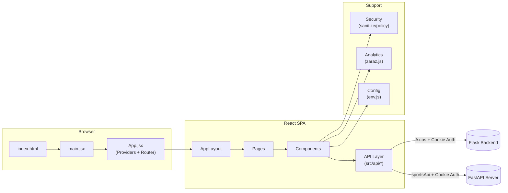
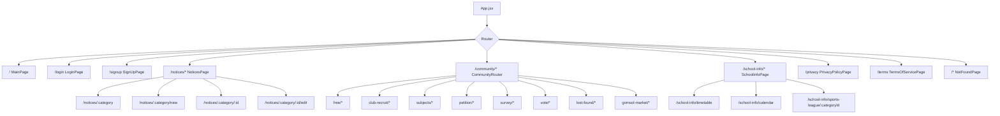

# beomseo.in Frontend

범서고 커뮤니티 서비스 `beomseo.in`의 React/Vite 프론트엔드입니다.  
공지, 커뮤니티(자유/동아리/청원/설문/투표/분실물/곰솔마켓/수학여행), 학교 생활 정보(시간표/학사 캘린더/스포츠리그 문자중계/팀별 라인업/개인별 순위), 인증, 분석 트래킹을 단일 SPA로 제공합니다.

## 프로젝트 개요

- 앱 타입: React SPA (`react-router-dom`)
- 빌드 도구: Vite
- 데이터 통신: Axios 기반 API 모듈 (`src/api/*`)
- 상태 관리: React Context (`ThemeContext`, `NetworkStatusContext`, `PwaInstallContext`, `AuthContext`)
- 실시간 동기화: 스포츠리그 화면에서 `EventSource + BroadcastChannel/localStorage + polling fallback`
- 수학여행 게시판: 반 비밀번호 기반 잠금 해제, 익명/로그인 글쓰기, rich HTML 본문, 5점 단위 점수판
- 보안 경계: URL/HTML/CSV sanitize 유틸리티 (`src/security/*`)
- 분석: Cloudflare Zaraz + GA4 이벤트 래퍼 (`src/analytics/zaraz.js`)

## 아키텍처 개요



### 앱 셸 런타임 메모

1. `src/App.jsx`는 `ThemeProvider → NetworkStatusProvider → PwaInstallProvider → AuthProvider` 순서로 전역 상태를 감쌉니다.
2. `src/api/auth.js`에서 transport 계열 네트워크 실패가 발생하면 `app:network-request-failed` 커스텀 이벤트를 발행합니다.
3. `NetworkStatusContext`는 브라우저 `online/offline` 이벤트와 위 커스텀 이벤트를 함께 받아 오프라인 상태를 판정합니다.
4. `OfflineGate`는 오프라인일 때 전체 화면 오버레이를 띄우고, 배경 문서 스크롤을 잠급니다.
5. PWA 설치 상태는 `PwaInstallContext`가 관리하며, `beforeinstallprompt` 지원 브라우저와 iOS Safari 수동 설치 경로를 분리해서 처리합니다.

## 기술 스택

| 구분 | 사용 기술 |
|---|---|
| Runtime | `react`, `react-dom` |
| Router | `react-router-dom` |
| HTTP Client | `axios` |
| Charts | `recharts` |
| Form Builder | `react-form-builder2` |
| Rich Content Sanitizing | `dompurify` |
| Icons | `lucide-react` |
| Bundler | `vite` |
| Lint | `eslint` |

## 사전 요구사항

- Node.js 20+
- npm 10+

## 로컬 실행

1. 의존성 설치

```bash
npm install
```

2. 환경 변수 파일 준비

```bash
cp .env.example .env
```

3. 개발 서버 실행

```bash
npm run dev
```

4. 프로덕션 빌드 확인

```bash
npm run build
npm run preview
```

## 환경 변수

`frontend/.env.example` 기준으로 설정합니다.

| 변수명 | 기본값 | 설명 |
|---|---|---|
| `VITE_API_URL` | `http://localhost:5000/` | 백엔드 API Base URL |
| `VITE_ENABLE_API_MOCKS` | `0` | 개발 환경 네트워크 실패 시 mock fallback 활성화 (`1`/`0`) |
| `VITE_ANALYTICS_ENABLED` | `1` | 분석 이벤트 전송 전체 활성화 |
| `VITE_ANALYTICS_ALLOW_IN_DEV` | `0` | 개발 환경에서도 트래킹 허용 여부 |
| `VITE_ANALYTICS_ALLOWED_HOSTS` | `beomseo.in` | 이벤트 전송 허용 host 목록 (`,` 구분, `*` 지원) |
| `VITE_ANALYTICS_BLOCKED_KEYS` | `nickname,password,email,token,refresh_token,access_token` | 트래킹 payload에서 제거할 민감 키 |
| `VITE_APP_NAME` | `beomseo.in` | 헤더/푸터 앱 표시 이름 |
| `VITE_ALLOWED_ASSET_HOSTS` | `""` | 외부 에셋 허용 host 목록 (비어 있으면 모두 허용) |
| `VITE_UPLOAD_MAX_ATTACHMENTS` | `5` | 첨부 파일 최대 개수 |
| `VITE_UPLOAD_MAX_IMAGES` | `5` | 이미지 최대 개수 |
| `VITE_UPLOAD_MAX_FILE_SIZE_MB` | `10` | 업로드 파일 최대 용량(MB) |
| `VITE_PETITION_THRESHOLD_DEFAULT` | `50` | 청원 기본 임계치 |
| `VITE_SPORTS_LEAGUE_API_URL` | `VITE_API_URL` | 스포츠리그 + 수학여행 FastAPI 서버 URL (미설정 시 Flask fallback) |

## 라우팅 개요

최상위 라우트는 `src/App.jsx`에 정의되어 있으며, 모든 페이지 컴포넌트는 `lazy()` 로딩됩니다.



세부 라우트/기능별 연결은 [frontend-code-map.md](docs/frontend-code-map.md)에서 확인할 수 있습니다.

### 헤더와 정적 법적 페이지

- `Header`의 커뮤니티 메뉴는 `CLUB_RECRUIT_BOARD_ENABLED` 환경변수에 따라 동아리 모집 링크를 조건부로 노출합니다.
- 학교 생활 정보 메뉴의 스포츠리그 링크는 기본 카테고리 ID로 바로 연결됩니다.
- `/privacy`, `/terms` 페이지는 정적 법적 문서이며, 페이지 내부 목차(anchor)와 `맨 위로` 스크롤 헬퍼를 직접 렌더링합니다.

## 스포츠리그 문자중계 동기화

- 초기 진입은 `src/api/sportsLeague.js`가 메모리/`localStorage` 캐시를 먼저 읽고, 백엔드 snapshot을 백그라운드에서 다시 가져오는 **stale-while-revalidate** 방식으로 시작합니다.
- 스포츠리그 REST 호출과 SSE 스트림은 전용 `sportsApi` Axios 인스턴스를 사용합니다. `VITE_SPORTS_LEAGUE_API_URL` 환경변수로 FastAPI 서버 주소를 지정하며, 미설정 시 기존 Flask 서버로 fallback합니다.
- 실시간 수신은 `GET /api/sports-league/categories/:categoryId/stream` EventSource를 사용하고, 스트림 오류 시 5초 polling + 3초 재연결로 복구를 시도합니다.
- 팀별 라인업/개인별 순위는 `usePlayersStore`가 별도 `/players` API로 관리합니다. 즉, 선수 데이터는 snapshot/SSE에 포함되지 않고 진입 시 조회 + 수정 응답으로만 갱신됩니다.
- 다른 탭과의 동기화는 `BroadcastChannel`을 우선 사용하고, 지원되지 않는 브라우저에서는 `storage` 이벤트로 폴백합니다.
- 개발 환경에서 `VITE_ENABLE_API_MOCKS=1`이고 네트워크 계열 실패가 나면 `src/api/mocks/sportsLeague.mock.js`가 동일한 snapshot 계약을 흉내 냅니다.
- mock transport는 선수 라인업도 별도 `beomseo:sports-league:players:{categoryId}` localStorage 키 공간에 저장해 snapshot 캐시와 분리합니다.

## 오프라인 및 PWA 설치 흐름

- 오프라인 상태는 단순 `navigator.onLine`만 쓰지 않고, `/api/health` 재확인 결과까지 합쳐서 판단합니다.
- 브라우저가 `online` 이벤트를 보내도 API origin이 실제로 죽어 있으면 `recheckConnection()`이 계속 오프라인 상태를 유지합니다.
- 인증 클라이언트 외 다른 API 모듈도 필요하면 같은 `app:network-request-failed` 이벤트 패턴을 재사용할 수 있습니다.
- iOS Safari는 설치 프롬프트 API가 없기 때문에 `promptInstall()` 호출 시 도움말 UI를 여는 `manual` 경로를 사용합니다.

## 수학여행 게시판 흐름

- 허브(`/community/field-trip`)와 반 게시판(`/community/field-trip/classes/:classId`)은 분리된 경로를 사용합니다.
- 글 상세는 `/community/field-trip/classes/:classId/posts/:postId`, 수정은 `/edit` 전용 경로를 사용합니다.
- 반 비밀번호를 확인하면 해당 브라우저 세션에서 게시판 읽기와 anonymous 작성이 가능해집니다.
- 로그인 사용자가 글을 작성하면 계정 닉네임/역할이 자동 반영되고, anonymous 작성은 별도 닉네임 입력을 사용합니다.
- 본문은 notices editor를 재사용한 rich HTML이며, 미션 카드 preview는 plain-text로만 표시합니다.
- 수학여행 첨부/본문 이미지 URL은 Flask base가 아니라 FastAPI base를 기준으로 절대경로화됩니다.
- 점수 조정은 `±5` 단위만 허용되고, 게시판 비밀번호/설명 수정은 `admin`만 가능합니다.

## 404 처리 및 Nginx 운영 메모

- React 라우터는 존재하지 않는 경로를 전역 `NotFoundPage`로 렌더링합니다.
- `community`, `notices`, `school-info` 내부의 잘못된 하위 경로도 더 이상 기본 목록으로 리다이렉트하지 않고 404 화면을 보여줍니다.
- 브라우저가 이미 로드된 뒤의 클라이언트 내비게이션에서는 HTTP 상태코드를 바꿀 수 없습니다. 직접 URL 진입/새로고침 시의 HTTP `404`는 Nginx에서 route allowlist로 제어해야 합니다.
- 프론트 라우트를 추가/변경하면 React 라우트와 함께 Nginx allowlist도 반드시 같이 갱신해야 합니다.

예시 스케치:

```nginx
map $uri $spa_route_ok {
    default 0;
    ~^/$ 1;
    ~^/(login|signup|privacy|terms)/?$ 1;
    ~^/notices/?$ 1;
    ~^/notices/(school|council)/?$ 1;
    ~^/notices/(school|council)/new/?$ 1;
    ~^/notices/(school|council)/[0-9]+/?$ 1;
    ~^/notices/(school|council)/[0-9]+/edit/?$ 1;
    ~^/community/?$ 1;
    ~^/community/(free|club-recruit|subjects|petition|survey|vote|lost-found|gomsol-market)/?$ 1;
    ~^/community/(free|club-recruit|subjects|petition|survey|vote|lost-found|gomsol-market)/new/?$ 1;
    ~^/community/(free|club-recruit|subjects|petition|survey|vote|lost-found|gomsol-market)/[0-9]+/?$ 1;
    ~^/community/survey/[0-9]+/(edit|results)/?$ 1;
    ~^/school-info/?$ 1;
    ~^/school-info/(timetable|meal|calendar)/?$ 1;
    ~^/school-info/sports-league/?$ 1;
    ~^/school-info/sports-league/[A-Za-z0-9._-]+/?$ 1;
}

server {
    root /var/www/beomseo/frontend/dist;
    index index.html;

    location /api/ {
        proxy_pass http://backend_upstream;
    }

    location /assets/ {
        try_files $uri =404;
    }

    location / {
        try_files $uri $uri/ @spa;
    }

    location @spa {
        error_page 404 /index.html;

        if ($spa_route_ok = 0) {
            return 404;
        }

        rewrite ^ /index.html break;
    }
}
```

주의:

- 위 예시는 운영 서버 블록 구조에 맞게 조정해야 합니다.
- `/assets`, 이미지, favicon 같은 정적 파일 요청은 반드시 실제 파일 기준 `404`를 유지해야 합니다.
- `/api/...` 경로는 SPA fallback에 포함하지 않습니다.

## 백엔드 인증 계약

프론트는 백엔드 인증을 **Bearer 헤더가 아닌 쿠키 기반 JWT + CSRF**로 사용합니다.

1. 모든 인증 요청은 `withCredentials: true`를 사용합니다.
2. 비안전 메서드(`POST`, `PUT`, `PATCH`, `DELETE`)는 `X-CSRF-TOKEN` 헤더를 포함해야 합니다.
3. 토큰 저장/전달은 HttpOnly 쿠키(`access_token_cookie`, `refresh_token_cookie`)를 기준으로 합니다.

## 문서 인덱스

- [프론트엔드 코드 맵](docs/frontend-code-map.md)
- [프론트엔드 아키텍처](docs/frontend-architecture.md)
- [프론트엔드 API 레퍼런스](docs/frontend-api-reference.md)
- [Analytics 트래킹 스펙](docs/analytics-tracking.md)
- [팀 체크리스트](docs/team-checklist.md)

백엔드 문서:

- [backend/README.md](../backend/README.md)
- [backend/docs/backend_api.md](../backend/docs/backend_api.md)
- [backend/docs/backend_architecture.md](../backend/docs/backend_architecture.md)

## 기여 전 체크포인트

- 코드 변경 시 연관 문서를 함께 업데이트합니다.
- 라우트 추가/변경 시 `frontend-code-map.md`를 동기화합니다.
- `src/api/*` 변경 시 `frontend-api-reference.md`를 동기화합니다.
- 트래킹 이벤트/파라미터 변경 시 `analytics-tracking.md`를 동기화합니다.
- 세부 체크 항목은 [team-checklist.md](docs/team-checklist.md)를 사용합니다.
