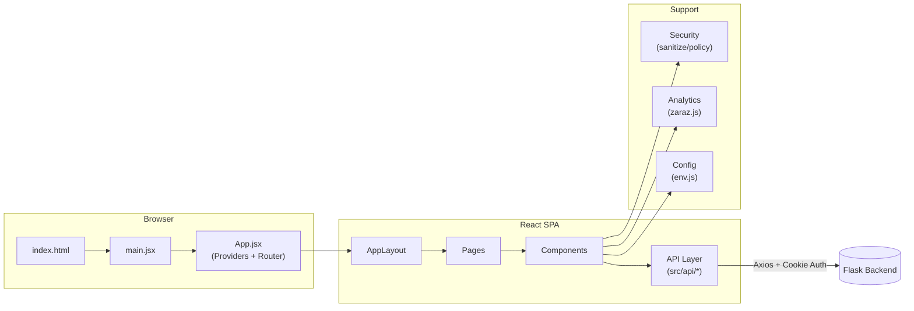
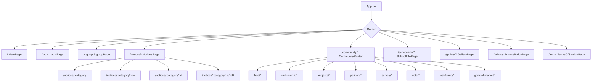

# beomseo.in Frontend

범서고 커뮤니티 서비스 `beomseo.in`의 React/Vite 프론트엔드입니다.  
공지, 커뮤니티(자유/동아리/청원/설문/투표/분실물/곰솔마켓), 인증, 분석 트래킹을 단일 SPA로 제공합니다.

## 프로젝트 개요

- 앱 타입: React SPA (`react-router-dom`)
- 빌드 도구: Vite
- 데이터 통신: Axios 기반 API 모듈 (`src/api/*`)
- 상태 관리: React Context (`AuthContext`, `ThemeContext`)
- 보안 경계: URL/HTML/CSV sanitize 유틸리티 (`src/security/*`)
- 분석: Cloudflare Zaraz + GA4 이벤트 래퍼 (`src/analytics/zaraz.js`)

## 아키텍처 개요



## 기술 스택

| 구분 | 사용 기술 |
|---|---|
| Runtime | `react`, `react-dom` |
| Router | `react-router-dom` |
| HTTP Client | `axios` |
| Charts | `recharts` |
| Form Builder | `react-form-builder2` |
| Rich Content Sanitizing | `dompurify` |
| Icons | `lucide-react` |
| Bundler | `vite` |
| Lint | `eslint` |

## 사전 요구사항

- Node.js 20+
- npm 10+

## 로컬 실행

1. 의존성 설치

```bash
npm install
```

2. 환경 변수 파일 준비

```bash
cp .env.example .env
```

3. 개발 서버 실행

```bash
npm run dev
```

4. 프로덕션 빌드 확인

```bash
npm run build
npm run preview
```

## 환경 변수

`frontend/.env.example` 기준으로 설정합니다.

| 변수명 | 기본값 | 설명 |
|---|---|---|
| `VITE_API_URL` | `http://localhost:5000/` | 백엔드 API Base URL |
| `VITE_ENABLE_API_MOCKS` | `0` | 개발 환경 네트워크 실패 시 mock fallback 활성화 (`1`/`0`) |
| `VITE_ANALYTICS_ENABLED` | `1` | 분석 이벤트 전송 전체 활성화 |
| `VITE_ANALYTICS_ALLOW_IN_DEV` | `0` | 개발 환경에서도 트래킹 허용 여부 |
| `VITE_ANALYTICS_ALLOWED_HOSTS` | `beomseo.in` | 이벤트 전송 허용 host 목록 (`,` 구분, `*` 지원) |
| `VITE_ANALYTICS_BLOCKED_KEYS` | `nickname,password,email,token,refresh_token,access_token` | 트래킹 payload에서 제거할 민감 키 |
| `VITE_APP_NAME` | `beomseo.in` | 헤더/푸터 앱 표시 이름 |
| `VITE_ALLOWED_ASSET_HOSTS` | `""` | 외부 에셋 허용 host 목록 (비어 있으면 모두 허용) |
| `VITE_UPLOAD_MAX_ATTACHMENTS` | `5` | 첨부 파일 최대 개수 |
| `VITE_UPLOAD_MAX_IMAGES` | `5` | 이미지 최대 개수 |
| `VITE_UPLOAD_MAX_FILE_SIZE_MB` | `10` | 업로드 파일 최대 용량(MB) |
| `VITE_PETITION_THRESHOLD_DEFAULT` | `50` | 청원 기본 임계치 |

## 라우팅 개요

최상위 라우트는 `src/App.jsx`에 정의되어 있으며, 모든 페이지 컴포넌트는 `lazy()` 로딩됩니다.



세부 라우트/기능별 연결은 [frontend-code-map.md](docs/frontend-code-map.md)에서 확인할 수 있습니다.

## 백엔드 인증 계약

프론트는 백엔드 인증을 **Bearer 헤더가 아닌 쿠키 기반 JWT + CSRF**로 사용합니다.

1. 모든 인증 요청은 `withCredentials: true`를 사용합니다.
2. 비안전 메서드(`POST`, `PUT`, `PATCH`, `DELETE`)는 `X-CSRF-TOKEN` 헤더를 포함해야 합니다.
3. 토큰 저장/전달은 HttpOnly 쿠키(`access_token_cookie`, `refresh_token_cookie`)를 기준으로 합니다.

## 문서 인덱스

- [프론트엔드 코드 맵](docs/frontend-code-map.md)
- [프론트엔드 아키텍처](docs/frontend-architecture.md)
- [프론트엔드 API 레퍼런스](docs/frontend-api-reference.md)
- [Analytics 트래킹 스펙](docs/analytics-tracking.md)
- [팀 체크리스트](docs/team-checklist.md)

백엔드 문서:

- [backend/README.md](../backend/README.md)
- [backend/docs/backend_api.md](../backend/docs/backend_api.md)
- [backend/docs/backend_architecture.md](../backend/docs/backend_architecture.md)

## 기여 전 체크포인트

- 코드 변경 시 연관 문서를 함께 업데이트합니다.
- 라우트 추가/변경 시 `frontend-code-map.md`를 동기화합니다.
- `src/api/*` 변경 시 `frontend-api-reference.md`를 동기화합니다.
- 트래킹 이벤트/파라미터 변경 시 `analytics-tracking.md`를 동기화합니다.
- 세부 체크 항목은 [team-checklist.md](docs/team-checklist.md)를 사용합니다.
