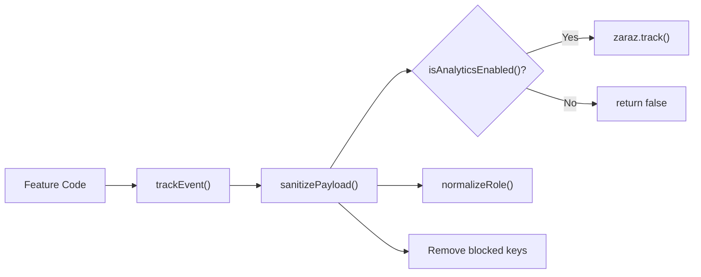

# Analytics Tracking Spec (GA4 via Cloudflare Zaraz)

프론트엔드에서 발생하는 분석 이벤트의 전송 조건, 이벤트 스키마, 개인정보 보호 규칙을 정의합니다.

## 문서 메타

| 항목 | 내용 |
|---|---|
| 대상 독자 | FE 개발자, 분석 담당자 |
| 소스 오브 트루스 | `src/analytics/zaraz.js`, `src/context/AuthContext.jsx`, `src/api/*.js` |
| 연계 문서 | [frontend-api-reference.md](./frontend-api-reference.md), [team-checklist.md](./team-checklist.md) |

## 1. 트래킹 아키텍처

- 이벤트 전송 함수: `trackEvent(eventName, params)`
- 전송 대상: `window.zaraz.track`
- 전송 실패 정책: 런타임 에러를 throw하지 않고 `false` 반환
- 공통 파라미터 보강: `page_path` 자동 주입 (미지정 시 현재 `pathname + search`)

## 2. 이벤트 전송 게이팅 규칙

`isAnalyticsEnabled()`가 `true`일 때만 전송합니다.

| 조건 | 설명 |
|---|---|
| `VITE_ANALYTICS_ENABLED` | `false`로 해석되면 즉시 비활성화 |
| `VITE_ANALYTICS_ALLOW_IN_DEV` | `false`일 때 `import.meta.env.PROD`가 아닌 환경에서 비활성화 |
| 허용 host | `VITE_ANALYTICS_ALLOWED_HOSTS`에 현재 `window.location.hostname`이 포함되어야 함 (`*` 허용) |
| Zaraz 런타임 | `window.zaraz.track` 함수가 존재해야 함 |

기본값:

- `VITE_ANALYTICS_ENABLED=1`
- `VITE_ANALYTICS_ALLOW_IN_DEV=0`
- `VITE_ANALYTICS_ALLOWED_HOSTS="beomseo.in"`

## 3. 개인정보/민감정보 보호 규칙

### 3.1 차단 키 (기본값)

다음 키는 payload 어디에 있든 제거됩니다.

- `nickname`
- `password`
- `email`
- `token`
- `refresh_token`
- `access_token`

환경변수 `VITE_ANALYTICS_BLOCKED_KEYS`로 덮어쓸 수 있습니다.

### 3.2 sanitize 동작

- 객체/배열은 재귀적으로 순회하여 민감 키를 제거
- `function`, `symbol`, `null/undefined`는 제거 또는 생략
- 전송 전 최종 payload는 sanitize 결과만 사용

## 4. 이벤트 카탈로그

### 4.1 인증 이벤트

| 이벤트명 | 발생 위치 | 파라미터 |
|---|---|---|
| `login` | `AuthContext.login()` 성공 | `user_role`, `page_path` |
| `login_failed` | `AuthContext.login()` 실패 | `error_type`, `page_path` |
| `sign_up` | `AuthContext.register()` 성공 | `user_role`, `page_path` |
| `sign_up_failed` | `AuthContext.register()` 실패 | `error_type`, `page_path` |

### 4.2 게시글 생성 이벤트

게시판별 `create()` 성공/실패 시 아래 이벤트를 사용합니다.

| 이벤트명 | 발생 위치 | 파라미터 |
|---|---|---|
| `post_created` | 각 `src/api/*.js`의 `create()` 성공 | `board_type`, `user_role`, `approval_status`, `page_path` |
| `post_create_failed` | 각 `src/api/*.js`의 `create()` 실패(실제 API 실패) | `board_type`, `user_role`, `error_type`, `page_path` |

`post_create_failed`는 mock fallback으로 처리되는 개발용 네트워크 실패를 제외하고 기록됩니다.

## 5. 파라미터 정의

### 5.1 `board_type`

현재 코드에서 사용되는 값:

- `notice`
- `free_board`
- `club_recruit`
- `subject_change`
- `petition`
- `survey`
- `vote`
- `lost_found`
- `gomsol_market`

### 5.2 `user_role`

- 작성자/사용자 role 문자열
- 예: `admin`, `student_council`, `student`, `teacher`

### 5.3 `approval_status`

- 게시글 상태 관련 문자열
- 예: `approved`, `pending`, `open`, `closed`, `selling`, `sold`

### 5.4 `error_type`

`normalizeErrorType()` 기준:

- `validation_error`
- `auth_error`
- `network_error`
- `server_error`
- `unknown_error`

### 5.5 `page_path`

- 현재 URL의 `pathname + search`
- 별도 지정하지 않으면 자동 주입

## 6. 이벤트 소스 오브 트루스 맵

| 파일 | 관련 함수 |
|---|---|
| `src/analytics/zaraz.js` | `trackEvent`, `trackAuthSuccess`, `trackAuthFailure`, `trackPostCreated`, `trackPostCreateFailed` |
| `src/context/AuthContext.jsx` | `login()`, `register()` 내부 성공/실패 트래킹 |
| `src/api/notices.js` | `create()` 성공/실패 트래킹 |
| `src/api/community.js` | `create()` 성공/실패 트래킹 |
| `src/api/clubRecruit.js` | `create()` 성공/실패 트래킹 |
| `src/api/subjectChanges.js` | `create()` 성공/실패 트래킹 |
| `src/api/petition.js` | `create()` 성공/실패 트래킹 |
| `src/api/survey.js` | `create()` 성공/실패 트래킹 |
| `src/api/vote.js` | `create()` 성공/실패 트래킹 |
| `src/api/lostFound.js` | `create()` 성공/실패 트래킹 |
| `src/api/gomsolMarket.js` | `create()` 성공/실패 트래킹 |

## 7. 검증 시나리오

1. `localhost` 환경에서 이벤트가 전송되지 않는지 확인합니다.
2. 허용 host에서 `login`/`login_failed`가 각각 1회씩 기록되는지 확인합니다.
3. `sign_up`/`sign_up_failed` 이벤트가 기대 파라미터와 함께 기록되는지 확인합니다.
4. 각 보드 생성 성공 시 `post_created` + 올바른 `board_type`이 기록되는지 확인합니다.
5. 실제 API 실패 시 `post_create_failed`가 기록되고 `error_type`이 분류되는지 확인합니다.
6. payload에 차단 키(`email`, `token` 등)가 포함되지 않는지 확인합니다.
7. `page_path`가 자동 주입되는지 확인합니다.

## 8. 운영 주의사항

- 신규 이벤트 추가 시 반드시 `analytics-tracking.md`와 `team-checklist.md`를 함께 업데이트합니다.
- `VITE_ANALYTICS_ALLOWED_HOSTS`를 `*`로 설정하면 오탐 전송 위험이 커지므로 운영 환경에서는 도메인 명시를 권장합니다.
- 분석 이벤트 스키마 변경 시 대시보드/키 이벤트 설정(GA4/Zaraz) 동기화를 먼저 확인합니다.
