# Frontend Architecture

프론트엔드 아키텍처의 계층, 데이터 흐름, 인증/복구 전략, 보안 경계를 신규 기여자 관점에서 설명합니다.

## 문서 메타

| 항목 | 내용 |
|---|---|
| 대상 독자 | 신규 FE 개발자 |
| 소스 오브 트루스 | `src/App.jsx`, `src/layout/AppLayout.jsx`, `src/context/*`, `src/api/*`, `src/security/*` |
| 연계 문서 | [frontend-code-map.md](./frontend-code-map.md), [frontend-api-reference.md](./frontend-api-reference.md), [analytics-tracking.md](./analytics-tracking.md) |

## 1. 아키텍처 개요

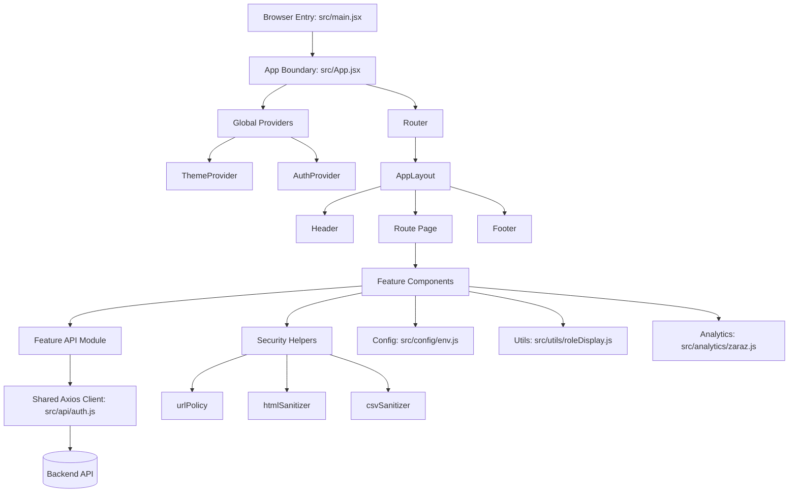

## 2. 계층별 책임

| 계층 | 핵심 파일 | 책임 | 비고 |
|---|---|---|---|
| Entry | `src/main.jsx` | React 앱 마운트 | StrictMode 적용 |
| App Boundary | `src/App.jsx` | Provider/Route/Suspense 조합 | 라우트 lazy-load |
| Layout | `src/layout/AppLayout.jsx` | 전역 UI 셸 | 접근성 skip-link 포함 |
| Context | `src/context/AuthContext.jsx`, `src/context/ThemeContext.jsx` | 인증/테마 전역 상태 | 페이지 공통 상태 제공 |
| Page | `src/pages/*` | 화면 단위 흐름 제어 | URL 상태와 API 호출 orchestration |
| Component | `src/components/*` | 표시 및 상호작용 UI | 기능별 재사용 컴포넌트 |
| API | `src/api/*` | 엔드포인트 호출, 정규화, fallback | UI와 백엔드 계약 분리 |
| Security | `src/security/*`, `src/components/security/SafeHtml.jsx` | 렌더링/링크/CSV 보안 경계 | 사용자 입력 신뢰 경계 |
| Analytics | `src/analytics/zaraz.js` | 이벤트 전송 래퍼/PII 차단 | host/환경 기반 게이팅 |
| Config | `src/config/env.js` | 환경변수 파싱/상수 노출 | 타입 보장, 기본값 처리 |
| Utils | `src/utils/roleDisplay.js` | 역할 정규화/표시 유틸리티 | 접두어/CSS 클래스 반환 |

## 3. 인증 토큰 갱신 흐름

`src/api/auth.js`의 Axios interceptor가 세션 복구를 담당합니다.

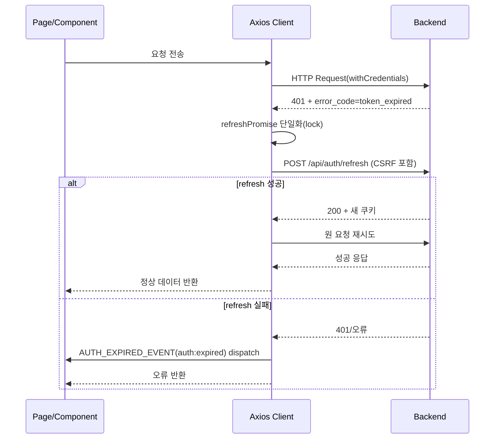

핵심 설계 포인트:

- `refreshPromise`로 동시 401 폭주를 1회 refresh 요청으로 수렴
- login/register/refresh 자체 요청은 재귀 refresh 대상에서 제외
- 초기 비로그인 `GET /api/auth/me` 실패는 글로벌 만료 경고로 확장하지 않음

## 4. Mock Fallback 흐름

mock fallback은 개발 환경의 네트워크 실패 복원용입니다.

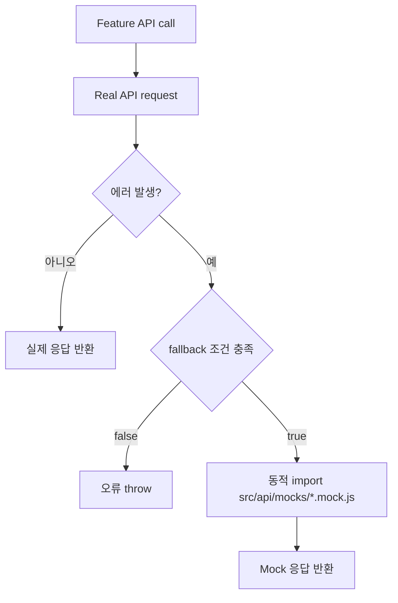

`shouldUseMockFallback(error)` 조건:

- `import.meta.env.DEV === true`
- `VITE_ENABLE_API_MOCKS === '1'`
- `!error.response` (transport/network 계열 실패)

## 4.1 스포츠리그 실시간 동기화 흐름

스포츠리그 화면은 단순 REST 조회가 아니라 `snapshot + SSE + 탭 간 동기화 + mock transport`를 함께 사용합니다.
스포츠리그 API 호출은 `VITE_SPORTS_LEAGUE_API_URL`을 기준으로 하는 전용 `sportsApi` Axios 인스턴스를 사용합니다.
미설정 시 `VITE_API_URL` (Flask 서버)로 fallback합니다.

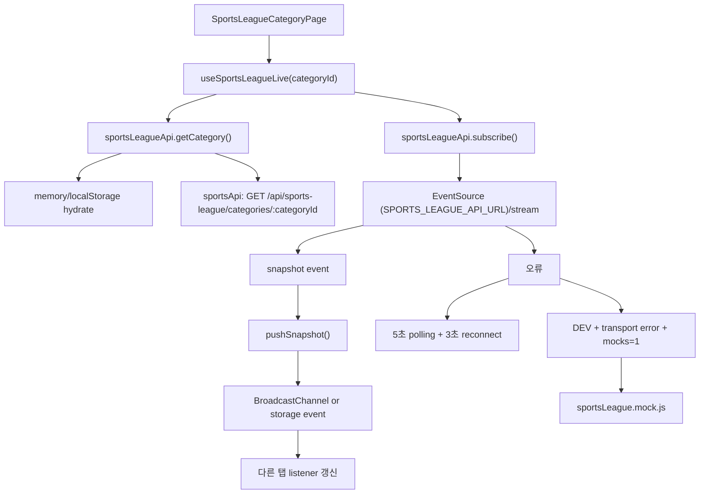

핵심 포인트:

- category별 구독 상태를 공유해 컴포넌트가 여러 개여도 EventSource는 1개만 유지됩니다.
- 최초 진입은 캐시된 snapshot을 먼저 보여주고, 백그라운드 refresh로 최신 값을 덮어씁니다.
- SSE가 끊기면 즉시 실패 처리하지 않고 polling/reconnect로 복구를 시도합니다.
- mock 전환은 개발 환경 transport 오류에만 열리고, 한 번 전환된 category는 세션 동안 mock transport를 유지합니다.
- `sportsApi` 인스턴스는 `auth.js`의 token refresh interceptor를 공유하지 않으며, CSRF 토큰만 자체 interceptor로 첨부합니다.

### 4.2 스포츠리그 선수 라인업/개인 순위 흐름

라인업/개인 순위는 실시간 문자중계 snapshot과 분리된 별도 데이터 흐름입니다.

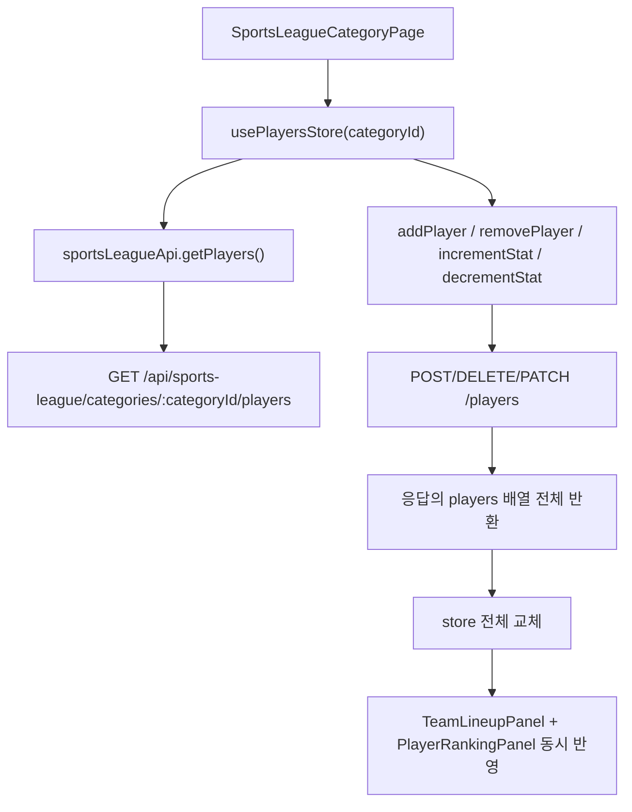

핵심 포인트:

- 선수 데이터는 `build_snapshot()` 결과에 포함되지 않으므로 SSE만으로는 갱신되지 않습니다.
- `TeamLineupPanel`과 `PlayerRankingPanel`은 같은 `usePlayersStore` 상태를 공유합니다.
- 운영진 조작은 절대값 overwrite가 아니라 `delta=-1|1` 증감형 계약으로 전달됩니다.
- mock transport도 snapshot과 선수 라인업을 별도 localStorage 키 공간으로 분리해 저장합니다.

## 5. 보안 경계와 데이터 신뢰 수준

| 경계 | 파일 | 방어 대상 |
|---|---|---|
| 외부 URL | `src/security/urlPolicy.js` | `javascript:`/`data:` 등 위험 scheme 차단, 허용 host 검증 |
| 리치 HTML | `src/security/htmlSanitizer.js` + `src/components/security/SafeHtml.jsx` | XSS/위험 태그/위험 속성 제거 |
| 설문 스키마 | `src/security/surveySchemaSanitizer.js` | third-party form schema의 link/src 필드 sanitize |
| CSV 내보내기 | `src/security/csvSanitizer.js` | Spreadsheet formula injection 완화 |
| 분석 payload | `src/analytics/zaraz.js` | 민감 키 차단(`email`, `token` 등), 이벤트 payload 정제 |

## 6. 라우팅 설계 원칙

- 최상위 라우트는 `src/App.jsx`에서만 정의
- 세부 기능 라우트는 기능별 라우터(`CommunityRouter`, `NoticesPage/index.jsx`, `SchoolInfo/index.jsx`)로 위임
- 페이지 컴포넌트는 가능한 한 API 호출 orchestration에 집중
- 표시 로직은 `src/components/*`로 분리
- data-dense 기능은 `src/features/<feature>/*`에 hook/data/utils를 묶어 페이지와 공용 API 사이를 정리

## 6.1 정적 템플릿 기반 화면 패턴

시간표 다운로드 화면은 백엔드 API 없이 번들된 정적 템플릿을 직접 소비합니다.

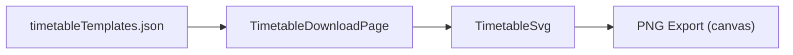

핵심 포인트:

- 시간표 데이터는 `src/components/timetable/timetableTemplates.json`에서 직접 제공
- 하단 브랜딩 문구는 SVG 내부 텍스트로 직접 렌더링
- SVG 미리보기와 PNG 내보내기가 동일한 데이터 소스를 사용해 출력 일관성 유지

## 6.2 정적 학사 캘린더 데이터 흐름

학사 캘린더는 백엔드 호출 없이 정적 데이터 모듈을 여러 화면에서 재사용하는 패턴을 사용합니다.

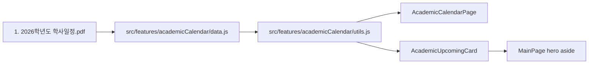

핵심 포인트:

- PDF 원문을 구현 시점에 정규화해 `data.js`에 저장하고, 런타임 PDF 파싱은 하지 않음
- 날짜 계산, 월 그리드 생성, 다음 일정 탐색은 `utils.js`에 모아 화면 간 중복을 줄임
- 메인 페이지와 학사 캘린더 페이지가 같은 데이터 소스를 공유해 일정 표현이 일관되게 유지됨
## 7. 기능 확장 규칙 (새 보드 추가 기준)

1. `src/pages/<Feature>/`에 `List/Detail/Compose` 라우트 화면 추가
2. `src/components/<feature>/`에 UI 컴포넌트 추가
3. `src/api/<feature>.js`에 API 모듈 추가 및 필요 시 mock 모듈 추가
4. `CommunityRouter` 또는 상위 라우트에 경로 연결
5. 필요 시 `trackPostCreated`/`trackPostCreateFailed` 연결
6. 문서 동기화
   - `frontend-code-map.md`
   - `frontend-api-reference.md`
   - `analytics-tracking.md`(이벤트 추가 시)

참고:

- 수학여행 이벤트는 허브와 반별 전용 페이지로 분리됩니다.
- 허브: `/community/field-trip`
- 반 게시판: `/community/field-trip/classes/:classId`
- 글쓰기: `/community/field-trip/classes/:classId/new`
- 글 상세: `/community/field-trip/classes/:classId/posts/:postId`
- 글 수정: `/community/field-trip/classes/:classId/posts/:postId/edit`
- 허브에서는 `tab` 쿼리스트링만 사용하고, 반/글 상태는 path segment로 관리합니다.

### 수학여행 게시판 흐름

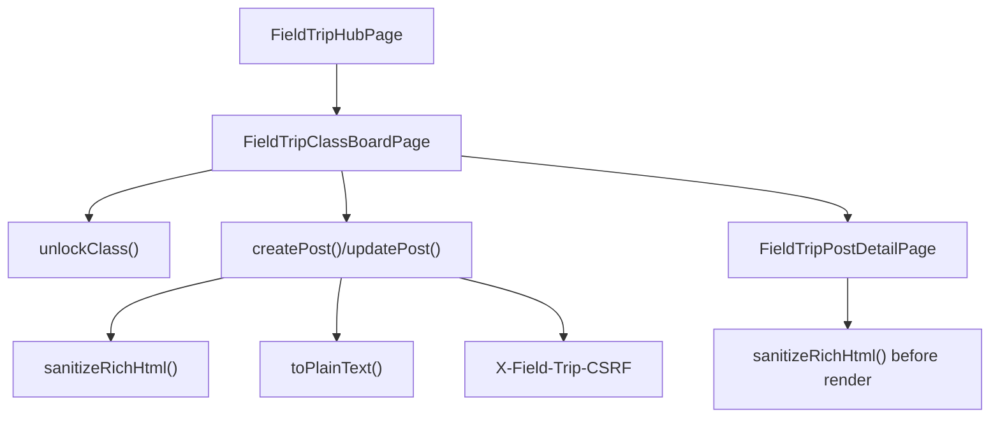

- 반 비밀번호를 확인하면 `field_trip_unlock_token`과 `field_trip_csrf_token`이 발급되고, 이후 동일 세션에서 읽기와 anonymous 작성이 가능해집니다.
- 작성 흐름은 익명과 로그인 사용자를 모두 지원하지만, 수정은 로그인한 작성자 또는 운영진만 가능합니다.
- 본문은 notices editor를 재사용한 rich HTML이며, 미션 카드 preview/빈 값 검사는 `toPlainText()` 기준으로 수행합니다.
- 게시글 상세는 별도 `FieldTripPostDetailPage`가 맡고, 게시판 페이지는 목록/잠금해제/작성/관리 설정에 집중합니다.
- 게시판 비밀번호 변경과 게시판 설명 수정은 `admin`만 가능하고, 점수 조정만 `student_council | admin`이 수행합니다.

## 8. 운영 관점 체크 포인트

- 인증 만료 UX: `AUTH_EXPIRED_EVENT` 수신 시 로그인 유도 흐름 확인
- 환경 분리: 운영에서 mock fallback 비활성 유지
- 트래킹 품질: 허용 host/PII 차단 정책 검증
- 계약 안정성: API 응답 변경은 `src/api/*`에서 먼저 흡수 후 페이지 레이어에 반영

## 9. 커뮤니티 라우트 트리

`CommunityRouter`는 8개 일반 보드와 1개의 이벤트 페이지를 함께 위임합니다.

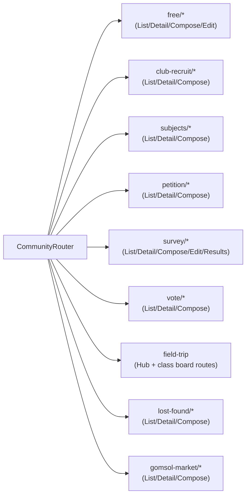

`survey` 보드만 `/:id/edit`과 `/:id/results` 추가 라우트가 존재합니다.  
`field-trip`은 허브(`/community/field-trip`), 반 게시판(`/community/field-trip/classes/:classId`), 상세(`/posts/:postId`), 수정(`/posts/:postId/edit`)으로 분리되며,
허브에서는 `tab` 쿼리만 유지하고 게시글 상태는 개별 라우트로 표현합니다.  
전체 경로 매핑은 [frontend-code-map.md §3.3](./frontend-code-map.md)을 참고합니다.

## 10. 스타일/디자인 토큰 계층

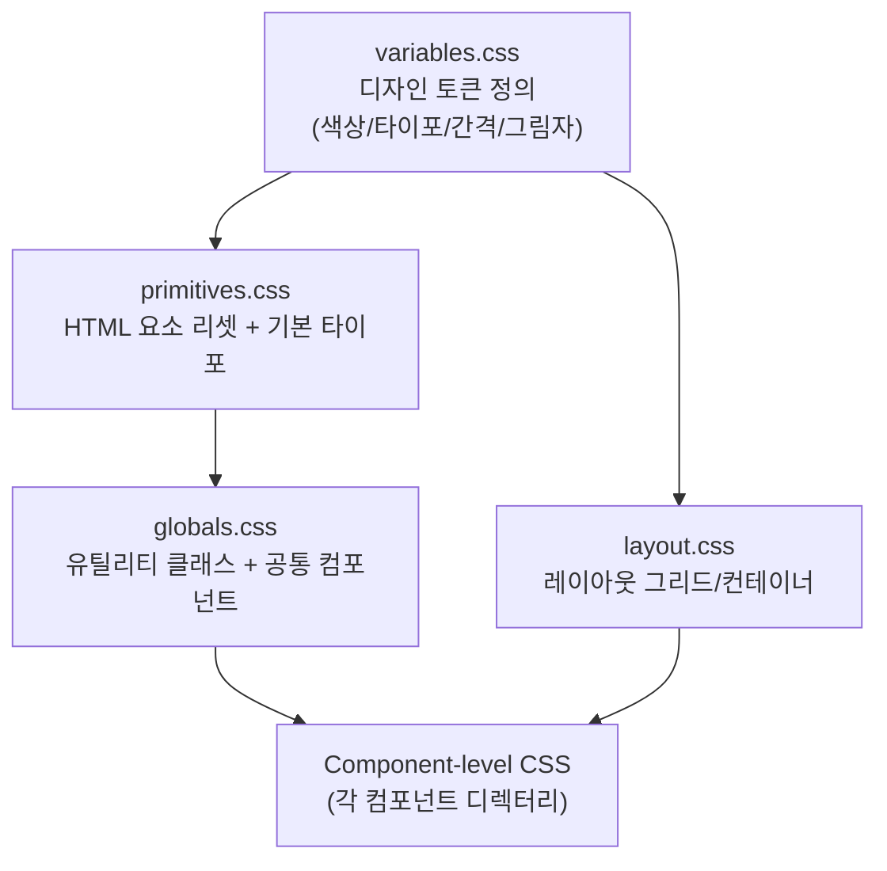

- `variables.css`는 라이트/다크 테마를 `[data-theme]` 셀렉터로 분리하여 정의
- `ThemeContext`가 `document.documentElement.dataset.theme`을 전환하면 모든 토큰이 자동 반영

## 11. 역할(Role) 시스템

`src/utils/roleDisplay.js`의 역할 정규화 흐름:

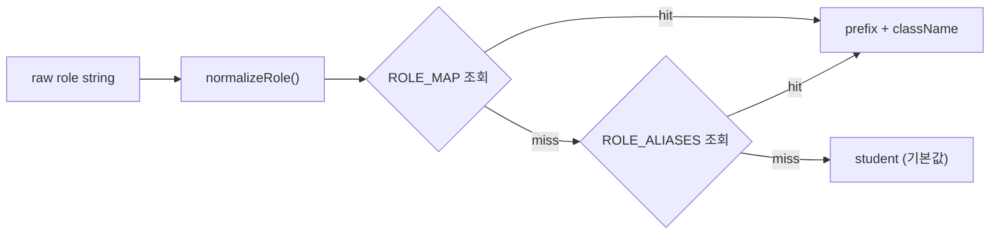

| 역할 | 접두어 | CSS 클래스 |
|---|---|---|
| `admin` | `[관리자]` | `role-admin` |
| `student_council` | `[학생회]` | `role-student-council` |
| `teacher` | `[교사]` | `role-teacher` |
| `student` | (없음) | `role-student` |

`getRoleDisplay()`는 `displayPrefix`, `ariaLabel`, `roleClassName`, `safeNickname`을 반환하며, `RoleName` 컴포넌트와 게시판 UI에서 공통으로 사용됩니다.

