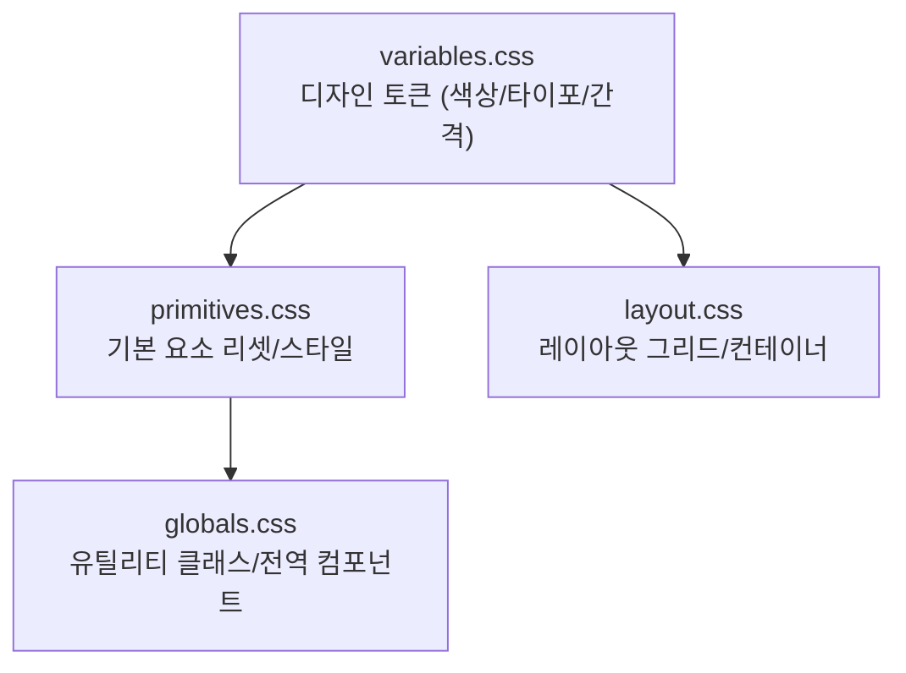

# Frontend Code Map

신규 프론트엔드 개발자가 코드 구조를 빠르게 탐색할 수 있도록, 실제 구현 파일 기준으로 정리한 문서입니다.

## 문서 메타

| 항목 | 내용 |
|---|---|
| 대상 독자 | 신규 FE 개발자 |
| 기준 코드 | `frontend/src/*` |
| 관련 문서 | [frontend-architecture.md](./frontend-architecture.md), [frontend-api-reference.md](./frontend-api-reference.md), [analytics-tracking.md](./analytics-tracking.md), [team-checklist.md](./team-checklist.md) |
| 백엔드 API 원문 | [`../../backend/docs/backend_api.md`](../../backend/docs/backend_api.md) |

## 1. 부트스트랩과 앱 셸

| 파일 | 역할 |
|---|---|
| `src/main.jsx` | React 앱 엔트리포인트. `#root`에 `<App />` 마운트 |
| `src/App.jsx` | 전역 Provider(`ThemeProvider`, `NetworkStatusProvider`, `PwaInstallProvider`, `AuthProvider`) + 최상위 라우팅 구성 |
| `src/layout/AppLayout.jsx` | 공통 레이아웃(접근성 skip-link, Header, main, Footer, OfflineGate) |
| `src/components/Header/Header.jsx` | 전역 내비게이션/테마 토글/인증 상태 UI. 동아리 모집 feature flag와 스포츠리그 직접 링크 포함 |
| `src/components/Footer/Footer.jsx` | 외부 링크/법적 문서 링크/운영 정보 |
| `src/components/pwa/OfflineGate.jsx` | 오프라인 시 전체 화면 오버레이와 재시도 흐름 제공 |
| `src/pages/CommunityPage.jsx` | 커뮤니티 허브 페이지. 모든 보드 카드를 그리드로 나열하며, 현재 활성 보드를 하이라이트 |

## 2. 주요 디렉터리 맵

| 디렉터리 | 역할 |
|---|---|
| `src/pages` | 라우트 단위 화면 컴포넌트 |
| `src/components` | 재사용 UI 컴포넌트 |
| `src/api` | 백엔드 연동 모듈 및 mock fallback |
| `src/features` | 기능 단위 data/hook/utils 묶음 |
| `src/context` | 전역 상태 컨텍스트(Theme/NetworkStatus/PWA/Auth) |
| `src/pwa` | 오프라인/설치 상태에서 재사용하는 브라우저 이벤트 유틸 |
| `src/security` | URL/HTML/CSV/설문 스키마 sanitize 정책 |
| `src/analytics` | Zaraz 이벤트 전송 래퍼 |
| `src/config` | 환경변수 파싱 및 상수 노출 |
| `src/styles` | 전역 스타일 토큰/레이아웃 CSS |

## 3. 라우트 트리 (실제 코드 기준)

### 3.1 최상위 라우트 (`src/App.jsx`)

| 경로 | 요소 |
|---|---|
| `/` | `MainPage` |
| `/login` | `LoginPage` |
| `/signup` | `SignUpPage` |
| `/notices/*` | `NoticesPage` |
| `/community/*` | `CommunityRouter` |
| `/school-info/*` | `SchoolInfoRouter` (`src/pages/SchoolInfo/index.jsx`) |
| `/privacy` | `PrivacyPolicyPage` |
| `/terms` | `TermsOfServicePage` |
| `*` | `NotFoundPage` |

`/privacy`, `/terms`는 정적 법적 문서 페이지이며, 서버 데이터 fetch 없이 anchor 기반 목차와 `맨 위로` 스크롤 헬퍼를 렌더링합니다.

### 3.2 공지 라우트 (`src/pages/NoticesPage/index.jsx`)

| 경로 | 요소 |
|---|---|
| `/notices` | `Navigate -> /notices/school` |
| `/notices/:category` | `ListView` (`school`, `council`만 허용) |
| `/notices/:category/new` | `ComposeView(mode=create)` |
| `/notices/:category/:id` | `DetailView` (`id` 숫자 경로만 허용) |
| `/notices/:category/:id/edit` | `ComposeView(mode=edit)` |
| `/notices/*` (invalid path) | `NotFoundPage` |

### 3.3 커뮤니티 라우트 (`src/pages/CommunityRouter.jsx`)

```mermaid
graph TD
    CR["CommunityRouter"] -->|index| DEF["Navigate → /community/free"]
    CR --> F["free/*"]
    CR --> CLB["club-recruit/*"]
    CR --> SUB["subjects/*"]
    CR --> PET["petition/*"]
    CR --> SUR["survey/*"]
    CR --> VOT["vote/*"]
    CR --> FT["field-trip"]
    CR --> LF["lost-found/*"]
    CR --> GM["gomsol-market/*"]
    CR -->|"*"| FALL["NotFoundPage"]

    F --> F1["FreeBoardListView"]
    F --> F2["FreeBoardComposeView(create)"]
    F --> F3["FreeBoardDetailView"]
    F --> F4["FreeBoardComposeView(edit)"]

    CLB --> CLB1["ClubRecruitListPage"]
    CLB --> CLB2["ClubRecruitComposePage"]
    CLB --> CLB3["ClubRecruitDetailPage"]

    SUB --> SUB1["SubjectsListPage"]
    SUB --> SUB2["SubjectComposePage"]
    SUB --> SUB3["SubjectDetailPage"]

    PET --> PET1["PetitionListView"]
    PET --> PET2["PetitionComposeView"]
    PET --> PET3["PetitionDetailView"]

    SUR --> SUR1["SurveyExchangeListView"]
    SUR --> SUR2["SurveyExchangeComposePage"]
    SUR --> SUR3["SurveyExchangeDetailView"]
    SUR --> SUR4["SurveyExchangeComposePage(edit)"]
    SUR --> SUR5["SurveyResultsView"]

    VOT --> VOT1["VoteListView"]
    VOT --> VOT2["VoteComposeView"]
    VOT --> VOT3["VoteDetailView"]

    FT --> FT1["FieldTripPage (Hub)"]
    FT --> FT2["FieldTripClassBoardPage"]
    FT --> FT3["FieldTripPostDetailPage"]

    LF --> LF1["LostFoundListView"]
    LF --> LF2["LostFoundComposeView"]
    LF --> LF3["LostFoundDetailView"]

    GM --> GM1["GomsolMarketListView"]
    GM --> GM2["GomsolMarketComposeView"]
    GM --> GM3["GomsolMarketDetailView"]
```

| 경로 | 요소 |
|---|---|
| `/community` | `Navigate` → `/community/free` |
| `/community/free` | `FreeBoardListView` |
| `/community/free/new` | `FreeBoardComposeView(mode=create)` |
| `/community/free/:id` | `FreeBoardDetailView` (`id` 숫자 경로만 허용) |
| `/community/free/:id/edit` | `FreeBoardComposeView(mode=edit)` (`id` 숫자 경로만 허용) |
| `/community/club-recruit` | `ClubRecruitListPage` |
| `/community/club-recruit/new` | `ClubRecruitComposePage` |
| `/community/club-recruit/:id` | `ClubRecruitDetailPage` (`id` 숫자 경로만 허용) |
| `/community/subjects` | `SubjectsListPage` |
| `/community/subjects/new` | `SubjectComposePage` |
| `/community/subjects/:id` | `SubjectDetailPage` (`id` 숫자 경로만 허용) |
| `/community/petition` | `PetitionListView` |
| `/community/petition/new` | `PetitionComposeView` |
| `/community/petition/:id` | `PetitionDetailView` (`id` 숫자 경로만 허용) |
| `/community/survey` | `SurveyExchangeListView` |
| `/community/survey/new` | `SurveyExchangeComposePage` |
| `/community/survey/:id` | `SurveyExchangeDetailView` (`id` 숫자 경로만 허용) |
| `/community/survey/:id/edit` | `SurveyExchangeComposePage` (`id` 숫자 경로만 허용) |
| `/community/survey/:id/results` | `SurveyResultsView` (`id` 숫자 경로만 허용) |
| `/community/vote` | `VoteListView` |
| `/community/vote/new` | `VoteComposeView` |
| `/community/vote/:id` | `VoteDetailView` (`id` 숫자 경로만 허용) |
| `/community/field-trip` | `FieldTripPage` (`FieldTripHubPage` re-export) |
| `/community/field-trip/classes/:classId` | `FieldTripClassBoardPage` |
| `/community/field-trip/classes/:classId/new` | `FieldTripClassBoardPage` |
| `/community/field-trip/classes/:classId/posts/:postId` | `FieldTripPostDetailPage` |
| `/community/field-trip/classes/:classId/posts/:postId/edit` | `FieldTripClassBoardPage` |
| `/community/lost-found` | `LostFoundListView` |
| `/community/lost-found/new` | `LostFoundComposeView` |
| `/community/lost-found/:id` | `LostFoundDetailView` (`id` 숫자 경로만 허용) |
| `/community/gomsol-market` | `GomsolMarketListView` |
| `/community/gomsol-market/new` | `GomsolMarketComposeView` |
| `/community/gomsol-market/:id` | `GomsolMarketDetailView` (`id` 숫자 경로만 허용) |
| `/community/*` (invalid path) | `NotFoundPage` |

### 3.4 학교 생활 정보 라우트 (`src/pages/SchoolInfo/index.jsx`)

| 경로 | 요소 |
|---|---|
| `/school-info` | `SchoolInfoHub` |
| `/school-info/timetable` | `TimetableDownloadPage` |
| `/school-info/meal` | `MealPage` |
| `/school-info/calendar` | `AcademicCalendarPage` |
| `/school-info/sports-league` | `Navigate` → `/school-info/sports-league/2026-spring-grade3-boys-soccer` |
| `/school-info/sports-league/:categoryId` | `SportsLeagueCategoryPage` |
| `/school-info/*` (invalid path) | `NotFoundPage` |

## 4. 기능별 수직 슬라이스 탐색

| 기능 | 페이지 레이어 | 컴포넌트 레이어 | API 레이어 |
|---|---|---|---|
| 공지 | `src/pages/NoticesPage/*` | `src/components/notices/*` | `src/api/notices.js` |
| 자유게시판 | `src/pages/FreeBoard/*` | `src/components/freeboard/*` | `src/api/community.js` |
| 동아리 모집 | `src/pages/ClubRecruit/*` | `src/components/clubRecruit/*` | `src/api/clubRecruit.js` |
| 선택과목 변경 | `src/pages/Subjects/*` | `src/components/subjects/*` | `src/api/subjectChanges.js` |
| 청원 | `src/pages/Petition/*` | `src/components/petition/*` | `src/api/petition.js` |
| 설문 품앗이 | `src/pages/SurveyExchange/*` | `src/components/survey/*` | `src/api/survey.js` |
| 투표 | `src/pages/Vote/*` | `src/components/vote/*` | `src/api/vote.js` |
| 수학여행 이벤트 | `src/pages/FieldTrip/*` (`FieldTripHubPage`, `FieldTripClassBoardPage`, `FieldTripPostDetailPage`) | `src/components/fieldTrip/*`, `src/features/fieldTrip/*` | `src/api/fieldTrip.js` |
| 분실물 | `src/pages/LostFound/*` | `src/components/lostfound/*` | `src/api/lostFound.js` |
| 곰솔마켓 | `src/pages/GomsolMarket/*` | `src/components/gomsolmarket/*` | `src/api/gomsolMarket.js` |
| 학교 생활 정보(시간표) | `src/pages/SchoolInfo/*` | `src/components/timetable/*` | 없음 (`src/components/timetable/timetableTemplates.json` 정적 템플릿 사용) |
| 학교 생활 정보(오늘의 급식) | `src/pages/SchoolInfo/MealPage.jsx` | `src/components/MealCard/*`, `src/features/meals/*` | `src/api/meals.js` |
| 학교 생활 정보(학사 캘린더) | `src/pages/SchoolInfo/AcademicCalendarPage.jsx` | `src/components/AcademicUpcomingCard/*`, `src/features/academicCalendar/*` | 없음 (`src/features/academicCalendar/data.js` 정적 데이터 사용) |
| 학교 생활 정보(스포츠리그 문자중계/라인업/개인 순위) | `src/pages/SchoolInfo/SportsLeagueCategoryPage.jsx` | `src/features/sportsLeague/*` (`useSportsLeagueLive`, `usePlayersStore`, `TeamLineupPanel`, `PlayerRankingPanel`) | `src/api/sportsLeague.js` |

### 4.1 스포츠리그 feature 슬라이스 (`src/features/sportsLeague/*`)

| 파일 | 역할 |
|---|---|
| `data.js` | 카테고리 ID, 탭/이벤트 템플릿, 운영진 역할 상수 |
| `useSportsLeagueLive.js` | snapshot 조회 + SSE 구독 + 이벤트 CRUD orchestration |
| `usePlayersStore.js` | 선수 라인업/개인 순위 전용 상태 훅 (`getPlayers`, add/remove/stat) |
| `TeamLineupPanel.jsx` | 팀별 라인업 탭 UI, 팀 선택/선수 추가·삭제 |
| `PlayerRankingPanel.jsx` | 개인별 순위 탭 UI, 득점/어시스트 정렬 및 inline +/- 조정 |
| `utils.js` | 경기 정렬, 현재/다음 경기 판별, 순위 계산, tone/label 헬퍼 |

## 5. 컨텍스트 책임

### `src/context/AuthContext.jsx`

- 세션 초기화: `authApi.getMe()`
- 인증 액션: `login`, `register`, `logout`
- 만료 이벤트 구독: `AUTH_EXPIRED_EVENT` 수신 시 사용자 상태 초기화
- 분석 이벤트 연결: 로그인/회원가입 성공/실패 트래킹 호출

### `src/context/ThemeContext.jsx`

- 테마 상태(`light`/`dark`) 유지
- `localStorage` + 시스템 테마 감지
- `document.documentElement[data-theme]` 동기화

### `src/context/NetworkStatusContext.jsx`

- 브라우저 `online/offline` 이벤트와 `app:network-request-failed` 커스텀 이벤트를 함께 구독
- `/api/health` 재확인 결과로 실제 API 도달 가능 여부 판정
- `OfflineGate`가 사용할 `isOffline`, `lastSource`, `recheckConnection()` 제공

### `src/context/PwaInstallContext.jsx`

- `beforeinstallprompt`, `appinstalled`, `display-mode: standalone` 상태를 통합 관리
- iOS Safari 수동 설치 경로(`isIosManualInstall`)와 일반 설치 프롬프트 경로를 분리
- 설치 CTA가 사용할 `canInstall`, `promptInstall()`, `helpOpen` 상태 제공

## 6. API 계층 구조

| 구분 | 소스 오브 트루스 파일 | 설명 |
|---|---|---|
| 공통 HTTP 클라이언트 | `src/api/auth.js` | Axios 인스턴스, CSRF 헤더, 401 refresh 재시도, transport 실패 시 오프라인 이벤트 발행 |
| 기능 API | `src/api/*.js` | 기능별 endpoint 래핑 및 응답 정규화 |
| 응답 정규화 | `src/api/normalizers.js` | 페이지네이션/업로드 URL 보정 |
| mock 정책 | `src/api/mockPolicy.js` | `DEV + VITE_ENABLE_API_MOCKS=1 + transport error` 조건에서만 fallback |
| mock 구현 | `src/api/mocks/*.mock.js` | 실제 응답 형태를 모사한 개발용 데이터 |

상세 메서드/엔드포인트는 [frontend-api-reference.md](./frontend-api-reference.md)를 참고합니다.

## 7. 보안 경계 파일 집합 (`src/security/*`)

| 파일 | 책임 |
|---|---|
| `src/security/urlPolicy.js` | 외부 링크/오픈채팅/에셋 URL 안전성 검증 |
| `src/security/htmlSanitizer.js` | DOMPurify 기반 리치 HTML sanitize |
| `src/security/surveySchemaSanitizer.js` | 설문 스키마의 link/src 필드 sanitize |
| `src/security/csvSanitizer.js` | CSV formula injection 방어 |
| `src/components/security/SafeHtml.jsx` | sanitize 이후 `dangerouslySetInnerHTML` 렌더링 경계 |

## 8. 레거시/호환 레이어

| 파일 | 목적 |
|---|---|
| `src/pages/NoticesPage.jsx` | 레거시 import 호환용 wrapper (`./NoticesPage/index.jsx` re-export) |
| `src/pages/MainPage/index.js` | `MainPage.jsx` 진입점 재-export |
| `src/pages/SchoolInfoPage.jsx` | 레거시 import 호환용 wrapper (`./SchoolInfo/index.jsx` re-export) |

새 코드에서는 폴더 기반 엔트리(`src/pages/NoticesPage/index.jsx`)를 우선 사용합니다.

## 9. 온보딩 권장 읽기 순서

1. `src/main.jsx`
2. `src/App.jsx`
3. `src/layout/AppLayout.jsx`
4. `src/context/AuthContext.jsx`
5. `src/api/auth.js`
6. `src/security/urlPolicy.js` + `src/security/htmlSanitizer.js`
7. `src/pages/CommunityRouter.jsx`
8. 임의의 기능 1개 수직 슬라이스(page + component + api) 끝까지 추적

## 10. 변경 시 동기화 규칙

- 라우트 변경: 본 문서 + `frontend-architecture.md` 동시 갱신
- 라우트 변경: 운영 Nginx SPA allowlist도 함께 갱신
- API 변경: `frontend-api-reference.md` 동시 갱신
- 트래킹 변경: `analytics-tracking.md` 동시 갱신
- 역할 표시 로직(`src/utils/roleDisplay.js`) 변경: 본 문서 갱신
- 환경변수 추가/변경: `README.md` 환경 변수 표 + `src/config/env.js` 함께 갱신
- PR 전 최종 점검: [team-checklist.md](./team-checklist.md)

## 11. 공유 UI 컴포넌트

`src/components/` 중 기능 보드 외의 공유 컴포넌트입니다.

| 디렉터리 | 역할 | 사용 위치 |
|---|---|---|
| `AnnouncementCard/` | 메인 페이지 공지 카드 | `MainPage` |
| `CountdownWidget/` | D-Day 카운트다운 위젯 | `MainPage` |
| `MealCard/` | 급식 정보 카드 | `MainPage` |
| `QuickLinkCard/` | 바로가기 카드 | `MainPage` |
| `RoleName/` | 역할 기반 닉네임 렌더링 | 게시판 상세/목록 전역 |
| `security/SafeHtml.jsx` | sanitize 후 `dangerouslySetInnerHTML` 렌더링 경계 | 리치 HTML 출력 전역 |

## 11.1 시간표 다운로드 모듈

`학교 생활 정보 > 시간표 다운로드` 기능은 정적 템플릿 + SVG 렌더링 조합으로 구성됩니다.

| 파일 | 역할 |
|---|---|
| `src/pages/SchoolInfo/TimetableDownloadPage.jsx` | 학년/반 선택, 입력 상태, 다운로드 액션 orchestration |
| `src/components/timetable/TimetableControls.jsx` | 학년/반 드롭다운과 선택과목 입력 폼 |
| `src/components/timetable/TimetablePreview.jsx` | 미리보기 카드와 SVG 프리뷰 래퍼 |
| `src/components/timetable/TimetableSvg.jsx` | 시간표 SVG 렌더링 |
| `src/components/timetable/exportTimetablePng.js` | SVG → PNG 다운로드 |
| `src/components/timetable/timetableUtils.js` | 템플릿 조회, 글자 크기 계산, 폰트 로딩 유틸 |
| `src/components/timetable/timetableTemplates.json` | 반별 시간표 템플릿 데이터 |

## 12. 유틸리티 & 설정 파일

### `src/config/env.js`

`VITE_*` 환경변수를 읽어 타입이 보장된 상수로 노출합니다.

| Export | 환경변수 | 타입 | 기본값 |
|---|---|---|---|
| `APP_NAME` | `VITE_APP_NAME` | `string` | `beomseo.in` |
| `UPLOAD_MAX_ATTACHMENTS` | `VITE_UPLOAD_MAX_ATTACHMENTS` | `number` | `5` |
| `UPLOAD_MAX_IMAGES` | `VITE_UPLOAD_MAX_IMAGES` | `number` | `5` |
| `UPLOAD_MAX_FILE_SIZE_MB` | `VITE_UPLOAD_MAX_FILE_SIZE_MB` | `number` | `10` |
| `UPLOAD_MAX_FILE_SIZE_BYTES` | (계산값) | `number` | `10 * 1024 * 1024` |
| `PETITION_THRESHOLD_DEFAULT` | `VITE_PETITION_THRESHOLD_DEFAULT` | `number` | `50` |
| `ALLOWED_ASSET_HOSTS` | `VITE_ALLOWED_ASSET_HOSTS` | `string[]` | `[]` |

### `src/utils/roleDisplay.js`

역할 문자열을 정규화하고, 접두어/CSS 클래스를 반환하는 유틸리티입니다.

| Export | 설명 |
|---|---|
| `getRoleDisplay({ role, nickname, showPrefix, prefixOverride })` | 정규화된 역할에 따라 `displayPrefix`, `ariaLabel`, `roleClassName`, `safeNickname` 반환 |
| `default` | `getRoleDisplay`와 동일 |

지원 역할: `admin`(`[관리자]`), `student_council`(`[학생회]`), `teacher`(`[교사]`), `student`(접두어 없음)

별칭 지원: `council`, `studentcouncil`, `student-council`, `student council` → `student_council`

## 13. 스타일 시스템 파일

`src/styles/` 디렉터리는 전역 CSS 토큰과 레이아웃을 관리합니다.

| 파일 | 역할 |
|---|---|
| `variables.css` | CSS custom property (색상, 타이포그래피, 간격, 그림자 등) — 라이트/다크 테마 모두 정의 |
| `primitives.css` | HTML 요소 리셋 + 기본 타이포 스타일 |
| `globals.css` | 유틸리티 클래스, 공통 컴포넌트 스타일 |
| `layout.css` | 최상위 레이아웃 그리드 규칙 |

