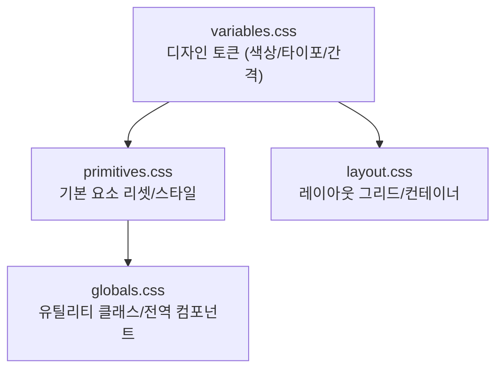

# Frontend Code Map

신규 프론트엔드 개발자가 코드 구조를 빠르게 탐색할 수 있도록, 실제 구현 파일 기준으로 정리한 문서입니다.

## 문서 메타

| 항목 | 내용 |
|---|---|
| 대상 독자 | 신규 FE 개발자 |
| 기준 코드 | `frontend/src/*` |
| 관련 문서 | [frontend-architecture.md](./frontend-architecture.md), [frontend-api-reference.md](./frontend-api-reference.md), [analytics-tracking.md](./analytics-tracking.md), [team-checklist.md](./team-checklist.md) |
| 백엔드 API 원문 | [`../../backend/docs/backend_api.md`](../../backend/docs/backend_api.md) |

## 1. 부트스트랩과 앱 셸

| 파일 | 역할 |
|---|---|
| `src/main.jsx` | React 앱 엔트리포인트. `#root`에 `<App />` 마운트 |
| `src/App.jsx` | 전역 Provider(`ThemeProvider`, `NetworkStatusProvider`, `PwaInstallProvider`, `AuthProvider`) + 최상위 라우팅 구성 |
| `src/layout/AppLayout.jsx` | 공통 레이아웃(접근성 skip-link, Header, main, Footer, OfflineGate) |
| `src/components/Header/Header.jsx` | 전역 내비게이션/테마 토글/인증 상태 UI. 공지 영역의 학교 소개 진입점, 커뮤니티 보드 feature flag, 학교 생활 정보 유틸리티 링크(QR/샤니마스 카드/스포츠리그 등) 포함 |
| `src/components/Footer/Footer.jsx` | 외부 링크/법적 문서 링크/운영 정보 |
| `src/components/pwa/OfflineGate.jsx` | 오프라인 시 전체 화면 오버레이와 재시도 흐름 제공 |
| `src/pages/CommunityPage.jsx` | 커뮤니티 허브 페이지. 모든 보드 카드를 그리드로 나열하며, 현재 활성 보드를 하이라이트 |

## 2. 주요 디렉터리 맵

| 디렉터리 | 역할 |
|---|---|
| `src/pages` | 라우트 단위 화면 컴포넌트 |
| `src/components` | 재사용 UI 컴포넌트 |
| `src/api` | 백엔드 연동 모듈 + FastAPI/급식 알림 클라이언트 |
| `src/features` | 기능 단위 data/hook/utils 묶음 |
| `src/context` | 전역 상태 컨텍스트(Theme/NetworkStatus/PWA/Auth) |
| `src/pwa` | 오프라인/설치 상태, Firebase Web Push, 설치 기기 식별 유틸 |
| `src/security` | URL/HTML/CSV/설문 스키마 sanitize 정책 |
| `src/analytics` | Zaraz 이벤트 전송 래퍼 |
| `src/config` | 환경변수 파싱 및 상수 노출 |
| `src/styles` | 전역 스타일 토큰/레이아웃 CSS |

## 3. 라우트 트리 (실제 코드 기준)

### 3.1 최상위 라우트 (`src/App.jsx`)

| 경로 | 요소 |
|---|---|
| `/` | `MainPage` |
| `/login` | `LoginPage` |
| `/signup` | `SignUpPage` |
| `/notices/*` | `NoticesPage` (`src/pages/Notices/index.jsx`) |
| `/community/*` | `CommunityRouter` |
| `/school-info/*` | `SchoolInfoRouter` (`src/pages/SchoolLifeInfo/index.jsx`) |
| `/privacy` | `PrivacyPolicyPage` |
| `/terms` | `TermsOfServicePage` |
| `*` | `NotFoundPage` |

`/privacy`, `/terms`는 정적 법적 문서 페이지이며, 서버 데이터 fetch 없이 anchor 기반 목차와 `맨 위로` 스크롤 헬퍼를 렌더링합니다.

### 3.2 공지 라우트 (`src/pages/Notices/index.jsx`)

| 경로 | 요소 |
|---|---|
| `/notices` | `Navigate -> /notices/school` |
| `/notices/budget/*` | `BudgetBoardPage` |
| `/notices/lost-found` | `LostFoundListView` |
| `/notices/lost-found/new` | `LostFoundComposeView` |
| `/notices/lost-found/:id` | `LostFoundDetailView` (`id` 숫자 경로만 허용) |
| `/notices/school-info/*` | `SchoolInfoRouter` |
| `/notices/*` (`budget`, `lost-found`, `school-info` 외 경로) | `NoticeCenterPage` |

#### 3.2.1 학교/학생회 공지 서브라우트 (`src/pages/Notices/NoticeCenter/NoticeCenterPage.jsx`)

| 경로 | 요소 |
|---|---|
| `/notices/school` | `ListView` |
| `/notices/council` | `ListView` |
| `/notices/:category/new` | `ComposeView(mode=create)` (`school`, `council`만 허용) |
| `/notices/:category/:id` | `DetailView` (`id` 숫자 경로만 허용) |
| `/notices/:category/:id/edit` | `ComposeView(mode=edit)` (`id` 숫자 경로만 허용) |
| `/notices/*` (invalid path) | `NotFoundPage` |

#### 3.2.2 예산 공개 서브라우트 (`src/pages/Notices/BudgetBoard/BudgetBoardPage.jsx`)

| 경로 | 요소 |
|---|---|
| `/notices/budget` | `Navigate -> /notices/budget/:budgetYear/:budgetMonth` (`GET /api/notices/budget/settings`의 기본 연/월 사용) |
| `/notices/budget/:budgetYear/:budgetMonth` | `BudgetListView` |
| `/notices/budget/:budgetYear/:budgetMonth/new` | `BudgetComposeView(mode=create)` |
| `/notices/budget/:budgetYear/:budgetMonth/:id` | `BudgetDetailView` (`budgetYear`, `id` 숫자 경로, `budgetMonth` 허용값 가드) |
| `/notices/budget/:budgetYear/:budgetMonth/:id/edit` | `BudgetComposeView(mode=edit)` (`budgetYear`, `id` 숫자 경로, `budgetMonth` 허용값 가드) |
| `/notices/budget/*` (invalid path) | `NotFoundPage` |

예산 공개 라우트 메모:

- 회계 사이클은 `03`~`12`, `01`, `02` 고정 순서를 사용합니다.
- URL의 `budgetYear`는 달력 연도가 아니라 회계연도 시작 연도입니다.
- `BudgetBoardPage`는 settings 응답의 연도 범위를 벗어난 경로를 즉시 404 화면으로 처리합니다.

#### 3.2.3 학교 소개 라우트 (`src/pages/Notices/SchoolInfo/index.jsx`)
| 경로 | 요소 |
|---|---|
| `/notices/school-info` | `Navigate -> /notices/school-info/bshs-info` |
| `/notices/school-info/bshs-info` | `BeomseoInfoPage` |
| `/notices/school-info/cshs-info` | `CSHSInfoPage` |
| `/notices/school-info/*` (invalid path) | `NotFoundPage` |

학교 소개 라우트 메모:

- `SchoolInfoTabs`가 범서고·천상고 소개 탭의 라벨, 경로, 활성 상태 판정을 한곳에서 관리합니다.
- `BeomseoInfoPage`는 공식 홈페이지의 교육 방향, 학교상징, 학교현황, 연혁, 오시는 길을 정적 콘텐츠로 보여주고 각 원문 출처 링크를 제공합니다.
- 두 학교 소개 페이지는 백엔드 API를 호출하지 않으며, 정적 SEO/prerender 정보는 `src/seo/policy.js`에서 관리합니다.

### 3.3 커뮤니티 라우트 (`src/pages/Community/index.jsx`)

인성 가치 PICK!, 동아리 모집, 수학여행 라우트는 각 보드 feature flag가 켜진 배포에서만 등록됩니다.

```mermaid
graph TD
    CR["CommunityRouter"] -->|index| DEF["Navigate → /community/free"]
    CR --> F["free/*"]
    CR --> VP["value-pick/*"]
    CR --> CLB["club-recruit/*"]
    CR --> SUB["subjects/*"]
    CR --> PET["petition/*"]
    CR --> SUR["survey/*"]
    CR --> VOT["vote/*"]
    CR --> BOS["bospi"]
    CR --> FT["field-trip"]
    CR --> LF["lost-found/*"]
    CR --> GM["gomsol-market/*"]
    CR -->|"*"| FALL["NotFoundPage"]

    F --> F1["FreeBoardListView"]
    F --> F2["FreeBoardComposeView(create)"]
    F --> F3["FreeBoardDetailView"]
    F --> F4["FreeBoardComposeView(edit)"]

    VP --> VP1["ValuePickListView"]
    VP --> VP2["ValuePickComposeView(create)"]
    VP --> VP3["ValuePickDetailView"]
    VP --> VP4["ValuePickComposeView(edit)"]

    CLB --> CLB1["ClubRecruitListPage"]
    CLB --> CLB2["ClubRecruitComposePage"]
    CLB --> CLB3["ClubRecruitDetailPage"]

    SUB --> SUB1["SubjectsListPage"]
    SUB --> SUB2["SubjectComposePage"]
    SUB --> SUB3["SubjectDetailPage"]

    PET --> PET1["PetitionListView"]
    PET --> PET2["PetitionComposeView"]
    PET --> PET3["PetitionDetailView"]

    SUR --> SUR1["SurveyExchangeListView"]
    SUR --> SUR2["SurveyExchangeComposePage"]
    SUR --> SUR3["SurveyExchangeDetailView"]
    SUR --> SUR4["SurveyExchangeComposePage(edit)"]
    SUR --> SUR5["SurveyResultsView"]

    VOT --> VOT1["VoteListView"]
    VOT --> VOT2["VoteComposeView"]
    VOT --> VOT3["VoteDetailView"]

    BOS --> BOS1["BospiPage"]

    FT --> FT1["FieldTripPage (Hub)"]
    FT --> FT2["FieldTripClassBoardPage"]
    FT --> FT3["FieldTripPostDetailPage"]

    LF --> LF1["LostFoundListView"]
    LF --> LF2["LostFoundComposeView"]
    LF --> LF3["LostFoundDetailView"]

    GM --> GM1["GomsolMarketListView"]
    GM --> GM2["GomsolMarketComposeView"]
    GM --> GM3["GomsolMarketDetailView"]
```

| 경로 | 요소 |
|---|---|
| `/community` | `Navigate` → `/community/free` |
| `/community/free` | `FreeBoardListView` |
| `/community/free/new` | `FreeBoardComposeView(mode=create)` |
| `/community/free/:id` | `FreeBoardDetailView` (`id` 숫자 경로만 허용) |
| `/community/free/:id/edit` | `FreeBoardComposeView(mode=edit)` (`id` 숫자 경로만 허용) |
| `/community/value-pick` | `ValuePickListView` |
| `/community/value-pick/new` | `ValuePickComposeView(mode=create)` |
| `/community/value-pick/:id` | `ValuePickDetailView` (`id` 숫자 경로만 허용) |
| `/community/value-pick/:id/edit` | `ValuePickComposeView(mode=edit)` (`id` 숫자 경로만 허용) |
| `/community/club-recruit` | `ClubRecruitListPage` |
| `/community/club-recruit/new` | `ClubRecruitComposePage` |
| `/community/club-recruit/:id` | `ClubRecruitDetailPage` (`id` 숫자 경로만 허용) |
| `/community/subjects` | `SubjectsListPage` |
| `/community/subjects/new` | `SubjectComposePage` |
| `/community/subjects/:id` | `SubjectDetailPage` (`id` 숫자 경로만 허용) |
| `/community/petition` | `PetitionListView` |
| `/community/petition/new` | `PetitionComposeView` |
| `/community/petition/:id` | `PetitionDetailView` (`id` 숫자 경로만 허용) |
| `/community/survey` | `SurveyExchangeListView` |
| `/community/survey/new` | `SurveyExchangeComposePage` |
| `/community/survey/:id` | `SurveyExchangeDetailView` (`id` 숫자 경로만 허용) |
| `/community/survey/:id/edit` | `SurveyExchangeComposePage` (`id` 숫자 경로만 허용) |
| `/community/survey/:id/results` | `SurveyResultsView` (`id` 숫자 경로만 허용) |
| `/community/vote` | `VoteListView` |
| `/community/vote/new` | `VoteComposeView` |
| `/community/vote/:id` | `VoteDetailView` (`id` 숫자 경로만 허용) |
| `/community/bospi` | `BospiPage` |
| `/community/field-trip` | `FieldTripPage` (`FieldTripHubPage` re-export) |
| `/community/field-trip/classes/:classId` | `FieldTripClassBoardPage` |
| `/community/field-trip/classes/:classId/new` | `FieldTripClassBoardPage` |
| `/community/field-trip/classes/:classId/posts/:postId` | `FieldTripPostDetailPage` |
| `/community/field-trip/classes/:classId/posts/:postId/edit` | `FieldTripClassBoardPage` |
| `/community/lost-found` | `LostFoundListView` |
| `/community/lost-found/new` | `LostFoundComposeView` |
| `/community/lost-found/:id` | `LostFoundDetailView` (`id` 숫자 경로만 허용) |
| `/community/gomsol-market` | `GomsolMarketListView` |
| `/community/gomsol-market/new` | `GomsolMarketComposeView` |
| `/community/gomsol-market/:id` | `GomsolMarketDetailView` (`id` 숫자 경로만 허용) |
| `/community/*` (invalid path) | `NotFoundPage` |

### 3.4 학교 생활 정보 라우트 (`src/pages/SchoolLifeInfo/index.jsx`)

| 경로 | 요소 |
|---|---|
| `/school-info` | `SchoolInfoHub` |
| `/school-info/qr-generator` | `QrCodeGeneratorPage` |
| `/school-info/shany-card-generator` | `ShanyCardGeneratorPage` |
| `/school-info/timetable` | `TimetableDownloadPage` |
| `/school-info/evaluation-plans` | `EvaluationPlansPage` |
| `/school-info/meal` | `MealPage` |
| `/school-info/calendar` | `AcademicCalendarPage` |
| `/school-info/sports-league` | `Navigate` → `/school-info/sports-league/2026-spring-grade2-boys-soccer` |
| `/school-info/sports-league/:categoryId` | `SportsLeagueCategoryPage` |
| `/school-info/*` (invalid path) | `NotFoundPage` |

## 4. 기능별 수직 슬라이스 탐색

| 기능 | 페이지 레이어 | 컴포넌트 레이어 | API 레이어 |
|---|---|---|---|
| 공지/예산 공개 | `src/pages/Notices/*` | `src/components/notices/*` | `src/api/notices.js` |
| 공지(학교 소개) | `src/pages/Notices/SchoolInfo/*` | `SchoolInfoTabs`, 페이지별 CSS Module | 없음 (정적 학교 소개 콘텐츠 + 공식 출처 링크) |
| 자유게시판 | `src/pages/Community/FreeBoard/*` | `src/components/freeboard/*` | `src/api/community.js` |
| 인성 가치 PICK! | `src/pages/Community/ValuePick/*` | `src/components/Community/ValuePick/*` | `src/api/valuePick.js` |
| 동아리 모집 | `src/pages/Community/ClubRecruit/*` | `src/components/clubRecruit/*` | `src/api/clubRecruit.js` |
| 선택과목 변경 | `src/pages/Community/Subjects/*` | `src/components/subjects/*` | `src/api/subjectChanges.js` |
| 청원 | `src/pages/Community/Petition/*` | `src/components/petition/*` | `src/api/petition.js` |
| 설문 품앗이 | `src/pages/Community/SurveyExchange/*` | `src/components/survey/*` | `src/api/survey.js` |
| 투표 | `src/pages/Community/Vote/*` | `src/components/vote/*` | `src/api/vote.js` |
| BOSPI | `src/pages/Community/Bospi/BospiPage.jsx` | `BospiPage.module.css`의 현재 지수/예측/랭킹/지수보드 섹션 | `src/api/bospi.js` |
| 수학여행 이벤트 | `src/pages/Community/FieldTrip/*` (`FieldTripHubPage`, `FieldTripClassBoardPage`, `FieldTripPostDetailPage`) | `src/components/fieldTrip/*`, `src/features/fieldTrip/*` | `src/api/fieldTrip.js` |
| 분실물 | `src/pages/Notices/LostFound/*` | `src/components/lostfound/*` | `src/api/lostFound.js` |
| 곰솔마켓 | `src/pages/Community/GomsolMarket/*` | `src/components/gomsolmarket/*` | `src/api/gomsolMarket.js` |
| 학교 생활 정보(QR 코드 생성기) | `src/pages/SchoolLifeInfo/QrCodeGenerator/QrCodeGeneratorPage.jsx` | `QrCodeGeneratorPage.module.css`, `react-qrcode-logo` | 없음 (브라우저 캔버스 기반 생성/다운로드) |
| 학교 생활 정보(샤니마스 카드 생성기) | `src/pages/SchoolLifeInfo/ShanyCardGenerator/ShanyCardGeneratorPage.jsx` | `ShanyCardGeneratorPage.module.css`, `react-shany-card-generator` | 없음 (브라우저 Blob 기반 생성/다운로드) |
| 학교 생활 정보(시간표) | `src/pages/SchoolLifeInfo/TimetableDownload/*` | `src/components/timetable/*` | 없음 (`src/components/timetable/timetableTemplates.json` 정적 템플릿 사용) |
| 학교 생활 정보(평가계획서) | `src/pages/SchoolLifeInfo/EvaluationPlans/*` | 없음 | 없음 (`public/evaluation-plans/*` 정적 HWP 사용) |
| 학교 생활 정보(오늘의 급식) | `src/pages/SchoolLifeInfo/Meal/MealPage.jsx` | `src/components/MealCard/*`, `src/features/meals/*` | `src/api/meals.js`, `src/api/mealNotifications.js` |
| 학교 생활 정보(학사 캘린더) | `src/pages/SchoolLifeInfo/AcademicCalendar/AcademicCalendarPage.jsx` | `src/components/AcademicUpcomingCard/*`, `src/features/academicCalendar/*` | 없음 (`src/features/academicCalendar/data.js` 정적 데이터 사용) |
| 학교 생활 정보(스포츠리그 문자중계/라인업/개인 순위) | `src/pages/SchoolLifeInfo/SportsLeagueCategory/SportsLeagueCategoryPage.jsx` | `src/features/sportsLeague/*` (`useSportsLeagueLive`, `usePlayersStore`, `TeamLineupPanel`, `PlayerRankingPanel`) | `src/api/sportsLeague.js` |

### 4.1 공지/예산 공개 파일 구성

| 파일 | 역할 |
|---|---|
| `src/pages/Notices/index.jsx` | `/notices/*`를 `NoticeCenterPage`와 `BudgetBoardPage`로 분기 |
| `src/pages/Notices/NoticeCenter/NoticeCenterPage.jsx` | 학교/학생회 공지 전용 셸과 중첩 라우트 |
| `src/pages/Notices/BudgetBoard/BudgetBoardPage.jsx` | 예산 공개 설정 로드, 연도 전환, 월 탭, 예산 공개 중첩 라우트 |
| `src/pages/Notices/BudgetBoard/BudgetListView.jsx` | `category='budget'`, `budgetYear`, `budgetMonth` 필터 기반 월별 리스트 |
| `src/pages/Notices/BudgetBoard/BudgetDetailView.jsx` | 예산 공개 상세, 댓글/반응/첨부 재사용 |
| `src/pages/Notices/BudgetBoard/BudgetComposeView.jsx` | 경로 기반 회계연도/월을 고정한 작성·수정 화면 |
| `src/pages/Notices/BudgetBoard/budgetUtils.js` | `03`~`02` 회계 사이클 계산 및 라벨/경로 유틸 |
| `src/pages/Notices/SchoolInfo/index.jsx` | `/notices/school-info/*` 하위 학교 소개 라우터와 잘못된 학교 소개 경로 404 처리 |
| `src/pages/Notices/SchoolInfo/SchoolInfoTabs.jsx` | 범서고·천상고 소개 탭과 활성 경로 판정 |
| `src/pages/Notices/SchoolInfo/BeomseoInfoPage.jsx` | 범서고 교육 방향, 상징, 현황, 연혁, 위치, 공식 출처 링크를 정적 렌더링 |
| `src/pages/Notices/SchoolInfo/CSHSInfoPage.jsx` | 천상고 소개 카드와 다음 학교 행사 D-Day 렌더링 |
| `src/components/notices/NoticeToolbar.jsx` | `showAttributeFilters`, `sortOptions`, `searchPlaceholder`로 budget 보드 확장 |
| `src/components/notices/NoticeList.jsx` | `emptyStateProps`, `cardProps`로 budget 전용 비어 있음/카드 렌더링 재사용 |
| `src/components/notices/NoticeCard.jsx` | `hideBadges`, `hideTags`로 예산 공개 카드 표현 단순화 |
| `src/components/notices/EmptyState.jsx` | `createPath`, `title`, `description` override 지원 |

### 4.2 스포츠리그 feature 슬라이스 (`src/features/sportsLeague/*`)

| 파일 | 역할 |
|---|---|
| `data.js` | 기본/이전 카테고리 ID, API 로딩 전 대체 카테고리 목록, 이벤트 템플릿, 운영진 역할 상수 |
| `useSportsLeagueLive.js` | category 변경 시 기존 snapshot 초기화 + snapshot 조회 + SSE 구독 + 이벤트 CRUD orchestration |
| `usePlayersStore.js` | 선수 라인업/개인 순위 전용 상태 훅 (`getPlayers`, add/remove/stat) |
| `TeamLineupPanel.jsx` | 팀별 라인업 탭 UI, 팀 선택/선수 추가·삭제 |
| `PlayerRankingPanel.jsx` | 개인별 순위 탭 UI, 득점/어시스트 정렬 및 inline +/- 조정 |
| `utils.js` | 경기 정렬, 현재/다음 경기 판별, 순위 계산, tone/label 헬퍼 |

## 5. 컨텍스트 책임

### `src/context/AuthContext.jsx`

- 세션 초기화: `authApi.getMe()`
- 인증 액션: `login`, `register`, `logout`
- 만료 이벤트 구독: `AUTH_EXPIRED_EVENT` 수신 시 사용자 상태 초기화
- 분석 이벤트 연결: 로그인/회원가입 성공/실패 트래킹 호출

### `src/context/ThemeContext.jsx`

- 테마 상태(`light`/`dark`) 유지
- `localStorage` + 시스템 테마 감지
- `document.documentElement[data-theme]` 동기화

### `src/context/NetworkStatusContext.jsx`

- 브라우저 `online/offline` 이벤트와 `app:network-request-failed` 커스텀 이벤트를 함께 구독
- `/api/health` 재확인 결과로 실제 API 도달 가능 여부 판정
- `OfflineGate`가 사용할 `isOffline`, `lastSource`, `recheckConnection()` 제공

### `src/context/PwaInstallContext.jsx`

- `beforeinstallprompt`, `appinstalled`, `display-mode: standalone` 상태를 통합 관리
- iOS Safari 수동 설치 경로(`isIosManualInstall`)와 일반 설치 프롬프트 경로를 분리
- 설치 CTA가 사용할 `canInstall`, `promptInstall()`, `helpOpen` 상태 제공

## 6. API 계층 구조

| 구분 | 소스 오브 트루스 파일 | 설명 |
|---|---|---|
| 공통 HTTP 클라이언트 | `src/api/auth.js` | Axios 인스턴스, CSRF 헤더, 401 refresh 재시도, transport 실패 시 오프라인 이벤트 발행 |
| FastAPI HTTP 클라이언트 | `src/api/fastapiClient.js` | FastAPI origin 전용 Axios 인스턴스, CSRF 헤더, transport 실패 전파 |
| 기능 API | `src/api/*.js` | 기능별 endpoint 래핑 및 응답 정규화 |
| 응답 정규화 | `src/api/normalizers.js` | 페이지네이션/업로드 URL 보정 |

상세 메서드/엔드포인트는 [frontend-api-reference.md](./frontend-api-reference.md)를 참고합니다.

## 7. 보안 경계 파일 집합 (`src/security/*`)

| 파일 | 책임 |
|---|---|
| `src/security/urlPolicy.js` | 외부 링크/오픈채팅/에셋 URL 안전성 검증 |
| `src/security/htmlSanitizer.js` | DOMPurify 기반 리치 HTML sanitize |
| `src/security/surveySchemaSanitizer.js` | 설문 스키마의 link/src 필드 sanitize |
| `src/security/csvSanitizer.js` | CSV formula injection 방어 |
| `src/components/security/SafeHtml.jsx` | sanitize 이후 `dangerouslySetInnerHTML` 렌더링 경계 |

## 8. 레거시/호환 레이어

| 파일 | 목적 |
|---|---|
| `src/pages/MainPage/index.js` | `MainPage.jsx` 진입점 재-export |

새 코드에서는 폴더 기반 엔트리(`src/pages/Notices/index.jsx`, `src/pages/SchoolLifeInfo/index.jsx`)를 우선 사용합니다.

## 9. 온보딩 권장 읽기 순서

1. `src/main.jsx`
2. `src/App.jsx`
3. `src/layout/AppLayout.jsx`
4. `src/context/AuthContext.jsx`
5. `src/api/auth.js`
6. `src/security/urlPolicy.js` + `src/security/htmlSanitizer.js`
7. `src/pages/Community/index.jsx`
8. 임의의 기능 1개 수직 슬라이스(page + component + api) 끝까지 추적

## 10. 변경 시 동기화 규칙

- 라우트 변경: 본 문서 + `frontend-architecture.md` 동시 갱신
- 라우트 변경: 운영 Nginx SPA allowlist도 함께 갱신
- API 변경: `frontend-api-reference.md` 동시 갱신
- 트래킹 변경: `analytics-tracking.md` 동시 갱신
- 역할 표시 로직(`src/utils/roleDisplay.js`) 변경: 본 문서 갱신
- 환경변수 추가/변경: `README.md` 환경 변수 표 + `src/config/env.js` 함께 갱신
- PR 전 최종 점검: [team-checklist.md](./team-checklist.md)

## 11. 공유 UI 컴포넌트

`src/components/` 중 기능 보드 외의 공유 컴포넌트입니다.

| 디렉터리 | 역할 | 사용 위치 |
|---|---|---|
| `AnnouncementCard/` | 메인 페이지 공지 카드 | `MainPage` |
| `CountdownWidget/` | D-Day 카운트다운 위젯 | `MainPage` |
| `MealCard/` | 급식 정보 카드 | `MainPage` |
| `QuickLinkCard/` | 바로가기 카드 | `MainPage` |
| `RoleName/` | 역할 기반 닉네임 렌더링 | 게시판 상세/목록 전역 |
| `security/SafeHtml.jsx` | sanitize 후 `dangerouslySetInnerHTML` 렌더링 경계 | 리치 HTML 출력 전역 |

## 11.1 시간표 다운로드 모듈

`학교 생활 정보 > 시간표 다운로드` 기능은 정적 템플릿 + SVG 렌더링 조합으로 구성됩니다.

| 파일 | 역할 |
|---|---|
| `src/pages/SchoolLifeInfo/TimetableDownload/TimetableDownloadPage.jsx` | 학년/반 선택, 입력 상태, 다운로드 액션 orchestration |
| `src/components/timetable/TimetableControls.jsx` | 학년/반 드롭다운과 선택과목 입력 폼 |
| `src/components/timetable/TimetablePreview.jsx` | 미리보기 카드와 SVG 프리뷰 래퍼 |
| `src/components/timetable/TimetableSvg.jsx` | 시간표 SVG 렌더링 |
| `src/components/timetable/exportTimetablePng.js` | SVG → PNG 다운로드 |
| `src/components/timetable/timetableUtils.js` | 템플릿 조회, 글자 크기 계산, 폰트 로딩 유틸 |
| `src/components/timetable/timetableTemplates.json` | 반별 시간표 템플릿 데이터 |

## 11.2 평가계획서 다운로드 모듈

`학교 생활 정보 > 평가계획서 다운로드` 기능은 백엔드 API 없이 `frontend/public/evaluation-plans/`의 HWP 원본 파일을 직접 제공합니다.

| 파일 | 역할 |
|---|---|
| `src/pages/SchoolLifeInfo/EvaluationPlans/EvaluationPlansPage.jsx` | 학년별 다운로드 카드와 공공누리 제3유형 고지 렌더링 |
| `src/pages/SchoolLifeInfo/EvaluationPlans/EvaluationPlansPage.module.css` | 다운로드 카드, 공공누리 고지, 반응형 레이아웃 |
| `public/evaluation-plans/*.hwp` | 학교알리미 원본 평가계획서 파일 |
| `public/kogl/img_opentype03.jpg` | 공공누리 제3유형 표시 마크 |

평가계획서 HWP 파일과 공공누리 마크는 GPL-3.0 코드 라이선스가 아니라 루트의 `THIRD_PARTY_NOTICES.md`에 명시한 공공누리 제3유형 조건을 따릅니다.

## 11.3 QR 코드 생성기 모듈

`학교 생활 정보 > QR 코드 생성기` 기능은 백엔드 API 없이 브라우저에서 QR 생성과 파일 다운로드를 끝내는 클라이언트 전용 유틸리티입니다.

| 파일 | 역할 |
|---|---|
| `src/pages/SchoolLifeInfo/QrCodeGenerator/QrCodeGeneratorPage.jsx` | QR 내용, 오류 보정 단계, 색상, 로고, 패턴, 눈 스타일, 다운로드 형식 상태를 관리하고 `QRCode` 컴포넌트에 props로 전달 |
| `src/pages/SchoolLifeInfo/QrCodeGenerator/QrCodeGeneratorPage.module.css` | 좌측 설정 패널, 우측 sticky 미리보기, 컬러 입력, 토글/라디오, 다운로드 버튼 반응형 스타일 |
| `src/pages/SchoolLifeInfo/index.jsx` | `/school-info/qr-generator` 지연 로딩 라우트 등록 |
| `src/pages/SchoolLifeInfo/SchoolInfoHub/SchoolInfoHub.jsx` | 학교 생활 정보 허브 카드 등록 |
| `src/components/Header/Header.jsx` | 전역 학교 생활 정보 메뉴 링크 등록 |
| `src/seo/policy.js` | QR 생성기 정적 SEO/sitemap/prerender 메타데이터 등록 |

동작 메모:

- `react-qrcode-logo`가 QR 캔버스를 렌더링하고 참조(ref)의 `download()` 메서드로 PNG/JPG/WebP 저장을 시도합니다.
- 다운로드 API가 실패하면 캔버스 `toDataURL()` 기반 대체 경로로 같은 파일 형식을 생성합니다.
- 기본 로고 또는 업로드 로고가 선택되면 중앙 모듈 손실을 보완하기 위해 오류 보정 단계가 4단계로 고정됩니다.
- 사용자 업로드 로고는 `FileReader.readAsDataURL()`로 변환해 서버 업로드 없이 미리보기와 다운로드에 사용합니다.

## 11.4 샤니마스 카드 생성기 모듈

`학교 생활 정보 > 샤니마스 카드 생성기` 기능은 백엔드 API 없이 브라우저에서 샤니마스 스타일 이름 레이어와 카드 합성 이미지를 생성합니다.

| 파일 | 역할 |
|---|---|
| `src/pages/SchoolLifeInfo/ShanyCardGenerator/ShanyCardGeneratorPage.jsx` | 생성 모드, 레어리티, 텍스트, 업로드 이미지, 이름 위치, 파일 형식, 배율, 배경색 상태를 관리하고 `react-shany-card-generator` 렌더링/다운로드 API를 호출 |
| `src/pages/SchoolLifeInfo/ShanyCardGenerator/ShanyCardGeneratorPage.module.css` | 프리셋 바, 설정 패널, sticky 미리보기, 업로드 입력, 슬라이더, 상태 메시지 반응형 스타일 |
| `src/pages/SchoolLifeInfo/index.jsx` | `/school-info/shany-card-generator` 지연 로딩 라우트 등록 |
| `src/pages/SchoolLifeInfo/SchoolInfoHub/SchoolInfoHub.jsx` | 학교 생활 정보 허브 카드 등록 |
| `src/components/Header/Header.jsx` | 전역 학교 생활 정보 메뉴 링크 등록 |
| `src/seo/policy.js` | 샤니마스 카드 생성기 정적 SEO/sitemap/prerender 메타데이터 등록 |
| `package.json` / `package-lock.json` | `react-shany-card-generator`와 전이 의존성 `html-to-image` 추가 |

동작 메모:

- 이름 레이어 모드는 `ShanyCardNameLayer` 미리보기와 `renderCardNameBlob()` 다운로드 경로를 사용합니다.
- 카드 합성 모드는 업로드한 이미지 파일을 `ShanyCardPreview`와 `renderShanyCardBlob()`에 전달하며, 이미지 크기 안에서 X/Y 위치를 보정합니다.
- `ensureShanyCardFontElements()`를 페이지 마운트 시 호출해 미리보기와 export 이미지의 폰트 표현을 맞춥니다.
- 파일명은 카드 이름을 기반으로 만들되 파일 시스템에서 문제가 되는 문자를 `-`로 치환합니다.
- 출력 배율, 캡처 배율, 이름 배율은 UI에서는 0~500% 범위를 제공하지만 실제 렌더링에는 0 크기 이미지가 생기지 않도록 최소 양수 배율로 보정합니다.

## 11.5 공지 영역 학교 소개 모듈

`공지사항 > 학교 소개`는 공지 CRUD와 별개로 운영되는 정적 소개 화면입니다. 공지 드롭다운에서는 `/notices/school-info`로 진입하고, 라우터는 기본값을 범서고 소개(`/notices/school-info/bshs-info`)로 이동시킵니다.

| 파일 | 역할 |
|---|---|
| `src/pages/Notices/SchoolInfo/index.jsx` | 기본 경로 리다이렉트, 범서고/천상고 소개 라우트, 학교 소개 전용 404 구성 |
| `src/pages/Notices/SchoolInfo/SchoolInfoTabs.jsx` | 범서고와 천상고 탭의 단일 경로 목록과 활성 판정 |
| `src/pages/Notices/SchoolInfo/BeomseoInfoPage.jsx` | 범서고 공식 자료를 학생용 섹션으로 재구성하고 원문 출처 링크 제공 |
| `src/pages/Notices/SchoolInfo/CSHSInfoPage.jsx` | 천상고 소개 문구, 핵심 가치 카드, 다음 학교 행사 D-Day 제공 |
| `src/seo/policy.js` | 두 소개 경로의 title, description, breadcrumbs, sitemap/prerender 설정과 범서고 `HighSchool` JSON-LD |

동작 메모:

- 이 모듈은 백엔드 API를 호출하지 않으므로 배포 전 정적 콘텐츠와 공식 출처 링크를 코드 리뷰에서 함께 확인합니다.
- `main.jsx`의 prerender preload 목록에 학교 소개 라우터와 두 페이지가 포함되어 Suspense 경계를 정적 HTML 생성 시 해소합니다.
- 운영 Nginx allowlist에는 `/notices/school-info`, `/notices/school-info/bshs-info`, `/notices/school-info/cshs-info`를 추가해야 직접 URL 진입이 404로 오판되지 않습니다.

## 12. 유틸리티 & 설정 파일

### `src/config/env.js`

`VITE_*` 환경변수를 읽어 타입이 보장된 상수로 노출합니다.

| Export | 환경변수 | 타입 | 기본값 |
|---|---|---|---|
| `APP_NAME` | `VITE_APP_NAME` | `string` | `beomseo.in` |
| `API_BASE_URL` | `VITE_API_URL` | `string` | `http://localhost:5000` |
| `FASTAPI_BASE_URL` | `VITE_SPORTS_LEAGUE_API_URL` | `string` | `API_BASE_URL` fallback |
| `VALUE_PICK_BOARD_ENABLED` | `VITE_VALUE_PICK_BOARD_ENABLED` | `boolean` | `true` |
| `CLUB_RECRUIT_BOARD_ENABLED` | `VITE_CLUB_RECRUIT_BOARD_ENABLED` | `boolean` | `true` |
| `FIELD_TRIP_BOARD_ENABLED` | `VITE_FIELD_TRIP_BOARD_ENABLED` | `boolean` | `true` |
| `UPLOAD_MAX_ATTACHMENTS` | `VITE_UPLOAD_MAX_ATTACHMENTS` | `number` | `5` |
| `UPLOAD_MAX_IMAGES` | `VITE_UPLOAD_MAX_IMAGES` | `number` | `5` |
| `UPLOAD_MAX_FILE_SIZE_MB` | `VITE_UPLOAD_MAX_FILE_SIZE_MB` | `number` | `10` |
| `UPLOAD_MAX_FILE_SIZE_BYTES` | (계산값) | `number` | `10 * 1024 * 1024` |
| `FIELD_TRIP_VIDEO_MAX_SIZE_MB` | `VITE_FIELD_TRIP_VIDEO_MAX_SIZE_MB` | `number` | `500` |
| `PETITION_THRESHOLD_DEFAULT` | `VITE_PETITION_THRESHOLD_DEFAULT` | `number` | `50` |
| `ALLOWED_ASSET_HOSTS` | `VITE_ALLOWED_ASSET_HOSTS` | `string[]` | `[]` |

### `src/pwa/firebaseMessaging.js`

Firebase Web Push와 foreground 알림을 담당합니다.

| Export | 역할 |
|---|---|
| `isFirebaseMessagingConfigured()` | 필수 `VITE_FIREBASE_*` 값 충족 여부 |
| `isFirebaseMessagingSupported()` | 현재 브라우저/서비스워커 환경 지원 여부 |
| `getCurrentFirebaseMessagingToken()` | 기존 FCM token 조회 |
| `requestFirebaseMessagingPermissionAndToken()` | 권한 요청 + token 발급 |
| `deleteCurrentFirebaseMessagingToken()` | 현재 기기의 token 해제 |
| `startFirebaseForegroundMessageListener()` | foreground 메시지를 브라우저 알림으로 표시 |

### `src/pwa/mealNotificationInstallationId.js`

- `localStorage`에 저장되는 브라우저/PWA 인스턴스 식별자 관리
- 급식 알림 구독 API의 `installationId` 입력값 소스

### `src/utils/roleDisplay.js`

역할 문자열을 정규화하고, 접두어/CSS 클래스를 반환하는 유틸리티입니다.

| Export | 설명 |
|---|---|
| `getRoleDisplay({ role, nickname, showPrefix, prefixOverride })` | 정규화된 역할에 따라 `displayPrefix`, `ariaLabel`, `roleClassName`, `safeNickname` 반환 |
| `default` | `getRoleDisplay`와 동일 |

지원 역할: `admin`(`[관리자]`), `student_council`(`[학생회]`), `teacher`(`[교사]`), `student`(접두어 없음)

별칭 지원: `council`, `studentcouncil`, `student-council`, `student council` → `student_council`

## 13. 스타일 시스템 파일

`src/styles/` 디렉터리는 전역 CSS 토큰과 레이아웃을 관리합니다.

```mermaid
flowchart TD
    V["variables.css\n디자인 토큰 (색상/타이포/간격)"] --> P["primitives.css\n기본 요소 리셋/스타일"]
    P --> G["globals.css\n유틸리티 클래스/전역 컴포넌트"]
    V --> L["layout.css\n레이아웃 그리드/컨테이너"]
```

| 파일 | 역할 |
|---|---|
| `variables.css` | CSS custom property (색상, 타이포그래피, 간격, 그림자 등) — 라이트/다크 테마 모두 정의 |
| `primitives.css` | HTML 요소 리셋 + 기본 타이포 스타일 |
| `globals.css` | 유틸리티 클래스, 공통 컴포넌트 스타일 |
| `layout.css` | 최상위 레이아웃 그리드 규칙 |

